# ORGEE — Phase 3 Entity-Relationship Diagram

This renders natively in GitHub (Mermaid support built into markdown preview).
Cardinality notes: `||--o{` = one-to-many, optional on the "many" side reflects
nullable foreign keys (anonymous activity, per the Phase 2 identity-resolution
design — most sessions/events/exposures are NOT tied to a known customer).

```mermaid
erDiagram
    Dim_Customer ||--o{ Fact_Order_Items : "places"
    Dim_Product  ||--o{ Fact_Order_Items : "ordered as"
    Dim_Seller   ||--o{ Fact_Order_Items : "fulfilled by"
    Dim_Date     ||--o{ Fact_Order_Items : "purchased on"

    Dim_Customer ||--o{ Fact_Reviews : "writes"
    Dim_Date     ||--o{ Fact_Reviews : "created on"

    Dim_Customer ||--o{ Fact_Sessions : "browses as (once identified)"
    Dim_Device   ||--o{ Fact_Sessions : "used on"
    Dim_Date     ||--o{ Fact_Sessions : "started on"

    Fact_Sessions ||--o{ Fact_Events : "contains"
    Dim_Customer  ||--o{ Fact_Events : "performed by (once identified)"
    Dim_Product   ||--o{ Fact_Events : "relates to"
    Dim_Device    ||--o{ Fact_Events : "used on"
    Dim_Date      ||--o{ Fact_Events : "occurred on"

    Fact_Sessions ||--o| Fact_Identity_Links : "resolved by"
    Dim_Customer  ||--o{ Fact_Identity_Links : "identified as"
    Dim_Date      ||--o{ Fact_Identity_Links : "linked on"

    Dim_Campaign  ||--o{ Fact_Campaign_Exposures : "generates"
    Dim_Customer  ||--o{ Fact_Campaign_Exposures : "seen by (if identified)"
    Dim_Date      ||--o{ Fact_Campaign_Exposures : "exposed on"

    Dim_Product   ||--o{ Fact_Inventory_Snapshot : "observed for"
    Dim_Date      ||--o{ Fact_Inventory_Snapshot : "observed on"

    Dim_Experiment ||--o{ Fact_Experiment_Assignments : "assigns"
    Dim_Customer   ||--o{ Fact_Experiment_Assignments : "assigned to"
    Dim_Date       ||--o{ Fact_Experiment_Assignments : "assigned on"

    Dim_Experiment ||--o{ Fact_Recommendation_Events : "measured by"
    Dim_Customer   ||--o{ Fact_Recommendation_Events : "shown to (if identified)"
    Dim_Product    ||--o{ Fact_Recommendation_Events : "recommends"
    Dim_Date       ||--o{ Fact_Recommendation_Events : "occurred on"

    Dim_Customer {
        int customer_sk PK
        varchar customer_id UK
        varchar customer_unique_id
        varchar customer_city
        char customer_state
    }
    Dim_Product {
        int product_sk PK
        varchar product_id UK
        varchar product_category_name_english
        decimal product_weight_g
    }
    Dim_Seller {
        int seller_sk PK
        varchar seller_id UK
        varchar seller_city
        char seller_state
    }
    Dim_Date {
        int date_sk PK
        date full_date
        varchar day_name
        bit is_weekend
    }
    Dim_Campaign {
        int campaign_sk PK
        varchar campaign_id UK
        varchar channel
        date start_date
    }
    Dim_Experiment {
        int experiment_sk PK
        varchar experiment_id UK
        varchar primary_metric
    }
    Dim_Device {
        int device_sk PK
        varchar device_type
        varchar platform
    }
    Fact_Order_Items {
        bigint order_item_sk PK
        varchar order_id
        int customer_sk FK
        int product_sk FK
        int seller_sk FK
        decimal price
    }
    Fact_Reviews {
        bigint review_sk PK
        varchar review_id
        varchar order_id
        int customer_sk FK
        tinyint review_score
    }
    Fact_Sessions {
        bigint session_sk PK
        varchar session_id UK
        int customer_sk FK "nullable"
        int device_sk FK
    }
    Fact_Events {
        bigint event_sk PK
        varchar event_id UK
        varchar session_id FK
        int customer_sk FK "nullable"
        varchar event_type
    }
    Fact_Identity_Links {
        bigint identity_link_sk PK
        varchar anonymous_id UK
        varchar session_id FK
        int customer_sk FK "not null"
    }
    Fact_Campaign_Exposures {
        bigint campaign_exposure_sk PK
        int campaign_sk FK
        int customer_sk FK "nullable"
        varchar exposure_outcome
    }
    Fact_Inventory_Snapshot {
        bigint inventory_snapshot_sk PK
        int product_sk FK
        int available_quantity
        varchar inventory_status
    }
    Fact_Experiment_Assignments {
        bigint experiment_assignment_sk PK
        int experiment_sk FK
        int customer_sk FK "not null"
        varchar variant
    }
    Fact_Recommendation_Events {
        bigint recommendation_event_sk PK
        int experiment_sk FK
        int customer_sk FK "nullable"
        varchar event_type
    }
```

