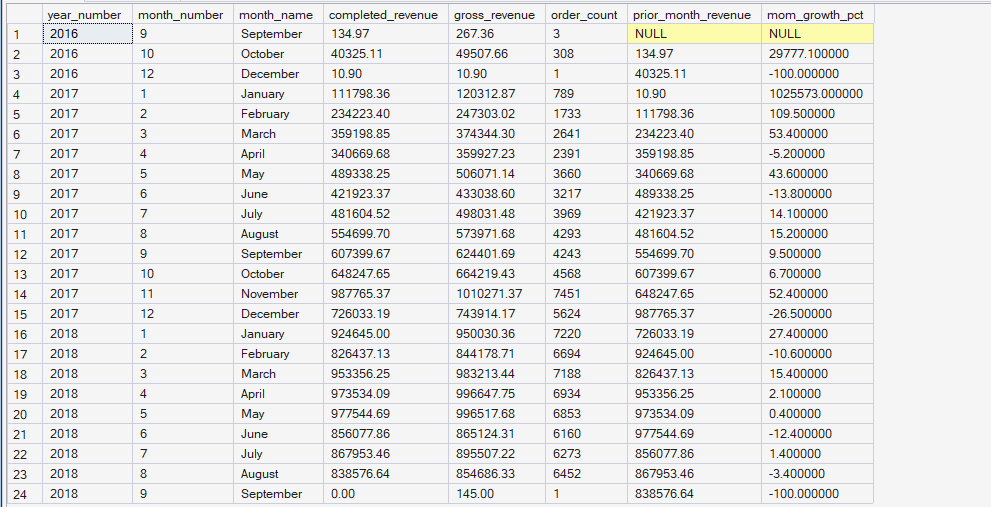
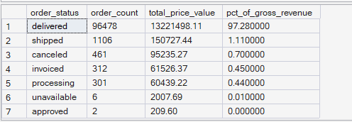
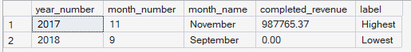

# ORGEE — Phase 4: Advanced SQL Analytics

## 01 — Revenue Trends

**SQL Script:** `01_revenue_trends.sql`

**Business Question:**  
How has revenue trended month over month, and which periods were strongest / weakest? Is growth accelerating or slowing?

---

## 1. Objective

This analysis evaluates monthly revenue performance using the completed Phase 3 enterprise warehouse.

Revenue is reported in two forms:

- **Completed Revenue** — revenue from `delivered` orders only.
- **Gross Revenue** — total item price across all order statuses.

This distinction prevents canceled or unavailable orders from being treated as realized revenue.

---

## 2. Data Source

**Primary Table:** `dbo.Fact_Order_Items`

**Supporting Dimension:** `dbo.Dim_Date`

The analysis uses the Phase 3 star schema only. No raw CSV files are used.

---

## 3. SQL Techniques Used

| Technique | Purpose |
|---|---|
| CTE | Builds the monthly revenue aggregation |
| `LAG()` | Calculates prior-month revenue and month-over-month growth |
| `CASE` | Separates delivered revenue and handles edge cases |
| Aggregation | Calculates monthly revenue and order counts |
| Date Dimension Join | Adds calendar attributes |
| Window Aggregation | Calculates order-status revenue share |
| `RANK()` | Identifies highest and lowest revenue months |

---

# 4. Result Set A — Monthly Revenue Trend

The query returns **24 monthly rows** covering the available observation period.

The output includes:

- Year
- Month
- Month name
- Completed revenue
- Gross revenue
- Order count
- Prior-month revenue
- Month-over-month growth %

### Output Evidence

**Image:** `01A_revenue_trends_monthly.png`

**File Path:**

`04_Advanced_SQL_Analytics/images/01A_revenue_trends_monthly.png`

> **Output note:** The complete SQL result contains 24 rows. The screenshot is provided as execution evidence rather than reproducing the entire result set in this document.

---

# 5. Result Set B — Revenue by Order Status

| Order Status | Order Count | Total Price Value | % of Gross Revenue |
|---|---:|---:|---:|
| delivered | 96,478 | 13,221,498.11 | 97.28% |
| shipped | 1,106 | 150,727.44 | 1.11% |
| canceled | 461 | 95,235.27 | 0.70% |
| invoiced | 312 | 61,526.37 | 0.45% |
| processing | 301 | 60,439.22 | 0.44% |
| unavailable | 6 | 2,007.69 | 0.01% |
| approved | 2 | 209.60 | 0.00% |

### Output Evidence

**Image:** `01B_revenue_by_order_status.png`

**File Path:**

`04_Advanced_SQL_Analytics/images/01B_revenue_by_order_status.png`

> **Output note:** This result contains only 7 rows, so the complete output is documented directly above as a table.

---

# 6. Result Set C — Strongest and Weakest Month

### Highest Completed-Revenue Month

**November 2017**

- Completed revenue: **$987,765.37**

### Lowest Completed-Revenue Month

**September 2018**

- Completed revenue: **$0.00**

### Data-Boundary Note

September 2018 should **not** be interpreted as a genuine business collapse.

It represents the incomplete final period of the dataset, with only one order represented in that month.

Therefore, this result is treated as a **dataset-boundary artifact**, not a meaningful business finding.

### Output Evidence

**Image:** `01C_revenue_month_extremes.png`

**File Path:**

`04_Advanced_SQL_Analytics/images/01C_revenue_month_extremes.png`

---

# 7. Business Interpretation

## Revenue Trend

Completed revenue increased substantially from the beginning of the observation period through 2017 and remained at a relatively high level through most of 2018, with month-to-month fluctuations.

The strongest observed completed-revenue month was **November 2017 at $987,765.37**.

The month-over-month results also show that revenue did not increase monotonically; several periods experienced meaningful increases or declines relative to the previous month.

## Realized vs Gross Revenue

Delivered orders account for **97.28% of gross revenue**, while canceled orders account for **0.70%**.

This indicates that the gap between gross item value and delivered-order revenue is relatively small in this dataset. Nevertheless, non-delivered statuses should not be treated as realized revenue.

## Dataset Boundary

The apparent lowest month, September 2018, is not suitable for business interpretation because it represents the incomplete end of the source observation period.

---

# 8. Business Implication

The results support using **delivered-order revenue as the primary realized-revenue measure** for downstream business analysis.

The monthly trend can support:

- Demand and capacity planning
- Inventory and operational readiness
- Investigation of significant month-over-month changes
- Revenue performance monitoring
- Avoiding overstated revenue caused by including non-delivered orders

Partial boundary periods should be clearly flagged before using monthly trends for forecasting or executive decision-making.

---

# 9. Signature Observation

> **November 2017 was the strongest complete-revenue month at $987,765.37, while delivered orders contributed 97.28% of gross revenue.**

This finding is derived from the actual warehouse output.

---

# 10. Scope Control

This analysis remains within the scope of **Phase 4 — Advanced SQL Analytics**.

It intentionally does not perform:

- Funnel analysis
- Session drop-off analysis
- Customer journey analysis
- Cohort retention analysis
- RFM segmentation
- CLV
- Recommendation modeling
- A/B testing
- Power BI analysis
- What-If scenarios

These capabilities belong to later ORGEE phases.

---

# 11. Execution Evidence

| Evidence | Description | Path |
|---|---|---|
| `01A_revenue_trends_monthly.png` | Monthly revenue trend and MoM growth output | `images/01A_revenue_trends_monthly.png` |
| `01B_revenue_by_order_status.png` | Revenue distribution by order status | `images/01B_revenue_by_order_status.png` |
| `01C_revenue_month_extremes.png` | Highest and lowest completed-revenue month | `images/01C_revenue_month_extremes.png` |

**SQL Source:** `01_revenue_trends.sql`

**SQL Path:**

`04_Advanced_SQL_Analytics/01_revenue_trends.sql`

**Results Documentation:**

`04_Advanced_SQL_Analytics/01_Revenue_Trends_Results.md`