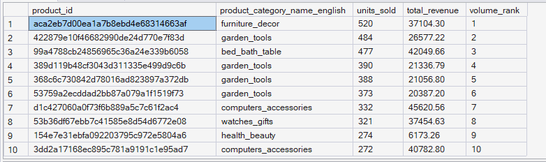
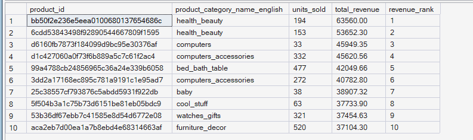
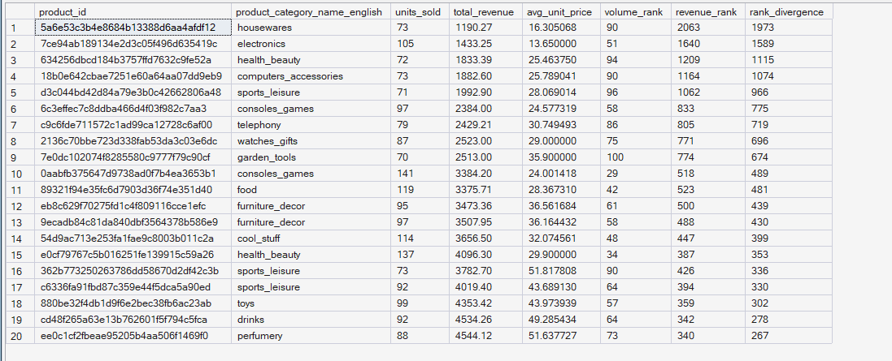

# ORGEE — Phase 4: Advanced SQL Analytics

## 02 — Best-Selling Products

**SQL Script:** `02_best_selling_products.sql`

**Business Question:**  
Which products sell the most by volume, and which generate the most revenue? Do the two rankings agree, or are there high-volume / low-revenue products and low-volume / high-revenue products worth knowing about?

---

## 1. Objective

This analysis evaluates product performance from two complementary perspectives:

- **Sales volume** — how many units were sold.
- **Revenue contribution** — how much revenue each product generated.

The analysis also compares the two rankings to identify products whose sales volume and revenue performance differ substantially.

All calculations are based on **delivered orders only**, ensuring that product performance reflects completed purchases.

---

## 2. Data Source

**Primary Fact Table:** `dbo.Fact_Order_Items`

**Supporting Dimension:** `dbo.Dim_Product`

The analysis uses the completed Phase 3 enterprise SQL warehouse and follows the established star schema.

No raw CSV files are used.

---

## 3. SQL Techniques Used

| Technique | Purpose |
|---|---|
| CTE | Creates reusable product-level analytical datasets |
| `RANK()` | Ranks products by units sold and revenue |
| Aggregation | Calculates units sold, revenue, and average unit price |
| `AVG()` | Calculates average selling price |
| `SUM()` | Calculates total product revenue |
| `COUNT()` | Calculates units sold |
| `ABS()` | Measures the absolute difference between volume and revenue rankings |
| `TOP` | Limits output to the most relevant products |

---

# 4. Result Set A — Top 10 Products by Units Sold

This result identifies the **10 products with the highest number of units sold** among delivered orders.

### Output

| Volume Rank | Product Category | Units Sold | Total Revenue |
|---:|---|---:|---:|
| 1 | furniture_decor | 520 | 37,104.30 |
| 2 | garden_tools | 484 | 26,577.22 |
| 3 | bed_bath_table | 477 | 42,049.66 |
| 4 | garden_tools | 390 | 21,336.79 |
| 5 | garden_tools | 388 | 21,056.80 |
| 6 | garden_tools | 373 | 20,387.20 |
| 7 | computers_accessories | 332 | 45,620.56 |
| 8 | watches_gifts | 321 | 37,454.63 |
| 9 | health_beauty | 274 | 61,732.26 |
| 10 | computers_accessories | 272 | 40,782.80 |

> The product IDs are available in the original SQL execution output and screenshot. The table above focuses on the primary business measures.

### Output Evidence

**Image:** `02A_best_selling_by_volume.png`

**File Path:**

`04_Advanced_SQL_Analytics/images/02A_best_selling_by_volume.png`



**Output size:** 10 rows.

The complete result set is represented in the screenshot.

---

# 5. Result Set B — Top 10 Products by Revenue

This result identifies the **10 products generating the highest revenue** among delivered orders.

### Output

| Revenue Rank | Product Category | Units Sold | Total Revenue |
|---:|---|---:|---:|
| 1 | health_beauty | 194 | 63,560.00 |
| 2 | health_beauty | 153 | 53,652.30 |
| 3 | computers | 33 | 45,949.35 |
| 4 | computers_accessories | 332 | 45,620.56 |
| 5 | bed_bath_table | 477 | 42,049.66 |
| 6 | computers_accessories | 272 | 40,782.80 |
| 7 | baby | 38 | 38,907.32 |
| 8 | cool_stuff | 63 | 37,733.90 |
| 9 | watches_gifts | 321 | 37,454.63 |
| 10 | furniture_decor | 520 | 37,104.30 |

### Output Evidence

**Image:** `02B_best_selling_by_revenue.png`

**File Path:**

`04_Advanced_SQL_Analytics/images/02B_best_selling_by_revenue.png`



**Output size:** 10 rows.

The complete result set is represented in the screenshot.

---

# 6. Result Set C — Volume vs Revenue Ranking Divergence

The third analysis compares each product's:

- Volume rank
- Revenue rank
- Average unit price
- Ranking divergence

The query first considers products within the **top 100 by volume** and then returns the **20 products with the largest difference between volume and revenue rank**.

### Ranking Divergence

The `rank_divergence` measure is calculated as:

```text
ABS(volume_rank - revenue_rank)
```

A larger value indicates that a product's position in the volume ranking differs substantially from its position in the revenue ranking.

### Output Evidence

**Image:** `02C_volume_vs_revenue_divergence.png`

**File Path:**

`04_Advanced_SQL_Analytics/images/02C_volume_vs_revenue_divergence.png`



**Output size:** 20 rows.

The complete `TOP 20` result is represented in the screenshot.

---

# 7. Key Observations

## Volume Leaders and Revenue Leaders Are Not Identical

The highest-volume product is a `furniture_decor` product with **520 units sold** and **$37,104.30** in revenue.

However, the highest-revenue product is a `health_beauty` product with only **194 units sold** but **$63,560.00** in revenue.

This demonstrates that **unit volume and revenue performance are distinct dimensions of product success**.

---

## High Volume Does Not Automatically Mean Highest Revenue

The product with the highest unit volume does not rank first in revenue.

For example:

- Top volume product: **520 units → $37,104.30**
- Top revenue product: **194 units → $63,560.00**

The difference is consistent with the higher revenue generated per unit by the top-revenue product.

---

## Some Products Generate High Revenue with Relatively Low Volume

The `computers` product ranked **3rd by revenue** with only **33 units sold**, generating **$45,949.35**.

This is a strong example of a product whose revenue performance is driven by a substantially higher unit price rather than high transaction volume.

---

## Category Representation Differs Across Rankings

The top-volume list contains several `garden_tools` products, while the top-revenue list contains multiple `health_beauty` and `computers_accessories` products.

This indicates that category representation can differ depending on whether performance is evaluated through **volume** or **revenue**.

---

# 8. Business Interpretation

The analysis shows that product performance should not be evaluated using unit sales alone.

A product can sell a large number of units while generating moderate revenue, while another product can sell substantially fewer units but generate considerably more revenue because of its higher selling price.

Therefore, the two rankings answer different business questions:

| Metric | Business Question |
|---|---|
| Units Sold | Which products have the strongest purchase volume? |
| Total Revenue | Which products contribute the most monetary value? |
| Average Unit Price | How much revenue does each unit generate on average? |
| Rank Divergence | Where does volume performance differ most from revenue performance? |

---

# 9. Business Implications

The findings support using **both volume and revenue rankings** when making product decisions.

Potential applications include:

- Identifying high-volume products suitable for promotions or bundling
- Identifying high-revenue products that may deserve premium placement
- Understanding the role of price in product revenue performance
- Avoiding decisions based solely on unit volume
- Prioritizing products differently for revenue growth versus transaction growth
- Investigating products with large volume/revenue ranking divergence

A product's strategic importance should therefore be evaluated using **volume, revenue, and price together**, rather than relying on a single ranking.

---

# 10. Signature Observation

> **The product with the highest sales volume is not the product with the highest revenue, demonstrating that product volume and revenue contribution measure different dimensions of commercial performance.**

The strongest contrast is visible between:

- **Volume leader:** 520 units → $37,104.30 revenue
- **Revenue leader:** 194 units → $63,560.00 revenue

This finding is derived directly from the warehouse output.

---

# 11. Output Summary

| Result Set | Output | Rows | Evidence |
|---|---|---:|---|
| A | Top products by units sold | 10 | `02A_best_selling_by_volume.png` |
| B | Top products by revenue | 10 | `02B_best_selling_by_revenue.png` |
| C | Volume vs revenue ranking divergence | 20 | `02C_volume_vs_revenue_divergence.png` |

---

# 12. Execution Evidence

### SQL Source

`04_Advanced_SQL_Analytics/02_best_selling_products.sql`

### Results Documentation

`04_Advanced_SQL_Analytics/02_Best_Selling_Products_Results.md`

### Screenshot Evidence

```text
04_Advanced_SQL_Analytics/
│
├── 02_best_selling_products.sql
├── 02_Best_Selling_Products_Results.md
│
└── images/
    ├── 02A_best_selling_by_volume.png
    ├── 02B_best_selling_by_revenue.png
    └── 02C_volume_vs_revenue_divergence.png
```

All three screenshots are execution evidence from the completed Phase 3 warehouse.

---

# 13. Scope Control

This analysis remains within the scope of **Phase 4 — Advanced SQL Analytics**.

It does not perform:

- RFM segmentation
- CLV
- Funnel analysis
- Customer journey analysis
- Cohort retention
- Recommendation modeling
- A/B testing
- Power BI analysis
- What-If analysis

Those capabilities belong to subsequent ORGEE phases.