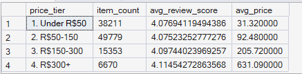
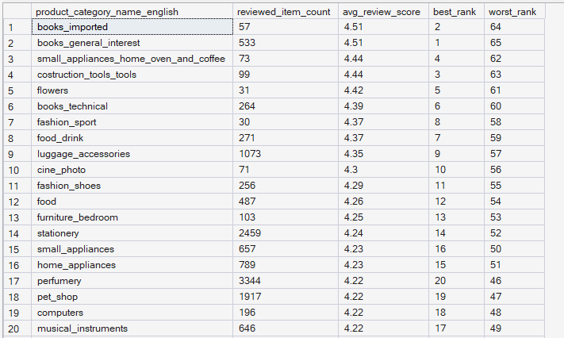
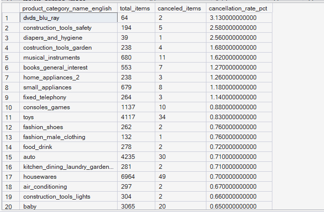

# ORGEE — Phase 4: Advanced SQL Analytics

## 03 — Product Performance

**SQL Script:** `03_product_performance.sql`

**Business Question:**  
Does price tier relate to customer satisfaction (review score)? Which product categories have the best/worst average review scores, and does category-level cancellation behavior provide an additional performance signal?

---

## 1. Objective

This analysis evaluates product performance from three perspectives:

1. **Price tier vs customer satisfaction**
2. **Category-level review performance**
3. **Category-level cancellation behavior**

The objective is to determine whether higher-priced products are associated with different customer satisfaction levels and to identify categories that stand out in review performance or cancellation behavior.

All analysis is performed using the completed Phase 3 enterprise SQL warehouse.

No raw CSV files are used.

---

## 2. Data Sources

### Primary Tables

- `dbo.Fact_Order_Items`
- `dbo.Fact_Reviews`
- `dbo.Dim_Product`

The analysis follows the ORGEE Kimball star schema established in Phase 3.

---

## 3. SQL Techniques Used

| Technique | Purpose |
|---|---|
| CTE | Creates reusable analytical datasets |
| `CASE` | Creates price tiers and cancellation flags |
| Aggregation | Calculates item counts, review scores, prices, and cancellation rates |
| `AVG()` | Calculates average review score and average price |
| `SUM()` | Calculates canceled item counts |
| `RANK()` | Ranks product categories by review performance |
| `HAVING` | Removes categories with fewer than 30 observations from category-level analysis |
| `ROUND()` | Formats analytical metrics |
| Star-schema joins | Connects facts with product and review dimensions/facts |

---

# 4. Result Set A — Review Score by Price Tier

This analysis groups delivered order items into four price tiers and compares the average review score across those tiers.

### Output

| Price Tier | Item Count | Average Review Score | Average Price |
|---|---:|---:|---:|
| Under R$50 | 38,211 | 4.0769 | R$31.32 |
| R$50–150 | 49,779 | 4.0752 | R$92.48 |
| R$150–300 | 15,353 | 4.0974 | R$205.72 |
| R$300+ | 6,670 | 4.1145 | R$631.09 |

### Output Evidence

**Image:** `03A_price_tier_review_score.png`

**Repository Path:**

`./images/03A_price_tier_review_score.png`



**Output size:** 4 rows.

This is the complete result set for the price-tier analysis.

---

# 5. Result Set B — Category Review Performance

This analysis calculates the average review score for each product category.

To avoid unstable rankings caused by very small sample sizes, only categories with **at least 30 reviewed items** are included.

The resulting dataset contains **65 qualifying categories**.

### Output Evidence

**Image:** `03B_category_review_performance.png`

**Repository Path:**

`./images/03B_category_review_performance.png`



### Screenshot Scope

The complete SQL result contains **65 rows**.

For GitHub documentation, the screenshot intentionally captures only the **first 20 rows** as a representative excerpt rather than embedding the entire result grid.

**Displayed rows:** 20  
**Total result rows:** 65

The SQL script remains the authoritative source for the complete result set.

### Highest-Ranked Categories Visible in the Captured Output

| Category | Reviewed Items | Average Review Score | Best Rank |
|---|---:|---:|---:|
| books_imported | 57 | 4.51 | 2 |
| books_general_interest | 533 | 4.51 | 1 |
| small_appliances_home_oven_and_coffee | 73 | 4.44 | 4 |
| construction_tools_tools | 99 | 4.44 | 3 |
| flowers | 31 | 4.42 | 5 |
| books_technical | 264 | 4.39 | 6 |
| fashion_sport | 30 | 4.37 | 8 |
| food_drink | 271 | 4.37 | 7 |
| luggage_accessories | 1,073 | 4.35 | 9 |
| cine_photo | 71 | 4.30 | 10 |

> The screenshot continues through the first 20 rows. The full 65-category ranking is available through the SQL query.

---

# 6. Result Set C — Category Cancellation Rate

This analysis evaluates cancellation behavior by product category.

For each category, the query calculates:

- Total items
- Canceled items
- Cancellation rate

Only categories with at least **30 items** are included.

The resulting dataset contains **66 qualifying categories**.

### Output Evidence

**Image:** `03C_category_cancellation_rate.png`

**Repository Path:**

`./images/03C_category_cancellation_rate.png`



### Screenshot Scope

The complete SQL result contains **66 rows**.

For GitHub documentation, the screenshot intentionally captures only the **first 20 rows** as a representative excerpt.

**Displayed rows:** 20  
**Total result rows:** 66

The SQL script remains the authoritative source for the complete result set.

### Highest Cancellation Rates Visible in the Captured Output

| Category | Total Items | Canceled Items | Cancellation Rate |
|---|---:|---:|---:|
| dvds_blu_ray | 64 | 2 | 3.13% |
| construction_tools_safety | 194 | 5 | 2.58% |
| diapers_and_hygiene | 39 | 1 | 2.56% |
| construction_tools_garden | 238 | 4 | 1.68% |
| musical_instruments | 680 | 11 | 1.62% |
| books_general_interest | 553 | 7 | 1.27% |
| home_appliances_2 | 238 | 3 | 1.26% |
| small_appliances | 679 | 8 | 1.18% |
| fixed_telephony | 264 | 3 | 1.14% |
| consoles_games | 1,137 | 10 | 0.88% |

> The screenshot continues through the first 20 rows. The complete 66-category result is available through the SQL query.

---

# 7. Key Observations

## Price Tier and Review Score

The average review scores are relatively close across all four price tiers:

- Under R$50 → **4.0769**
- R$50–150 → **4.0752**
- R$150–300 → **4.0974**
- R$300+ → **4.1145**

The observed review scores therefore remain within a relatively narrow range despite substantial differences in average product price.

The highest-priced tier has the highest average review score, but the difference from the lower tiers is small.

---

## Category Review Performance

The category-level analysis shows variation in average review scores across product categories.

The ranking uses a minimum threshold of **30 reviewed items**, which reduces the influence of extremely small samples.

Among the categories visible in the captured output, `books_imported` and `books_general_interest` have the highest displayed average review score at **4.51**.

---

## Category Cancellation Behavior

Cancellation rates also vary across categories.

Among the categories visible in the captured output:

- `dvds_blu_ray` has a **3.13%** cancellation rate.
- `construction_tools_safety` has a **2.58%** cancellation rate.
- `diapers_and_hygiene` has a **2.56%** cancellation rate.
- `construction_tools_garden` has a **1.68%** cancellation rate.

These categories represent potential candidates for further operational or fulfillment investigation.

---

# 8. Business Interpretation

The analysis provides three complementary views of product performance.

### Customer Satisfaction

Review scores remain relatively stable across price tiers, suggesting that price alone does not appear to create a large difference in observed customer satisfaction within this dataset.

### Category Experience

Some categories achieve materially higher average review scores than others, indicating that category-level product or fulfillment characteristics may influence customer experience.

### Operational Performance

Cancellation rates vary by category, providing an additional signal that can be used to identify categories requiring operational investigation.

Importantly, this analysis identifies **relationships and signals**, not causal effects.

---

# 9. Business Implications

The results can support several business decisions:

- Avoid assuming that premium-priced products automatically produce substantially better customer satisfaction.
- Investigate categories with unusually high cancellation rates.
- Use category-level review performance to identify potential quality or fulfillment strengths.
- Combine customer satisfaction and operational metrics when evaluating product categories.
- Use minimum sample-size thresholds when ranking categories to reduce noise from very small groups.

---

# 10. Signature Observation

> **Average review scores remain relatively stable across price tiers, with only a modest difference between the lowest and highest price groups.**

The observed averages range from approximately **4.08 to 4.11**, despite the average price increasing from approximately **R$31 to R$631**.

This indicates that, within this dataset, **higher product price does not correspond to a large improvement in average review score**.

---

# 11. Result Summary

| Result Set | Analysis | Total Rows | Rows Shown in Screenshot | Evidence |
|---|---|---:|---:|---|
| A | Review score by price tier | 4 | 4 | `03A_price_tier_review_score.png` |
| B | Category review performance | 65 | 20 | `03B_category_review_performance.png` |
| C | Category cancellation rate | 66 | 20 | `03C_category_cancellation_rate.png` |

### Screenshot Documentation Convention

For large SQL result sets, ORGEE uses a **representative-output approach**:

- The SQL query produces the complete analytical result.
- The GitHub documentation includes a readable screenshot excerpt.
- The number of displayed rows and total result rows are explicitly documented.
- The SQL script remains available for complete reproducibility.

This keeps the GitHub repository readable without hiding the actual scope of the analysis.

---

# 12. Execution Evidence

### SQL Source

`04_Advanced_SQL_Analytics/03_product_performance.sql`

### Results Documentation

`04_Advanced_SQL_Analytics/03_Product_Performance_Results.md`

### Screenshot Evidence

```text
04_Advanced_SQL_Analytics/
│
├── 03_product_performance.sql
├── 03_Product_Performance_Results.md
│
└── images/
    ├── 03A_price_tier_review_score.png
    ├── 03B_category_review_performance.png
    └── 03C_category_cancellation_rate.png
    
    ```

The screenshots provide visual execution evidence from the completed ORGEE SQL warehouse.

---

# 13. Scope Control

This analysis remains within the scope of **Phase 4 — Advanced SQL Analytics**.

It does not perform:

- RFM segmentation
- CLV
- Funnel analysis
- Customer journey analysis
- Cohort retention
- Recommendation modeling
- A/B testing
- Power BI analysis
- What-If analysis

These capabilities belong to subsequent ORGEE phases.