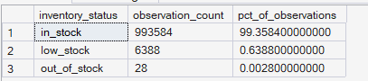
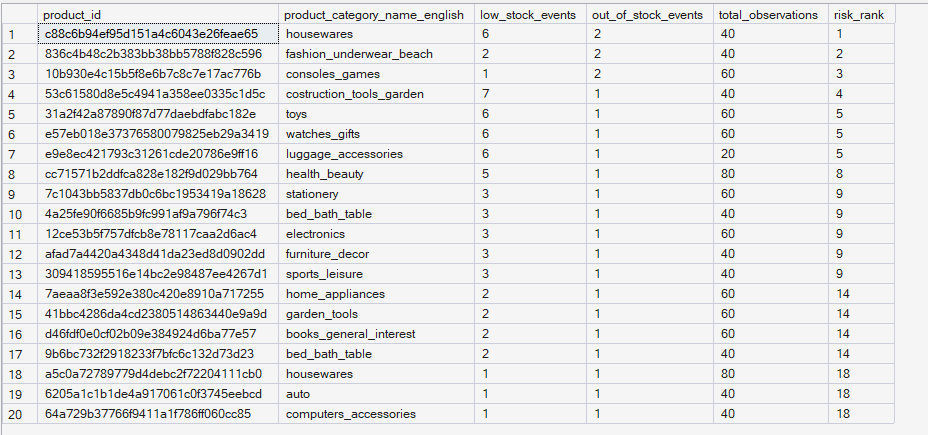
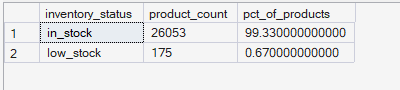

# ORGEE — Phase 4: Advanced SQL Analytics

## 04 — Inventory Health

**SQL Script:** `04_inventory_health.sql`

**Business Question:**  
What does the overall inventory health picture look like, and which specific products are at the greatest stockout risk?

---

## 1. Objective

This analysis evaluates inventory health from three perspectives:

1. **Overall inventory status distribution**
2. **Historical stockout and low-stock risk by product**
3. **Current inventory status based on the most recent observation per product**

The objective is to determine whether inventory is generally healthy, identify products with repeated inventory-risk signals, and distinguish historical inventory risk from the latest available product status.

All analysis is performed using the completed Phase 3 enterprise SQL warehouse.

No raw CSV files are used.

---

## 2. Data Sources

### Primary Tables

- `dbo.Fact_Inventory_Snapshot`
- `dbo.Dim_Product`

The analysis follows the ORGEE Kimball star schema established in Phase 3.

---

## 3. SQL Techniques Used

| Technique | Purpose |
|---|---|
| CTE | Creates reusable analytical datasets |
| `CASE` | Classifies low-stock and out-of-stock observations |
| Aggregation | Calculates inventory observations and product counts |
| `SUM()` | Counts low-stock and out-of-stock events |
| `ROW_NUMBER()` | Identifies the latest inventory observation for each product |
| `RANK()` | Ranks products according to inventory-risk severity |
| Window functions | Calculates percentage distributions |
| Weighted risk scoring | Gives greater importance to genuine out-of-stock events |
| `ROUND()` | Formats percentage metrics |
| Star-schema joins | Connects inventory facts with product attributes |

---

# 4. Result Set A — Overall Inventory Status Distribution

This analysis provides the overall distribution of inventory observations across the three inventory states:

- `in_stock`
- `low_stock`
- `out_of_stock`

The dataset contains approximately **1,000,000 inventory observations**.

### Output

| Inventory Status | Observation Count | % of Observations |
|---|---:|---:|
| in_stock | 993,584 | 99.3584% |
| low_stock | 6,388 | 0.6388% |
| out_of_stock | 28 | 0.0028% |

### Output Evidence

**Image:** `04A_inventory_status_distribution.png`

**Repository Path:**

`./images/04A_inventory_status_distribution.png`



**Output size:** 3 rows.

This is the complete result set for the overall inventory-status analysis.

---

# 5. Result Set B — Products with Highest Inventory Risk

This analysis identifies products that repeatedly experienced `low_stock` or `out_of_stock` conditions.

Because genuine stockouts are extremely rare in the dataset, the analysis uses a weighted risk score:

- `low_stock` event → weight of **1**
- `out_of_stock` event → weight of **10**

This ensures that a genuine stockout is treated as materially more severe than a low-stock warning.

### Output Evidence

**Image:** `04B_product_inventory_risk.png`

**Repository Path:**

`./images/04B_product_inventory_risk.png`



### Screenshot Scope

The complete SQL result is ranked and limited to the **top 20 highest-risk products**.

**Displayed rows:** 20  
**Total result rows displayed by query:** 20

The SQL script remains the authoritative source for the complete reproducible analysis.

### Highest-Risk Products Visible in the Captured Output

| Rank | Product Category | Low-Stock Events | Out-of-Stock Events | Total Observations |
|---:|---|---:|---:|---:|
| 1 | housewares | 6 | 2 | 40 |
| 2 | fashion_underwear_beach | 2 | 2 | 40 |
| 3 | consoles_games | 1 | 2 | 60 |
| 4 | construction_tools_garden | 7 | 1 | 40 |
| 5 | toys | 6 | 1 | 40 |
| 5 | watches_gifts | 6 | 1 | 60 |
| 5 | luggage_accessories | 6 | 1 | 20 |
| 8 | health_beauty | 5 | 1 | 80 |
| 9 | stationery | 3 | 1 | 60 |
| 9 | bed_bath_table | 3 | 1 | 40 |
| 9 | electronics | 3 | 1 | 60 |

> The screenshot contains the complete 20-row output returned by the `TOP 20` query. Product IDs are retained in the screenshot and SQL result as the unique product identifiers.

---

# 6. Result Set C — Current Inventory Status by Product

This analysis identifies the **most recent inventory observation for each product** using `ROW_NUMBER()`.

Unlike Result Set A, which measures historical inventory observations, this result represents the latest known inventory state for each product.

### Output

| Inventory Status | Product Count | % of Products |
|---|---:|---:|
| in_stock | 26,053 | 99.33% |
| low_stock | 175 | 0.67% |

### Output Evidence

**Image:** `04C_current_inventory_status.png`

**Repository Path:**

`./images/04C_current_inventory_status.png`



**Output size:** 2 rows.

The latest-observation result contains two inventory states in the captured output.

---

# 7. Key Observations

## Overall Inventory Health

Inventory observations are overwhelmingly classified as `in_stock`:

- **99.3584%** of observations are in stock.
- **0.6388%** are low-stock observations.
- Only **0.0028%** are genuine out-of-stock observations.

This indicates that the inventory dataset is heavily skewed toward healthy stock availability.

---

## Historical Inventory Risk

Although genuine stockouts are rare, some products repeatedly experience low-stock or out-of-stock events.

The highest-risk product in the captured output has:

- **6 low-stock events**
- **2 out-of-stock events**
- **40 total observations**

The weighted risk ranking gives greater importance to products experiencing actual stockouts rather than relying only on the frequency of low-stock warnings.

---

## Current Inventory Status

The latest observation per product shows:

- **26,053 products in stock**
- **175 products in low-stock status**

This means approximately **99.33% of products are currently in stock**, while approximately **0.67% are currently classified as low stock**.

The current-state view is consistent with the broader historical inventory picture: inventory is generally healthy, with a small portion of products requiring attention.

---

# 8. Business Interpretation

The inventory environment appears broadly healthy.

Historical inventory observations show that genuine stockouts are extremely uncommon, while low-stock events provide a more useful leading indicator of potential inventory pressure.

The current product-level snapshot also shows a very high proportion of products in stock.

The combination of these two views is important:

- **Historical frequency** identifies products that repeatedly experience inventory pressure.
- **Current status** identifies products that require attention based on their latest observation.

This prevents the analysis from relying exclusively on either historical events or the latest snapshot.

---

# 9. Business Implications

The results can support several inventory-management decisions:

- Prioritize monitoring of products with repeated low-stock or out-of-stock events.
- Use low-stock status as an early warning indicator before genuine stockouts occur.
- Investigate categories containing multiple high-risk products.
- Consider reorder-point adjustments for products with recurring inventory pressure.
- Use current inventory status alongside historical risk rather than relying on a single snapshot.
- Consider supplier or replenishment diversification where inventory risk repeatedly concentrates.

These results indicate **risk signals**, not causal explanations for why stockouts occurred.

Further operational investigation would be required to determine whether the underlying causes are demand spikes, replenishment delays, supplier constraints, or other operational factors.

---

# 10. Signature Observation

> **Inventory is overwhelmingly healthy, but low-stock events provide a more meaningful early-warning signal than genuine stockouts because actual out-of-stock observations are extremely rare.**

Only **28 out of approximately 1 million inventory observations** are classified as `out_of_stock`, representing approximately **0.0028%** of observations.

By comparison, **6,388 observations** are classified as `low_stock`, representing approximately **0.6388%**.

Therefore, the analysis appropriately treats low-stock conditions as the primary leading indicator while giving genuine stockouts greater severity in the product-risk ranking.

---

# 11. Result Summary

| Result Set | Analysis | Total Rows | Rows Shown in Screenshot | Evidence |
|---|---|---:|---:|---|
| A | Overall inventory status distribution | 3 | 3 | `04A_inventory_status_distribution.png` |
| B | Highest-risk products | 20 | 20 | `04B_product_inventory_risk.png` |
| C | Current inventory status by product | 2 | 2 | `04C_current_inventory_status.png` |

### Screenshot Documentation Convention

For large SQL result sets, ORGEE uses a **representative-output approach**:

- The SQL query produces the analytical result.
- The GitHub documentation includes a readable screenshot excerpt or the complete small result set.
- The number of displayed rows and total result rows are explicitly documented.
- The SQL script remains available for complete reproducibility.

This keeps the GitHub repository readable while preserving the underlying analytical output.

---

# 12. Execution Evidence

### SQL Source

`04_Advanced_SQL_Analytics/04_inventory_health.sql`

### Results Documentation

`04_Advanced_SQL_Analytics/04_Inventory_Health_Results.md`

### Screenshot Evidence

```text
04_Advanced_SQL_Analytics/
│
├── 04_inventory_health.sql
├── 04_Inventory_Health_Results.md
│
└── images/
    ├── 04A_inventory_status_distribution.png
    ├── 04B_product_inventory_risk.png
    └── 04C_current_inventory_status.png
```

The screenshots provide visual execution evidence from the completed ORGEE SQL warehouse.

---

# 13. Scope Control

This analysis remains within the scope of **Phase 4 — Advanced SQL Analytics**.

It does not perform:

- Customer journey analysis
- Funnel analysis
- Cohort retention
- RFM segmentation
- CLV
- Recommendation modeling
- A/B testing
- Power BI analysis
- What-If analysis

These capabilities belong to subsequent ORGEE phases.