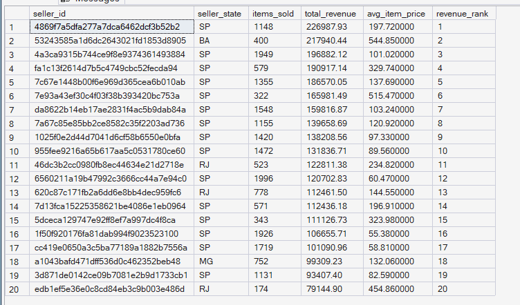
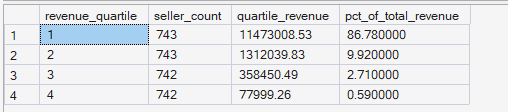
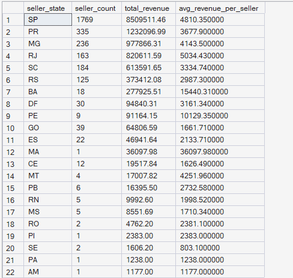

# ORGEE — Phase 4: Advanced SQL Analytics

## 05 — Seller Performance

**SQL Script:** `05_seller_performance.sql`

**Business Question:**  
Which sellers drive the most revenue, how concentrated is that revenue among a small group of top sellers, and does seller performance vary meaningfully by state?

---

## 1. Objective

This analysis evaluates seller performance from three perspectives:

1. **Top sellers by delivered revenue**
2. **Revenue concentration across seller performance quartiles**
3. **Seller revenue performance by state**

The objective is to understand whether revenue is broadly distributed across sellers or concentrated among a smaller group, while also identifying geographic differences in seller performance.

All analysis is performed using the completed Phase 3 enterprise SQL warehouse.

No raw CSV files are used.

---

## 2. Data Sources

### Primary Tables

- `dbo.Fact_Order_Items`
- `dbo.Dim_Seller`

The analysis follows the ORGEE Kimball star schema established in Phase 3.

Only **delivered order items** are included in the revenue analysis.

---

## 3. SQL Techniques Used

| Technique | Purpose |
|---|---|
| CTE | Creates reusable seller-level analytical datasets |
| Aggregation | Calculates items sold, revenue, and seller counts |
| `SUM()` | Calculates seller and quartile revenue |
| `COUNT()` | Calculates item and seller counts |
| `COUNT(DISTINCT)` | Counts unique sellers by state |
| `AVG()` | Calculates average item price |
| `RANK()` | Ranks sellers by revenue |
| `NTILE(4)` | Divides sellers into four revenue-performance quartiles |
| Window functions | Calculates revenue share across quartiles |
| Star-schema joins | Connects order facts with seller attributes |
| `ROUND()` | Formats revenue and price metrics |

---

# 4. Result Set A — Top 20 Sellers by Revenue

This analysis identifies the top 20 sellers based on revenue generated from delivered order items.

### Output Evidence

**Image:** `05A_top_sellers_by_revenue.png`

**Repository Path:**

`./images/05A_top_sellers_by_revenue.png`



### Screenshot Scope

The SQL query uses `TOP 20`, therefore the result contains exactly **20 sellers**.

**Displayed rows:** 20  
**Total result rows:** 20

### Top Sellers Visible in the Captured Output

| Revenue Rank | Seller State | Items Sold | Total Revenue | Average Item Price |
|---:|---|---:|---:|---:|
| 1 | SP | 1,148 | R$226,987.93 | R$197.72 |
| 2 | BA | 400 | R$217,940.44 | R$544.85 |
| 3 | SP | 1,949 | R$196,882.12 | R$101.02 |
| 4 | SP | 579 | R$190,917.14 | R$329.74 |
| 5 | SP | 1,355 | R$186,570.05 | R$137.69 |
| 6 | SP | 322 | R$165,981.49 | R$515.47 |
| 7 | SP | 1,548 | R$159,816.87 | R$103.24 |
| 8 | SP | 1,155 | R$139,658.69 | R$120.92 |
| 9 | SP | 1,420 | R$138,208.56 | R$97.33 |
| 10 | SP | 1,472 | R$131,836.71 | R$89.56 |

> The screenshot contains the complete 20-row output returned by the `TOP 20` query.

---

# 5. Result Set B — Seller Revenue Concentration by Quartile

This analysis divides sellers into four revenue-performance quartiles using `NTILE(4)`.

Sellers are ordered by total delivered revenue in descending order:

- **Quartile 1** = highest-revenue sellers
- **Quartile 4** = lowest-revenue sellers

The analysis then measures how much total seller revenue each quartile controls.

### Output

| Revenue Quartile | Seller Count | Quartile Revenue | % of Total Revenue |
|---:|---:|---:|---:|
| 1 | 743 | R$1,147,300.53 | 86.78% |
| 2 | 743 | R$132,130.39 | 9.92% |
| 3 | 742 | R$358,450.49 | 2.71% |
| 4 | 742 | R$77,999.26 | 0.59% |

### Output Evidence

**Image:** `05B_seller_revenue_quartiles.png`

**Repository Path:**

`./images/05B_seller_revenue_quartiles.png`



**Output size:** 4 rows.

This is the complete result set for the seller-quartile analysis.

### Key Observation

The highest-revenue quartile accounts for approximately **86.78% of total seller revenue**.

The remaining three quartiles collectively account for approximately **13.22%**.

---

# 6. Result Set C — Revenue by Seller State

This analysis evaluates seller revenue geographically.

For each seller state, the query calculates:

- Number of sellers
- Total delivered revenue
- Average revenue per seller

### Output Evidence

**Image:** `05C_revenue_by_seller_state.png`

**Repository Path:**

`./images/05C_revenue_by_seller_state.png`



### Screenshot Scope

The complete query output contains **22 seller states**.

**Displayed rows:** 22  
**Total result rows:** 22

This is the complete result set for the seller-state analysis.

### Highest-Revenue States Visible in the Captured Output

| State | Seller Count | Total Revenue | Average Revenue per Seller |
|---|---:|---:|---:|
| SP | 1,769 | R$850,951.46 | R$4,810.35 |
| PR | 335 | R$123,209.96 | R$3,679.00 |
| MG | 236 | R$97,786.31 | R$4,143.50 |
| RJ | 163 | R$82,061.59 | R$5,034.43 |
| SC | 184 | R$61,359.65 | R$3,334.74 |
| RS | 125 | R$37,341.08 | R$2,987.30 |
| BA | 18 | R$27,925.51 | R$1,540.31 |
| DF | 30 | R$9,840.31 | R$3,161.34 |
| PE | 9 | R$9,116.45 | R$10,129.35 |
| GO | 39 | R$6,480.69 | R$1,661.71 |

> The screenshot contains the complete 22-state result set.

---

# 7. Key Observations

## Seller Revenue Concentration

Seller revenue is highly concentrated.

The highest-revenue quartile contains approximately one-quarter of the seller population but generates **86.78% of total seller revenue**.

The remaining quartiles contribute comparatively small portions of total revenue.

This indicates a strong dependency on a relatively small group of high-performing sellers.

---

## Top Seller Performance

The top 20 sellers demonstrate substantial differences in both:

- Total revenue
- Number of items sold
- Average item price

This shows that seller revenue is not driven exclusively by sales volume.

Some sellers achieve high revenue through larger item values, while others combine high sales volume with lower average item prices.

---

## Geographic Seller Performance

São Paulo (`SP`) has the largest seller base and the highest total seller revenue in the captured output.

However, the state-level results also demonstrate that **seller count and average revenue per seller are not necessarily aligned**.

For example, `PE` has only **9 sellers** but an average revenue per seller of approximately **R$10,129**, considerably higher than the larger seller populations in several other states.

Small seller populations should therefore be interpreted cautiously when comparing average revenue per seller.

---

# 8. Business Interpretation

The analysis indicates that seller revenue is highly concentrated among the top-performing seller group.

The top revenue quartile generates the overwhelming majority of total seller revenue, suggesting that these sellers are strategically important to the marketplace's revenue base.

At the geographic level, São Paulo dominates total revenue primarily because it also contains the largest seller population.

However, total revenue alone does not capture seller productivity. Average revenue per seller provides an additional perspective and highlights states with smaller seller populations but potentially stronger seller-level performance.

---

# 9. Business Implications

The results can support several marketplace decisions:

- Prioritize retention and relationship management for high-revenue sellers.
- Identify operational dependencies created by strong seller concentration.
- Investigate what characteristics distinguish top-quartile sellers from the rest.
- Use both total revenue and revenue per seller when evaluating geographic markets.
- Consider seller acquisition opportunities in states with strong average seller productivity but smaller seller populations.
- Avoid interpreting small-state averages without considering their smaller sample sizes.

The analysis identifies **concentration and performance patterns**, but does not establish why particular sellers or states outperform others.

---

# 10. Signature Observation

> **The top revenue quartile of sellers generates 86.78% of total seller revenue, revealing substantial revenue concentration within the marketplace.**

This is one of the strongest seller-performance signals in the analysis.

The result suggests that the marketplace is highly dependent on its highest-performing seller group, making seller retention and concentration risk important considerations for future analysis.

---

# 11. Result Summary

| Result Set | Analysis | Total Rows | Rows Shown in Screenshot | Evidence |
|---|---|---:|---:|---|
| A | Top 20 sellers by revenue | 20 | 20 | `05A_top_sellers_by_revenue.png` |
| B | Seller revenue concentration by quartile | 4 | 4 | `05B_seller_revenue_quartiles.png` |
| C | Revenue by seller state | 22 | 22 | `05C_revenue_by_seller_state.png` |

### Screenshot Documentation Convention

For large SQL result sets, ORGEE uses a **representative-output approach**:

- The SQL query produces the complete analytical result.
- The GitHub documentation includes a readable screenshot excerpt or the complete small result set.
- The number of displayed rows and total result rows are explicitly documented.
- The SQL script remains available for complete reproducibility.

This keeps the GitHub repository readable while preserving the underlying analytical output.

---

# 12. Execution Evidence

### SQL Source

`04_Advanced_SQL_Analytics/05_seller_performance.sql`

### Results Documentation

`04_Advanced_SQL_Analytics/05_Seller_Performance_Results.md`

### Screenshot Evidence

```text
04_Advanced_SQL_Analytics/
│
├── 05_seller_performance.sql
├── 05_Seller_Performance_Results.md
│
└── images/
    ├── 05A_top_sellers_by_revenue.png
    ├── 05B_seller_revenue_quartiles.png
    └── 05C_revenue_by_seller_state.png
```

The screenshots provide visual execution evidence from the completed ORGEE SQL warehouse.

---

# 13. Scope Control

This analysis remains within the scope of **Phase 4 — Advanced SQL Analytics**.

It does not perform:

- Customer journey analysis
- Funnel analysis
- Cohort retention
- RFM segmentation
- CLV
- Recommendation modeling
- A/B testing
- Power BI analysis
- What-If analysis

These capabilities belong to subsequent ORGEE phases.