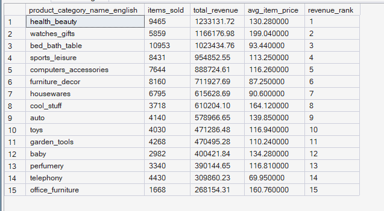
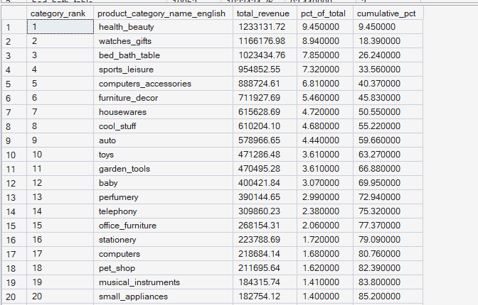
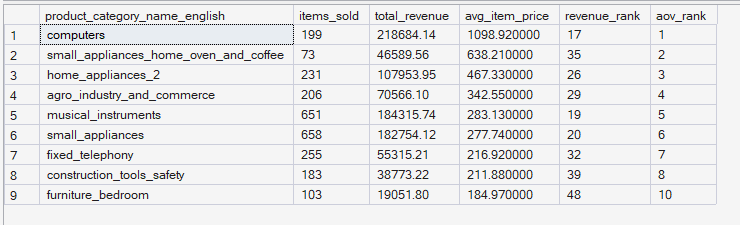

# ORGEE — Phase 4: Advanced SQL Analytics

## 06 — Category Performance

**SQL Script:** `06_category_performance.sql`

**Business Question:**  
Which product categories generate the most revenue, which categories have the highest average item value, and are the largest revenue-generating categories the same as the highest-value categories?

---

## 1. Objective

This analysis evaluates product-category performance from three perspectives:

1. **Category revenue ranking**
2. **Revenue share and cumulative concentration**
3. **High-AOV categories outside the top revenue rankings**

The objective is to understand which categories drive marketplace revenue, how concentrated revenue is across categories, and whether some relatively smaller categories generate higher-value transactions.

All analysis is performed using the completed Phase 3 enterprise SQL warehouse.

No raw CSV files are used.

---

## 2. Data Sources

### Primary Tables

- `dbo.Fact_Order_Items`
- `dbo.Dim_Product`

The analysis follows the ORGEE Kimball star schema established in Phase 3.

Only **delivered order items** are included in the revenue and category-performance analysis.

Product categories with missing English category names are excluded.

---

## 3. SQL Techniques Used

| Technique | Purpose |
|---|---|
| CTE | Creates reusable category-level analytical datasets |
| Aggregation | Calculates units sold, revenue, and average item price |
| `SUM()` | Calculates category revenue and cumulative revenue |
| `COUNT()` | Calculates items sold |
| `AVG()` | Calculates average item price |
| `RANK()` | Ranks categories by revenue and average item price |
| Window functions | Calculates running revenue and cumulative revenue share |
| `HAVING` | Restricts the high-AOV analysis to categories with at least 20 items |
| `ROUND()` | Formats revenue and price metrics |
| Star-schema joins | Connects order facts with product attributes |

---

# 4. Result Set A — Category Revenue Ranking

This analysis ranks product categories by total revenue generated from delivered order items.

The query returns the **top 15 revenue-generating categories**.

### Output Evidence

**Image:** `06A_category_revenue_ranking.png`

**Repository Path:**

`./images/06A_category_revenue_ranking.png`



### Screenshot Scope

The SQL query uses `TOP 15`, therefore the result contains exactly **15 rows**.

**Displayed rows:** 15  
**Total result rows:** 15

### Output

| Revenue Rank | Category | Items Sold | Total Revenue | Average Item Price |
|---:|---|---:|---:|---:|
| 1 | health_beauty | 9,465 | R$123,313.72 | R$130.28 |
| 2 | watches_gifts | 5,859 | R$116,617.98 | R$199.04 |
| 3 | bed_bath_table | 10,953 | R$102,343.76 | R$93.44 |
| 4 | sports_leisure | 8,431 | R$95,482.55 | R$113.25 |
| 5 | computers_accessories | 7,644 | R$88,872.61 | R$116.26 |
| 6 | furniture_decor | 8,160 | R$71,927.69 | R$87.25 |
| 7 | housewares | 6,795 | R$61,562.68 | R$90.60 |
| 8 | cool_stuff | 3,718 | R$61,020.10 | R$164.12 |
| 9 | auto | 4,140 | R$57,896.65 | R$139.85 |
| 10 | toys | 4,030 | R$47,128.46 | R$116.94 |
| 11 | garden_tools | 4,268 | R$47,049.28 | R$110.24 |
| 12 | baby | 2,982 | R$40,042.18 | R$134.28 |
| 13 | perfumery | 3,340 | R$39,014.45 | R$116.81 |
| 14 | telephony | 4,430 | R$30,986.02 | R$69.95 |
| 15 | office_furniture | 1,668 | R$26,815.31 | R$160.76 |

### Key Observation

`health_beauty` is the highest-revenue category in the captured result, generating approximately **R$123.31K** in delivered revenue.

`watches_gifts` ranks second despite having substantially fewer items sold, reflecting its higher average item price.

---

# 5. Result Set B — Category Revenue Share and Cumulative Concentration

This analysis evaluates how revenue is distributed across all qualifying product categories.

For every category, the query calculates:

- Revenue rank
- Total revenue
- Percentage of total category revenue
- Cumulative percentage of revenue

The cumulative percentage allows the analysis to evaluate the concentration of revenue across categories.

### Output Evidence

**Image:** `06B_category_revenue_concentration.png`

**Repository Path:**

`./images/06B_category_revenue_concentration.png`



### Screenshot Scope

The complete SQL result contains **71 categories**.

For GitHub documentation, the screenshot intentionally captures only the **first 20 rows** as a representative excerpt.

**Displayed rows:** 20  
**Total result rows:** 71

The SQL script remains the authoritative source for the complete 71-category ranking.

### Captured Output

| Category Rank | Category | Total Revenue | % of Total | Cumulative % |
|---:|---|---:|---:|---:|
| 1 | health_beauty | R$123,313.72 | 9.45% | 9.45% |
| 2 | watches_gifts | R$116,617.98 | 8.94% | 18.39% |
| 3 | bed_bath_table | R$102,343.76 | 7.85% | 26.24% |
| 4 | sports_leisure | R$95,482.55 | 7.32% | 33.56% |
| 5 | computers_accessories | R$88,872.61 | 6.81% | 40.37% |
| 6 | furniture_decor | R$71,927.69 | 5.46% | 45.83% |
| 7 | housewares | R$61,562.68 | 4.72% | 50.55% |
| 8 | cool_stuff | R$61,020.10 | 4.68% | 55.22% |
| 9 | auto | R$57,896.65 | 4.44% | 59.66% |
| 10 | toys | R$47,128.46 | 3.61% | 63.27% |
| 11 | garden_tools | R$47,049.28 | 3.61% | 66.88% |
| 12 | baby | R$40,042.18 | 3.07% | 69.95% |
| 13 | perfumery | R$39,014.45 | 2.99% | 72.94% |
| 14 | telephony | R$30,986.02 | 2.38% | 75.32% |
| 15 | office_furniture | R$26,815.31 | 2.06% | 77.39% |
| 16 | stationery | R$22,378.69 | 1.72% | 79.09% |
| 17 | computers | R$21,868.14 | 1.68% | 80.76% |
| 18 | pet_shop | R$21,165.94 | 1.62% | 82.39% |
| 19 | musical_instruments | R$18,435.74 | 1.41% | 83.80% |
| 20 | small_appliances | R$18,275.42 | 1.40% | 85.20% |

### Important Note on the Pareto Observation

The captured screenshot shows that the first **17 ranked categories** have a cumulative revenue share of approximately **80.76%**.

Therefore, based on the visible output:

> Approximately the top 17 categories account for just over 80% of total category revenue.

The complete 71-row result remains available through the SQL query for exact portfolio documentation and reproducibility.

---

# 6. Result Set C — High-AOV Categories Outside the Top-10 Revenue Ranking

This analysis identifies categories with relatively high average item prices that do not appear among the top 10 categories by total revenue.

The query applies a minimum threshold of **20 delivered items per category** to avoid extremely small category samples.

The result is ordered by average-item-price rank.

### Output Evidence

**Image:** `06C_high_aov_categories.png`

**Repository Path:**

`./images/06C_high_aov_categories.png`



### Screenshot Scope

The query returns **9 qualifying categories**.

**Displayed rows:** 9  
**Total result rows:** 9

This is the complete result set for the high-AOV analysis.

### Output

| AOV Rank | Category | Items Sold | Total Revenue | Average Item Price | Revenue Rank |
|---:|---|---:|---:|---:|---:|
| 1 | computers | 199 | R$21,868.14 | R$1,098.92 | 17 |
| 2 | small_appliances_home_oven_and_coffee | 73 | R$4,659.56 | R$638.21 | 35 |
| 3 | home_appliances_2 | 231 | R$107,953.95 | R$467.33 | 26 |
| 4 | agro_industry_and_commerce | 206 | R$70,566.10 | R$342.55 | 29 |
| 5 | musical_instruments | 651 | R$18,435.74 | R$283.13 | 19 |
| 6 | small_appliances | 658 | R$18,275.42 | R$277.74 | 20 |
| 7 | fixed_telephony | 255 | R$5,531.21 | R$216.92 | 32 |
| 8 | construction_tools_safety | 183 | R$38,773.22 | R$211.88 | 39 |
| 10 | furniture_bedroom | 103 | R$19,051.80 | R$184.97 | 48 |

### Key Observation

The analysis demonstrates that **high average item value does not necessarily translate into high total category revenue**.

For example:

- `computers` has the highest average item price at approximately **R$1,098.92**, but ranks only **17th** by total revenue.
- `small_appliances_home_oven_and_coffee` has an average item price of approximately **R$638.21**, while ranking **35th** by revenue.
- `furniture_bedroom` has an average item price of approximately **R$184.97**, but ranks **48th** by revenue.

This illustrates the difference between **transaction value** and **overall category scale**.

---

# 7. Key Observations

## Revenue Leadership

The highest-revenue categories are led by:

1. `health_beauty`
2. `watches_gifts`
3. `bed_bath_table`
4. `sports_leisure`
5. `computers_accessories`

These categories combine meaningful transaction volume with sufficient item value to generate substantial overall revenue.

---

## Revenue Concentration

The revenue-share analysis demonstrates meaningful concentration among the leading categories.

The first 20 categories visible in the result already account for approximately **85.20% of total category revenue**.

The **17th-ranked category** brings cumulative revenue contribution to approximately **80.76%**.

This indicates that a relatively small subset of categories drives a very large proportion of marketplace revenue.

---

## Revenue vs Average Item Value

The high-AOV analysis shows that category size and transaction value are different dimensions of performance.

A category can have:

- High average item value but relatively low total revenue
- High sales volume but lower average item value
- Both high volume and high value
- Low volume and low value

Therefore, category strategy should not rely on revenue ranking alone.

---

# 8. Business Interpretation

The category analysis reveals that marketplace revenue is concentrated among a relatively small number of product categories.

The leading categories contribute a large share of overall category revenue, while a number of smaller categories generate substantially higher average item values without achieving equivalent total revenue.

This suggests that **category scale is influenced by both transaction volume and item value**.

The distinction is particularly visible in the comparison between `health_beauty` and `computers`:

- `health_beauty` → high total revenue driven by substantial item volume
- `computers` → much higher average item price but considerably lower overall category revenue

The two categories therefore represent different commercial profiles.

---

# 9. Business Implications

The results can support several marketplace decisions:

- Prioritize major revenue-driving categories for inventory and operational planning.
- Identify high-AOV categories that may warrant additional assortment or merchandising attention.
- Avoid evaluating category attractiveness using average item price alone.
- Consider both category volume and transaction value when allocating marketing resources.
- Use cumulative revenue concentration to identify categories that have the greatest potential impact on marketplace-level revenue.
- Investigate whether high-AOV but lower-revenue categories are constrained by demand, assortment, exposure, or transaction frequency.

These findings identify **performance patterns**, but they do not establish causal reasons for category performance.

---

# 10. Signature Observation

> **The top 17 product categories account for approximately 80.76% of total category revenue, showing strong revenue concentration across categories.**

At the same time, the high-AOV analysis shows that some categories with substantially higher average item prices rank much lower in total revenue.

This demonstrates an important product-analytics distinction:

**Revenue scale ≠ transaction value.**

A category can generate high revenue through volume even when its average item value is moderate, while a premium category can have a high average item value without becoming a major revenue contributor.

---

# 11. Result Summary

| Result Set | Analysis | Total Rows | Rows Shown in Screenshot | Evidence |
|---|---|---:|---:|---|
| A | Top category revenue ranking | 15 | 15 | `06A_category_revenue_ranking.png` |
| B | Category revenue share and cumulative concentration | 71 | 20 | `06B_category_revenue_concentration.png` |
| C | High-AOV categories outside top-10 revenue ranking | 9 | 9 | `06C_high_aov_categories.png` |

### Screenshot Documentation Convention

For large SQL result sets, ORGEE uses a **representative-output approach**:

- The SQL query produces the complete analytical result.
- The GitHub documentation includes a readable screenshot excerpt.
- The number of displayed rows and total result rows are explicitly documented.
- Smaller result sets are documented in full.
- The SQL script remains the authoritative source for complete reproducibility.

This keeps the GitHub repository clean and readable while preserving the full analytical logic.

---

# 12. Execution Evidence

### SQL Source

`04_Advanced_SQL_Analytics/06_category_performance.sql`

### Results Documentation

`04_Advanced_SQL_Analytics/06_Category_Performance_Results.md`

### Screenshot Evidence

```text
04_Advanced_SQL_Analytics/
│
├── 06_category_performance.sql
├── 06_Category_Performance_Results.md
│
└── images/
    ├── 06A_category_revenue_ranking.png
    ├── 06B_category_revenue_concentration.png
    └── 06C_high_aov_categories.png
```

The screenshots provide visual execution evidence from the completed ORGEE SQL warehouse.

---

# 13. Scope Control

This analysis remains within the scope of **Phase 4 — Advanced SQL Analytics**.

It does not perform:

- Customer journey analysis
- Funnel analysis
- Cohort retention
- RFM segmentation
- CLV
- Recommendation modeling
- A/B testing
- Power BI analysis
- What-If analysis

These capabilities belong to subsequent ORGEE phases.