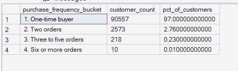
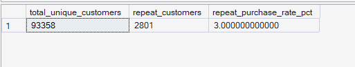
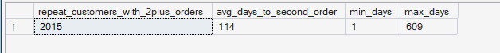

# ORGEE — Phase 4: Advanced SQL Analytics

## 07 — Customer Purchases

**SQL Script:** `07_customer_purchases.sql`

**Business Question:**  
How often do customers actually purchase? Is the business predominantly driven by one-time buyers, or is there a meaningful repeat-purchase customer base?

---

## 1. Objective

This analysis evaluates customer purchasing behavior from three perspectives:

1. **Purchase-frequency distribution**
2. **Overall repeat-purchase rate**
3. **Time between first and second orders**

The objective is to understand how frequently customers return to purchase and how large the repeat-purchase base is within the available observation period.

All analysis is performed using the completed Phase 3 enterprise SQL warehouse.

No raw CSV files are used.

---

## 2. Critical Data-Modeling Note

The Olist dataset contains two different customer identifiers with different analytical meanings.

`Dim_Customer.customer_id` is effectively an order-level identifier in the source dataset. It is not suitable for measuring repeat purchasing at the real-person level.

Therefore, this analysis groups customers using:

```text
customer_unique_id
```

This prevents the analysis from incorrectly treating every order as a separate customer.

The customer-level repeat-purchase analysis is therefore performed at the **person level**, rather than the order-level `customer_id`.

---

## 3. Data Sources

### Primary Tables

- `dbo.Fact_Order_Items`
- `dbo.Dim_Customer`
- `dbo.Dim_Date`

The analysis follows the ORGEE Kimball star schema established in Phase 3.

Only **delivered orders** are included in the customer purchase-frequency analysis.

---

## 4. SQL Techniques Used

| Technique | Purpose |
|---|---|
| CTE | Creates customer-level order datasets |
| `COUNT(DISTINCT)` | Counts unique orders per customer |
| `CASE` | Creates purchase-frequency buckets |
| `SUM()` | Calculates repeat-customer counts |
| `AVG()` | Calculates average time to second order |
| `MIN()` | Identifies the shortest observed return interval |
| `MAX()` | Identifies the longest observed return interval |
| `ROW_NUMBER()` | Establishes order sequence for each customer |
| `DATEDIFF()` | Calculates days between first and second orders |
| Window functions | Supports customer-level ordering and percentage calculations |
| Star-schema joins | Connects order facts with customer and date dimensions |

---

# 5. Result Set A — Purchase Frequency Distribution

This analysis groups customers according to the number of delivered orders they placed.

The four purchase-frequency buckets are:

- One-time buyer
- Two orders
- Three to five orders
- Six or more orders

### Output Evidence

**Image:** `07A_purchase_frequency_distribution.png`

**Repository Path:**

`./images/07A_purchase_frequency_distribution.png`



### Output

| Purchase Frequency | Customer Count | % of Customers |
|---|---:|---:|
| One-time buyer | 90,557 | 97.00% |
| Two orders | 2,573 | 2.76% |
| Three to five orders | 218 | 0.23% |
| Six or more orders | 10 | 0.01% |

**Output size:** 4 rows.

This is the complete result set for the purchase-frequency distribution.

### Key Observation

The customer base is overwhelmingly composed of one-time buyers.

Approximately **97.00% of customers placed only one delivered order**.

Only a small proportion placed multiple delivered orders.

---

# 6. Result Set B — Overall Repeat-Purchase Rate

This result provides the single headline metric for customer repeat purchasing.

A repeat customer is defined as a customer with:

```text
order_count > 1
```

at the `customer_unique_id` level.

### Output Evidence

**Image:** `07B_repeat_purchase_rate.png`

**Repository Path:**

`./images/07B_repeat_purchase_rate.png`



### Output

| Total Unique Customers | Repeat Customers | Repeat Purchase Rate |
|---:|---:|---:|
| 93,358 | 2,801 | 3.00% |

**Output size:** 1 row.

This is the complete result set for the overall repeat-purchase calculation.

### Key Observation

The executed analysis identifies:

- **93,358** unique customers with delivered orders
- **2,801** repeat customers
- **3.00%** repeat-purchase rate

This confirms that repeat purchasing represents a relatively small portion of the observed customer base.

---

# 7. Result Set C — Time to Second Order

This analysis measures how quickly customers return after their first delivered order.

For customers with at least two qualifying orders, the query identifies:

- First order date
- Second order date
- Days between the first and second orders

### Output Evidence

**Image:** `07C_time_to_second_order.png`

**Repository Path:**

`./images/07C_time_to_second_order.png`



### Output

| Repeat Customers with 2+ Orders | Average Days to Second Order | Minimum Days | Maximum Days |
|---:|---:|---:|---:|
| 2,015 | 114 | 1 | 609 |

**Output size:** 1 row.

This is the complete result set for the first-to-second-order timing analysis.

### Important Interpretation Note

The **2,015** customers in this result are the customers for whom the query identified a distinct first and second order date.

This figure should not be directly substituted for the **2,801 repeat-customer headline** in Result Set B, because the two calculations have different operational conditions around order sequencing and dates.

The executed SQL output is documented exactly as returned.

---

# 8. Key Observations

## Purchase Frequency

The customer base is strongly skewed toward one-time purchasing.

The executed result shows:

- **97.00%** one-time buyers
- **2.76%** customers with two orders
- **0.23%** customers with three to five orders
- **0.01%** customers with six or more orders

This means that customers with frequent repeat purchasing represent a very small portion of the observed population.

---

## Repeat Purchase Rate

The overall repeat-purchase rate is:

> **3.00%**

Out of **93,358 unique customers**, **2,801** placed more than one delivered order.

This establishes a clear baseline for future customer-retention analysis.

---

## Time to Second Purchase

Among the customers captured by the first-to-second-order timing calculation:

- Average time to second order: **114 days**
- Minimum observed interval: **1 day**
- Maximum observed interval: **609 days**

The average indicates that repeat purchasing, when it occurs, is generally separated by several months.

---

# 9. Business Interpretation

The executed results indicate that the marketplace is predominantly a **one-time-purchase business within the observed dataset**.

Approximately 97% of customers appear only once in the delivered-order customer base, while the overall repeat-purchase rate is approximately 3%.

The repeat customers who do return do not necessarily return immediately. The average interval to the second order is approximately **114 days**, suggesting a relatively long repurchase cycle for this customer population.

This creates an important distinction:

**Acquiring customers and retaining customers are fundamentally different growth levers.**

The current data shows a much larger one-time customer population than repeat customer population.

---

# 10. Business Implications

The results can support several future business decisions:

- Retention and re-engagement may represent a significant growth opportunity because the one-time customer population is very large.
- Marketing strategies can be designed around encouraging a second purchase rather than focusing exclusively on first-order acquisition.
- The approximately 114-day average return interval can inform the timing of future re-engagement analysis.
- Customers with multiple purchases can be studied further to identify characteristics associated with higher customer value.
- Future retention analysis should distinguish between first-time customers, repeat customers, and highly frequent purchasers.

These findings identify **observed purchasing patterns** and do not establish the causal reasons why customers do or do not return.

---

# 11. Signature Observation

> **Approximately 97% of customers are one-time buyers, resulting in an overall repeat-purchase rate of only 3.00%.**

This is a significant customer-growth signal for ORGEE.

The result suggests that the largest opportunity may not necessarily be acquiring more first-time customers, but understanding how to convert existing one-time buyers into repeat customers.

The subsequent Customer Journey, Cohort, RFM, and CLV phases can build on this baseline without duplicating the Phase 4 analysis.

---

# 12. Result Summary

| Result Set | Analysis | Total Rows | Rows Shown in Screenshot | Evidence |
|---|---|---:|---:|---|
| A | Purchase-frequency distribution | 4 | 4 | `07A_purchase_frequency_distribution.png` |
| B | Overall repeat-purchase rate | 1 | 1 | `07B_repeat_purchase_rate.png` |
| C | Time to second order | 1 | 1 | `07C_time_to_second_order.png` |

All three result sets are small enough to document completely.

---

# 13. Screenshot Documentation Convention

ORGEE uses the following documentation convention for SQL result evidence:

- Small result sets are documented in full.
- Large result sets are documented using a representative screenshot excerpt.
- The total number of rows is explicitly stated.
- The number of displayed rows is explicitly stated.
- Screenshot filenames use the corresponding SQL analysis number and result-set letter.
- The SQL script remains the authoritative source for complete reproducibility.

For this analysis, all three result sets are small and therefore the screenshots represent the complete returned outputs.

---

# 14. Execution Evidence

### SQL Source

`04_Advanced_SQL_Analytics/07_customer_purchases.sql`

### Results Documentation

`04_Advanced_SQL_Analytics/07_Customer_Purchases_Results.md`

### Screenshot Evidence

```text
04_Advanced_SQL_Analytics/
│
├── 07_customer_purchases.sql
├── 07_Customer_Purchases_Results.md
│
└── images/
    ├── 07A_purchase_frequency_distribution.png
    ├── 07B_repeat_purchase_rate.png
    └── 07C_time_to_second_order.png
```

The screenshots provide visual execution evidence from the completed ORGEE SQL warehouse.

---

# 15. Scope Control

This analysis remains within the scope of **Phase 4 — Advanced SQL Analytics**.

It does not perform:

- Customer journey mapping
- Funnel analysis
- Session drop-off analysis
- Cohort retention curves
- RFM segmentation
- CLV
- Recommendation modeling
- A/B testing
- Power BI analysis
- What-If analysis

These capabilities belong to subsequent ORGEE phases.