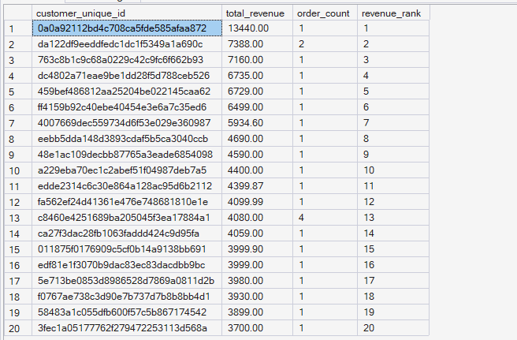
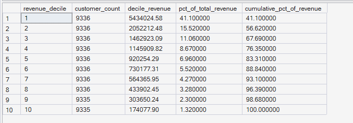
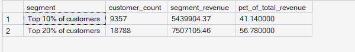

# ORGEE — Phase 4: Advanced SQL Analytics

## 08 — Customer Revenue Contribution

**SQL Script:** `08_customer_revenue_contribution.sql`

**Business Question:**  
How concentrated is revenue among top customers? What share of total revenue comes from the highest-value 10% and 20% of customers?

---

## 1. Objective

This analysis evaluates customer revenue concentration from three perspectives:

1. **Revenue generated by individual customers**
2. **Revenue contribution across customer deciles**
3. **Revenue contribution of the top 10% and top 20% of customers**

The objective is to determine whether revenue is broadly distributed across the customer base or concentrated among a relatively small group of high-value customers.

This analysis provides the **signature insight for Phase 4 — Advanced SQL Analytics**.

All analysis is performed using the completed Phase 3 enterprise SQL warehouse.

No raw CSV files are used.

---

## 2. Critical Data-Modeling Note

The Olist dataset contains two customer identifiers with different analytical meanings.

`Dim_Customer.customer_id` is effectively an order-level identifier in the source dataset.

For customer-level revenue analysis, grouping by `customer_id` would incorrectly treat individual orders as separate customers and would hide the actual concentration of revenue.

Therefore, this analysis uses:

```text
customer_unique_id
```

as the person-level customer identifier.

Revenue is calculated from delivered order items only.

This ensures that revenue contribution is measured at the actual customer/person level.

---

## 3. Data Sources

### Primary Tables

- `dbo.Fact_Order_Items`
- `dbo.Dim_Customer`

The analysis follows the ORGEE Kimball star schema established in Phase 3.

### Revenue Definition

For this analysis:

```text
Customer Revenue
=
SUM(Fact_Order_Items.price)
for delivered order items
```

Revenue is therefore based on realized delivered-order value rather than gross order-item value across all order statuses.

---

## 4. SQL Techniques Used

| Technique | Purpose |
|---|---|
| CTE | Builds reusable customer-level revenue datasets |
| `SUM()` | Calculates customer and segment revenue |
| `COUNT(DISTINCT)` | Determines customer/order counts |
| `RANK()` | Ranks customers by revenue |
| `NTILE(10)` | Divides customers into revenue deciles |
| `PERCENT_RANK()` | Identifies top customer segments by relative rank |
| Window `SUM()` | Calculates cumulative revenue contribution |
| Aggregation | Calculates revenue by customer segment |
| Star-schema joins | Connects order facts with customer data |

---

# 5. Result Set A — Top 20 Customers by Revenue

This analysis ranks customers according to their total delivered-order revenue.

The query returns the top 20 customers by revenue.

### Output Evidence

**Image:** `08A_top_customers_by_revenue.png`

**Repository Path:**

`./images/08A_top_customers_by_revenue.png`



### Screenshot Scope

The query returns the top 20 customers.

**Displayed rows:** 20

**Total result rows:** 20

Therefore, the screenshot represents the complete result set.

### Output Columns

| Column | Description |
|---|---|
| `customer_unique_id` | Person-level customer identifier |
| `total_revenue` | Total delivered-order revenue generated by the customer |
| `order_count` | Number of delivered orders |
| `revenue_rank` | Revenue ranking |

### Highest-Revenue Customer in Captured Output

The highest-ranked customer generated:

**R$13,440.00**

from **1 delivered order**.

The remaining top customers demonstrate that high customer revenue is not necessarily associated with a high order count within this dataset.

---

# 6. Result Set B — Revenue Decile Contribution

This is the primary concentration analysis.

Customers are divided into ten revenue deciles using:

```text
NTILE(10)
```

The highest-revenue customers are placed into the first decile, followed by progressively lower-revenue groups.

The analysis calculates:

- Number of customers per decile
- Revenue generated by each decile
- Percentage of total revenue
- Cumulative percentage of revenue

### Output Evidence

**Image:** `08B_revenue_decile_contribution.png`

**Repository Path:**

`./images/08B_revenue_decile_contribution.png`



### Output

| Revenue Decile | Customer Count | Decile Revenue | % of Total Revenue | Cumulative % of Revenue |
|---:|---:|---:|---:|---:|
| 1 | 9,336 | R$5,434,024.58 | 41.11% | 41.11% |
| 2 | 9,336 | R$2,052,212.48 | 15.52% | 56.62% |
| 3 | 9,336 | R$1,462,923.09 | 11.06% | 67.69% |
| 4 | 9,336 | R$1,145,909.82 | 8.67% | 76.35% |
| 5 | 9,336 | R$920,254.29 | 6.96% | 83.31% |
| 6 | 9,336 | R$730,177.31 | 5.52% | 88.84% |
| 7 | 9,336 | R$564,365.95 | 4.27% | 93.10% |
| 8 | 9,336 | R$433,902.45 | 3.28% | 96.39% |
| 9 | 9,335 | R$303,650.24 | 2.30% | 98.68% |
| 10 | 9,335 | R$174,077.90 | 1.32% | 100.00% |

**Output size:** 10 rows.

This is the complete result set for the revenue-decile analysis.

### Key Observation

The revenue distribution is highly concentrated.

The first revenue decile alone contributes approximately **41.11%** of total revenue.

The first two deciles together contribute approximately **56.62%** of total revenue.

The concentration progressively declines across the lower-value customer deciles.

---

# 7. Result Set C — Top 10% and Top 20% Revenue Contribution

This query provides the headline customer-revenue concentration figures used for the Phase 4 signature insight.

### Output Evidence

**Image:** `08C_top_customer_revenue_contribution.png`

**Repository Path:**

`./images/08C_top_customer_revenue_contribution.png`



### Output

| Segment | Customer Count | Segment Revenue | % of Total Revenue |
|---|---:|---:|---:|
| Top 10% of customers | 9,357 | R$5,439,904.37 | **41.14%** |
| Top 20% of customers | 18,788 | R$7,507,105.46 | **56.78%** |

**Output size:** 2 rows.

This is the complete result set for the headline customer concentration analysis.

---

# 8. Key Observations

## Revenue Concentration Is Strong

The most important finding from this analysis is that revenue is not evenly distributed across customers.

The highest-value customer segment contributes a disproportionately large share of total revenue.

The executed headline analysis shows:

- **Top 10% of customers → 41.14% of total revenue**
- **Top 20% of customers → 56.78% of total revenue**

Therefore, one-fifth of the customer base accounts for more than half of the observed delivered-order revenue.

---

## Decile-Level Pattern

The revenue decile analysis reinforces the concentration finding.

The first decile contributes approximately:

**41.11%**

of total revenue.

The first two deciles together contribute approximately:

**56.62%**

of total revenue.

By comparison, the lowest revenue decile contributes only:

**1.32%**

of total revenue.

This demonstrates a strong long-tail pattern in customer revenue contribution.

---

# 9. Business Interpretation

The customer base exhibits a substantial concentration of revenue among higher-value customers.

The top 10% of customers generate approximately 41% of total delivered-order revenue, while the top 20% generate approximately 57%.

This means that a relatively small portion of customers represents a disproportionately large share of the business's observed revenue.

The result provides an important foundation for later ORGEE phases.

Rather than treating every customer as equally valuable, future customer analytics can distinguish customers according to their economic contribution.

---

# 10. Business Implications

The concentration pattern has several potential business implications.

### Customer Retention

High-value customers may warrant stronger retention and re-engagement strategies because losing a small number of high-value customers could have a larger revenue impact than losing an equivalent number of low-value customers.

### Customer Segmentation

Future RFM and CLV analysis can use this revenue-concentration baseline to identify and characterize high-value customer groups.

### Marketing Allocation

Customer acquisition and retention investments do not necessarily need to be distributed uniformly.

High-value customer segments may justify differentiated engagement strategies.

### Executive Risk Awareness

Revenue concentration creates a potential dependency on a relatively small group of customers.

Executives should therefore monitor both:

```text
Customer Count
       +
Revenue Contribution
```

rather than relying on customer volume alone.

These are business implications derived from the observed concentration pattern; they do not establish that customer concentration is the causal reason for future revenue outcomes.

---

# 11. Signature Insight ⭐

> **The top 10% of customers generate 41.14% of total revenue, while the top 20% generate 56.78%.**

This is the primary **Phase 4 Signature Insight**.

It demonstrates that ORGEE can move beyond simple revenue totals and identify **how revenue is distributed across the customer base**.

The finding is calculated directly from the completed warehouse and is not a predetermined benchmark or fabricated result.

---

# 12. Signature Insight Framework

The Phase 4 blueprint requires major analytical phases to produce an actual business finding.

For this analysis:

```text
Customer Revenue
        ↓
Customer-Level Aggregation
        ↓
Revenue Ranking
        ↓
Revenue Deciles
        ↓
Top 10% / Top 20%
        ↓
Revenue Concentration
        ↓
Executive Insight
```

### Actual Finding

```text
Top 10% of customers
        ↓
41.14% of revenue

Top 20% of customers
        ↓
56.78% of revenue
```

This directly satisfies the Phase 4 signature-insight requirement.

---

# 13. Result Summary

| Result Set | Analysis | Total Rows | Rows Shown in Screenshot | Evidence |
|---|---|---:|---:|---|
| A | Top customers by revenue | 20 | 20 | `08A_top_customers_by_revenue.png` |
| B | Revenue decile contribution | 10 | 10 | `08B_revenue_decile_contribution.png` |
| C | Top 10% / Top 20% contribution | 2 | 2 | `08C_top_customer_revenue_contribution.png` |

All three result sets are small enough to document completely.

---

# 14. Screenshot Documentation Convention

ORGEE uses a consistent documentation approach for SQL result evidence.

### Small Result Sets

When a result set is small enough to display clearly:

- The complete result is captured.
- The screenshot contains all returned rows.
- The result count is explicitly documented.

### Large Result Sets

When a SQL query produces a large result:

- A representative screenshot excerpt is captured.
- The total result-row count is documented.
- The number of displayed rows is documented.
- The SQL script remains the authoritative source for the complete result.

This keeps the GitHub repository readable while preserving reproducibility.

---

# 15. Execution Evidence

### SQL Source

`04_Advanced_SQL_Analytics/08_customer_revenue_contribution.sql`

### Results Documentation

`04_Advanced_SQL_Analytics/08_Customer_Revenue_Contribution_Results.md`

### Screenshot Evidence

```text
04_Advanced_SQL_Analytics/
│
├── 08_customer_revenue_contribution.sql
├── 08_Customer_Revenue_Contribution_Results.md
│
└── images/
    ├── 08A_top_customers_by_revenue.png
    ├── 08B_revenue_decile_contribution.png
    └── 08C_top_customer_revenue_contribution.png
```

The screenshots provide visual execution evidence from the completed ORGEE SQL warehouse.

---

# 16. Reproducibility

The complete analytical logic is available in:

```text
08_customer_revenue_contribution.sql
```

The SQL script contains:

1. Customer-level revenue aggregation
2. Revenue ranking
3. Revenue decile calculation
4. Cumulative revenue calculation
5. Top 10% revenue contribution
6. Top 20% revenue contribution

The Markdown document provides the business-facing interpretation and visual evidence, while the SQL script provides the reproducible analytical implementation.

---

# 17. Scope Control

This analysis remains within the scope of:

**Phase 4 — Advanced SQL Analytics**

It does not perform:

- RFM segmentation
- CLV modeling
- Customer journey analysis
- Funnel analysis
- Cohort retention
- Recommendation modeling
- A/B testing
- Statistical experimentation
- Power BI dashboard development
- What-If analysis

These capabilities belong to subsequent ORGEE phases.

---

# 18. Phase 4 Connection

This analysis establishes an important baseline for the later customer analytics phases.

The progression is:

```text
Phase 4
Customer Revenue Concentration
        ↓
Who generates the revenue?
        ↓
Phase 5
Customer Journey & Retention
        ↓
Where do customers drop off?
        ↓
Phase 6
RFM + CLV + Customer Value
        ↓
Which customers are most valuable?
        ↓
Phase 7
Recommendation Intelligence
        ↓
What should we recommend?
        ↓
Phase 8
Experimentation
        ↓
Does personalization improve conversion?
```

Therefore, this Phase 4 analysis is intentionally limited to **describing what happened**, while deeper customer-value and retention decisions are reserved for the appropriate later phases.