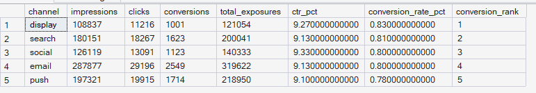
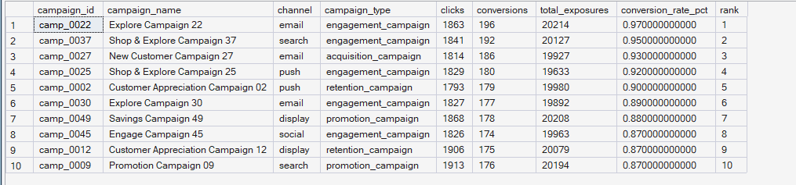
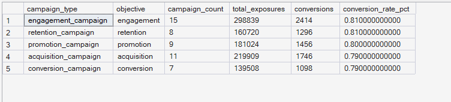

# ORGEE — Phase 4: Advanced SQL Analytics

## 09 — Marketing Performance

**SQL Script:** `09_marketing_performance.sql`

**Business Question:**  
Which campaigns and channels perform best in terms of click-through and conversion? Do the channels with the highest exposure volume also demonstrate the strongest conversion efficiency?

---

## 1. Objective

This analysis evaluates marketing performance from three perspectives:

1. **Channel-level performance**
2. **Campaign-level performance**
3. **Campaign-type performance**

The objective is to determine which marketing channels and campaign types generate the strongest engagement and conversion outcomes.

The analysis focuses on:

- Impressions
- Clicks
- Conversions
- Click-through rate (CTR)
- Conversion rate
- Campaign-level performance
- Campaign-type performance

This analysis intentionally remains at the **campaign/channel aggregate level**.

All analysis is performed using the completed Phase 3 enterprise SQL warehouse.

No raw CSV files are used.

---

## 2. Scope Boundary

This analysis uses:

```text
dbo.Fact_Campaign_Exposures
        +
dbo.Dim_Campaign
```

It deliberately does **not** use:

- `Fact_Events`
- `Fact_Sessions`
- Session-level behavior
- Funnel analysis
- Customer journey analysis
- Drop-off analysis

Those capabilities belong to later ORGEE phases, particularly Phase 5.

Therefore, this analysis answers:

> **What happened at the campaign/channel level?**

rather than:

> **How did customers move through the journey?**

This keeps the analysis aligned with the Phase 4 business question.

---

# 3. Data Sources

### Primary Tables

- `dbo.Fact_Campaign_Exposures`
- `dbo.Dim_Campaign`

### Key Fields Used

| Field | Purpose |
|---|---|
| `channel` | Marketing channel |
| `exposure_outcome` | Impression, click, or conversion |
| `campaign_id` | Campaign identifier |
| `campaign_name` | Campaign name |
| `campaign_type` | Campaign classification |
| `objective` | Campaign objective |

---

# 4. Metric Definitions

### Impressions

Number of exposure records where:

```text
exposure_outcome = 'impression'
```

### Clicks

Number of exposure records where:

```text
exposure_outcome = 'click'
```

### Conversions

Number of exposure records where:

```text
exposure_outcome = 'conversion'
```

### Total Exposures

Total number of campaign exposure records.

### Click-Through Rate

```text
CTR
=
Clicks / Total Exposures × 100
```

### Conversion Rate

```text
Conversion Rate
=
Conversions / Total Exposures × 100
```

The conversion-rate definition is intentionally based on total exposures, consistent with the SQL implementation.

---

# 5. SQL Techniques Used

| Technique | Purpose |
|---|---|
| CTE | Creates reusable channel and campaign-level analytical datasets |
| `CASE` | Converts exposure outcomes into analytical stages |
| `SUM()` | Calculates impressions, clicks, and conversions |
| `COUNT()` | Calculates total exposure volume |
| `COUNT(DISTINCT)` | Counts unique campaigns |
| `NULLIF()` | Prevents division-by-zero errors |
| `ROUND()` | Formats percentage metrics |
| `RANK()` | Ranks channels and campaigns by conversion performance |
| Aggregation | Produces channel, campaign, and campaign-type summaries |
| Star-schema joins | Connects campaign exposure facts with campaign dimensions |

---

# 6. Result Set A — Channel-Level Marketing Performance

This analysis compares the five available marketing channels using:

- Impressions
- Clicks
- Conversions
- Total exposures
- CTR
- Conversion rate
- Conversion rank

### Output

| Channel | Impressions | Clicks | Conversions | Total Exposures | CTR | Conversion Rate | Conversion Rank |
|---|---:|---:|---:|---:|---:|---:|---:|
| display | 108,837 | 11,216 | 1,001 | 121,054 | 9.27% | **0.83%** | 1 |
| search | 180,151 | 18,267 | 1,623 | 200,041 | 9.13% | **0.81%** | 2 |
| social | 126,119 | 13,091 | 1,123 | 140,333 | 9.33% | **0.80%** | 3 |
| email | 287,877 | 29,196 | 2,549 | 319,622 | 9.13% | **0.80%** | 4 |
| push | 197,321 | 19,915 | 1,714 | 218,950 | 9.10% | **0.78%** | 5 |

**Output size:** 5 rows.

This is the complete result set for the channel-level analysis.

---

## Output Evidence

**Image:** `09A_channel_performance.png`

**Repository Path:**

`./images/09A_channel_performance.png`



### Screenshot Scope

**Displayed rows:** 5

**Total result rows:** 5

The screenshot captures the complete channel-level result.

---

# 7. Channel-Level Observations

## Conversion Performance

`display` ranks first by conversion rate:

```text
Display conversion rate = 0.83%
```

followed by:

```text
Search  = 0.81%
Social  = 0.80%
Email   = 0.80%
Push    = 0.78%
```

The absolute differences between channels are relatively small, but the ranking demonstrates that exposure volume alone does not determine conversion efficiency.

## Volume vs Efficiency

`email` generates the largest exposure volume:

```text
319,622 total exposures
```

and also generates the highest number of conversions:

```text
2,549 conversions
```

However, its conversion rate is **0.80%**, placing it fourth among the five channels.

By contrast, `display` generates substantially fewer total exposures:

```text
121,054
```

but achieves the highest conversion rate:

```text
0.83%
```

This demonstrates the difference between **scale** and **conversion efficiency**.

---

# 8. Result Set B — Campaign-Level Performance

This analysis evaluates individual campaigns and ranks them according to conversion rate.

To reduce the influence of campaigns with very small exposure volumes, only campaigns with at least:

```text
1,000 exposures
```

are included.

The query returns the top 10 campaigns by conversion rate.

### Output

| Rank | Campaign ID | Campaign Name | Channel | Campaign Type | Clicks | Conversions | Total Exposures | Conversion Rate |
|---:|---|---|---|---|---:|---:|---:|---:|
| 1 | `camp_0022` | Explore Campaign 22 | email | engagement_campaign | 1,863 | 196 | 20,214 | **0.97%** |
| 2 | `camp_0037` | Shop & Explore Campaign 37 | search | engagement_campaign | 1,841 | 192 | 20,127 | **0.95%** |
| 3 | `camp_0027` | New Customer Campaign 27 | email | acquisition_campaign | 1,814 | 186 | 19,927 | **0.93%** |
| 4 | `camp_0025` | Shop & Explore Campaign 25 | push | engagement_campaign | 1,829 | 180 | 19,633 | **0.92%** |
| 5 | `camp_0002` | Customer Appreciation Campaign 02 | push | retention_campaign | 1,793 | 179 | 19,980 | **0.90%** |
| 6 | `camp_0030` | Explore Campaign 30 | email | engagement_campaign | 1,827 | 177 | 19,892 | **0.89%** |
| 7 | `camp_0049` | Savings Campaign 49 | display | promotion_campaign | 1,868 | 178 | 20,208 | **0.88%** |
| 8 | `camp_0045` | Engage Campaign 45 | social | engagement_campaign | 1,826 | 174 | 19,963 | **0.87%** |
| 9 | `camp_0012` | Customer Appreciation Campaign 12 | display | retention_campaign | 1,906 | 175 | 20,079 | **0.87%** |
| 10 | `camp_0009` | Promotion Campaign 09 | search | promotion_campaign | 1,913 | 176 | 20,194 | **0.87%** |

**Output size:** 10 rows.

This is the complete result set returned by the `TOP 10` campaign query.

---

## Output Evidence

**Image:** `09B_campaign_performance.png`

**Repository Path:**

`./images/09B_campaign_performance.png`



### Screenshot Scope

**Displayed rows:** 10

**Total result rows:** 10

The screenshot captures the complete result set returned by the query.

---

# 9. Campaign-Level Observations

The highest-ranked campaign is:

```text
Explore Campaign 22
```

with a conversion rate of:

```text
0.97%
```

The second-ranked campaign achieves:

```text
0.95%
```

The top 10 campaigns range from approximately:

```text
0.87% – 0.97%
```

The highest-performing campaigns are distributed across several channels rather than being concentrated in a single channel.

The visible top-performing campaigns include:

- Email
- Search
- Push
- Display
- Social

This suggests that strong campaign performance is not exclusive to one marketing channel.

---

# 10. Result Set C — Campaign-Type Performance

This analysis evaluates performance according to campaign type and objective.

It calculates:

- Campaign count
- Total exposures
- Conversions
- Conversion rate

### Output

| Campaign Type | Objective | Campaign Count | Total Exposures | Conversions | Conversion Rate |
|---|---|---:|---:|---:|---:|
| engagement_campaign | engagement | 15 | 298,839 | 2,414 | **0.81%** |
| retention_campaign | retention | 8 | 160,720 | 1,296 | **0.81%** |
| promotion_campaign | promotion | 9 | 181,024 | 1,456 | **0.80%** |
| acquisition_campaign | acquisition | 11 | 219,009 | 1,746 | **0.80%** |
| conversion_campaign | conversion | 7 | 139,508 | 1,098 | **0.79%** |

**Output size:** 5 rows.

This is the complete result set for the campaign-type analysis.

---

## Output Evidence

**Image:** `09C_campaign_type_performance.png`

**Repository Path:**

`./images/09C_campaign_type_performance.png`



### Screenshot Scope

**Displayed rows:** 5

**Total result rows:** 5

The screenshot captures the complete campaign-type result.

---

# 11. Campaign-Type Observations

The conversion-rate differences between campaign types are relatively narrow.

The highest observed conversion rate is:

```text
Engagement Campaign
0.81%
```

and the lowest is:

```text
Conversion Campaign
0.79%
```

Therefore, campaign type does not show a large difference in aggregate conversion efficiency within this dataset.

Engagement and retention campaigns have the highest observed conversion rate at approximately **0.81%**, while promotion and acquisition campaigns are approximately **0.80%**.

---

# 12. Key Findings

## Finding 1 — Display Has the Highest Channel Conversion Rate

Among the five channels:

```text
Display = 0.83%
Search  = 0.81%
Social  = 0.80%
Email   = 0.80%
Push    = 0.78%
```

`display` therefore ranks first on conversion efficiency.

---

## Finding 2 — Email Has the Highest Conversion Volume

Although `display` has the highest conversion rate, `email` generates the largest number of conversions:

```text
Email conversions = 2,549
```

This is primarily associated with its much larger exposure volume.

This demonstrates an important distinction:

```text
Conversion Volume ≠ Conversion Efficiency
```

A channel can generate more total conversions because of greater scale without having the highest conversion rate.

---

## Finding 3 — The Best Individual Campaign Reaches 0.97%

The highest-ranked campaign in the executed result is:

```text
Explore Campaign 22
```

with:

```text
196 conversions
20,214 exposures
0.97% conversion rate
```

This provides a campaign-level benchmark within the current dataset.

---

## Finding 4 — Campaign Types Are Relatively Similar

Campaign-type conversion rates range from:

```text
0.79% to 0.81%
```

The relatively narrow range suggests that campaign type alone does not create a large difference in aggregate conversion efficiency in this dataset.

---

# 13. Business Interpretation

The marketing data shows a meaningful distinction between **reach** and **efficiency**.

`email` provides the largest exposure and conversion volume, while `display` achieves the highest conversion rate.

Therefore, the channel producing the most conversions is not necessarily the channel converting the most efficiently.

At the campaign level, the strongest campaigns span multiple channels, indicating that high performance is not limited to a single channel.

Campaign-type performance is relatively stable, with only a small difference between the highest and lowest conversion rates.

Overall, the results indicate that marketing performance should be evaluated using both:

```text
Scale
+
Efficiency
```

rather than relying on exposure volume or conversion count alone.

---

# 14. Business Implications

The results can support several business decisions.

### Evaluate Efficiency Alongside Volume

Marketing performance should consider both conversion volume and conversion rate.

A high-volume channel can produce many conversions while still having lower conversion efficiency.

### Identify High-Performing Campaigns

Campaigns with stronger conversion rates can be investigated further to understand whether their:

- Audience
- Messaging
- Offer
- Channel
- Campaign objective

contribute to their stronger performance.

### Avoid Channel-Level Overgeneralization

Because the highest-performing campaigns appear across multiple channels, decisions should not be based solely on the aggregate performance of a channel.

Individual campaign execution can matter.

### Use Additional Business Data Before Budget Reallocation

This dataset contains exposure, click, and conversion outcomes but does not provide campaign spend in the analyzed result.

Therefore, this analysis **does not claim that marketing budget should immediately be shifted** between channels.

A true return-on-investment decision would require cost/spend data.

---

# 15. Signature Observation ⭐

> **Display has the highest channel-level conversion rate at 0.83%, while email generates the highest conversion volume at 2,549 conversions due to its substantially larger exposure volume.**

This demonstrates that:

```text
Highest Conversion Rate
        ≠
Highest Conversion Volume
```

The finding is based directly on the executed warehouse output.

It is not a predetermined result.

---

# 16. Business Insight Framework

The Phase 4 analytical framework is:

```text
Marketing Exposure Data
        ↓
Channel Aggregation
        ↓
Campaign Aggregation
        ↓
Campaign-Type Analysis
        ↓
Conversion Efficiency
        ↓
Business Interpretation
```

The actual finding is:

```text
Display
   ↓
Highest Conversion Rate
   ↓
0.83%

Email
   ↓
Highest Conversion Volume
   ↓
2,549 conversions
```

This provides a concrete business insight from the available marketing data.

---

# 17. Result Summary

| Result Set | Analysis | Total Rows | Rows Shown | Evidence |
|---|---|---:|---:|---|
| A | Channel-level performance | 5 | 5 | `09A_channel_performance.png` |
| B | Campaign-level performance | 10 | 10 | `09B_campaign_performance.png` |
| C | Campaign-type performance | 5 | 5 | `09C_campaign_type_performance.png` |

All three result sets are fully captured in the corresponding screenshots.

---

# 18. Screenshot Documentation Convention

ORGEE uses a consistent documentation approach for SQL result evidence.

### Small Result Sets

When the result set is small enough to display clearly:

- The complete result is captured.
- All returned rows are shown.
- The total row count is documented.
- The screenshot provides direct execution evidence.

### Large Result Sets

When a query produces a larger result set:

- A representative screenshot excerpt is captured.
- The total result-row count is documented.
- The number of displayed rows is documented.
- The SQL script remains the authoritative source for the complete result.

This keeps the GitHub repository readable while maintaining transparency and reproducibility.

---

# 19. Execution Evidence

### SQL Source

`04_Advanced_SQL_Analytics/09_marketing_performance.sql`

### Results Documentation

`04_Advanced_SQL_Analytics/09_Marketing_Performance_Results.md`

### Screenshot Evidence

```text
04_Advanced_SQL_Analytics/
│
├── 09_marketing_performance.sql
├── 09_Marketing_Performance_Results.md
│
└── images/
    ├── 09A_channel_performance.png
    ├── 09B_campaign_performance.png
    └── 09C_campaign_type_performance.png
```

The screenshots provide visual execution evidence from the completed ORGEE SQL warehouse.

---

# 20. Reproducibility

The complete analytical logic is available in:

```text
09_marketing_performance.sql
```

The SQL script contains:

1. Channel-level performance analysis
2. CTR calculation
3. Conversion-rate calculation
4. Channel ranking
5. Campaign-level performance ranking
6. Minimum-exposure filtering
7. Campaign-type performance analysis

The Markdown document provides the business-facing explanation and visual execution evidence, while the SQL script provides the complete reproducible implementation.

---

# 21. Scope Control

This analysis remains within the scope of:

**Phase 4 — Advanced SQL Analytics**

It does not perform:

- Customer journey analysis
- Funnel analysis
- Session drop-off analysis
- Cohort retention
- RFM segmentation
- CLV
- Recommendation modeling
- A/B testing
- Statistical experimentation
- Power BI dashboard development
- What-If analysis

These capabilities belong to subsequent ORGEE phases.

---

# 22. Phase 4 Connection

This analysis completes the marketing-performance component of Phase 4.

The broader ORGEE progression is:

```text
Phase 4 — Advanced SQL Analytics
        ↓
What happened?
        ↓
Revenue
Products
Inventory
Sellers
Categories
Customers
Marketing
        ↓
Phase 5 — Customer Journey Analytics
        ↓
Where do customers drop off?
        ↓
Phase 6 — Customer & Product Analytics
        ↓
Which customers and products are most valuable?
        ↓
Phase 7 — Recommendation Intelligence
        ↓
What should we recommend?
        ↓
Phase 8 — Experimentation
        ↓
Does personalization improve conversion?
```

Therefore, this analysis intentionally stops at **aggregate marketing performance** and does not cross into customer-level journey or experimentation analysis.