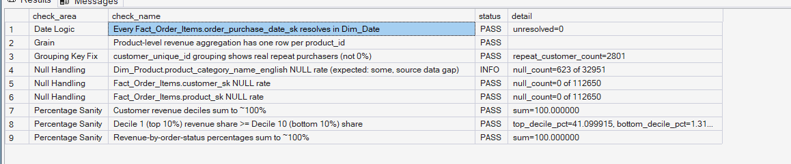
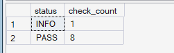

# ORGEE — Phase 4: Advanced SQL Analytics

## 10 — Phase 4 Validation

**SQL Script:** `10_phase4_validation.sql`

**Purpose:**  
Validate the assumptions, data relationships, analytical calculations, grouping logic, percentage calculations, and ranking logic used throughout the Phase 4 Advanced SQL Analytics scripts.

---

## 1. Objective

The Phase 4 validation script performs a final analytical sanity check across the SQL analyses developed in scripts `01` through `09`.

The validation focuses on:

1. NULL handling
2. Customer-level grouping logic
3. Date-key integrity
4. Percentage calculations
5. Revenue concentration logic
6. Product-level grain integrity
7. Analytical consistency

The objective is not to replace the individual SQL analyses, but to verify that the major assumptions and calculations used throughout Phase 4 behave as expected against the completed Phase 3 warehouse.

All validation is performed against the ORGEE enterprise SQL warehouse.

No raw CSV files are used.

---

# 2. Validation Framework

The validation follows the same **PASS / FAIL / INFO** pattern established during earlier ORGEE data-quality validation.

Each check produces:

- `check_area`
- `check_name`
- `status`
- `detail`

The script then produces an overall validation summary.

### Status Definitions

| Status | Meaning |
|---|---|
| `PASS` | The validation condition was satisfied |
| `FAIL` | The validation condition was not satisfied and requires investigation |
| `INFO` | Informational observation that is not treated as a failure |

---

# 3. Validation Checks

The script performs **9 validation checks** across the following areas:

| # | Check Area | Validation |
|---:|---|---|
| 1 | Date Logic | Every `Fact_Order_Items.order_purchase_date_sk` resolves to `Dim_Date` |
| 2 | Grain | Product-level revenue aggregation contains one row per product |
| 3 | Grouping Key Fix | `customer_unique_id` grouping identifies real repeat purchasers |
| 4 | Null Handling | Product English-category NULL rate |
| 5 | Null Handling | `Fact_Order_Items.customer_sk` NULL rate |
| 6 | Null Handling | `Fact_Order_Items.product_sk` NULL rate |
| 7 | Percentage Sanity | Customer revenue deciles sum to approximately 100% |
| 8 | Percentage Sanity | Top revenue decile exceeds or equals bottom decile |
| 9 | Percentage Sanity | Revenue-by-order-status percentages sum to approximately 100% |

---

# 4. Result Set A — Detailed Validation Results

### Output Evidence

**Image:** `10A_phase4_validation_results.png`

**Repository Path:**

`./images/10A_phase4_validation_results.png`



### Output Scope

**Displayed validation rows:** 9  
**Total validation checks:** 9

The screenshot captures the complete detailed validation result.

---

# 5. Detailed Validation Results

| # | Check Area | Validation | Status | Result |
|---:|---|---|---|---|
| 1 | Date Logic | Every `Fact_Order_Items.order_purchase_date_sk` resolves in `Dim_Date` | **PASS** | `unresolved=0` |
| 2 | Grain | Product-level revenue aggregation has one row per `product_id` | **PASS** | No duplicate product-level aggregation |
| 3 | Grouping Key Fix | `customer_unique_id` grouping shows real repeat purchasers | **PASS** | `repeat_customer_count=2801` |
| 4 | Null Handling | `Dim_Product.product_category_name_english` NULL rate | **INFO** | `623 of 32,951` |
| 5 | Null Handling | `Fact_Order_Items.customer_sk` NULL rate | **PASS** | `null_count=0 of 112,650` |
| 6 | Null Handling | `Fact_Order_Items.product_sk` NULL rate | **PASS** | `null_count=0 of 112,650` |
| 7 | Percentage Sanity | Customer revenue deciles sum to 100% | **PASS** | `sum=100.000000` |
| 8 | Percentage Sanity | Decile 1 revenue share ≥ Decile 10 revenue share | **PASS** | Top decile share exceeds bottom decile share |
| 9 | Percentage Sanity | Revenue-by-order-status percentages sum to 100% | **PASS** | `sum=100.000000` |

---

# 6. Validation Finding — Date Integrity

The validation confirms that every populated order purchase date key in `Fact_Order_Items` successfully resolves to a corresponding row in `Dim_Date`.

### Result

```text
unresolved = 0
```

### Status

**PASS**

This confirms that the Phase 4 revenue analyses can safely use the warehouse date dimension for order-date analysis without orphaned date keys.

---

# 7. Validation Finding — Product Grain

The product-level aggregation used in the product analytics was checked to ensure that the aggregation produces one analytical row per `product_id`.

### Result

**PASS**

No duplicate product-level aggregation was detected.

This is important because duplicate product rows caused by an unintended fan-out could distort:

- Units sold
- Revenue
- Product rankings
- Volume-vs-revenue comparisons

The validation confirms that the product-level aggregation maintains the intended analytical grain.

---

# 8. Validation Finding — Customer Grouping Key

The customer purchase analysis requires person-level grouping using:

```text
customer_unique_id
```

rather than the order-level `customer_id`.

The validation confirms that this grouping produces actual repeat purchasers.

### Result

```text
repeat_customer_count = 2,801
```

### Status

**PASS**

This confirms that the customer-level analysis is not suffering from the previously identified one-order-per-`customer_id` issue.

The result supports the Phase 4 customer purchase and revenue-concentration analyses.

---

# 9. Validation Finding — Product Category NULLs

The validation identified:

```text
623 of 32,951 products
```

without an English product category name.

### Status

**INFO**

This is explicitly treated as an informational observation rather than a failure.

The missing English category names originate from the underlying product/category translation data and represent a known source-data gap.

The presence of these NULLs does not invalidate the Phase 4 warehouse calculations.

Where category-level analysis requires an English category name, the relevant Phase 4 queries explicitly exclude NULL category names.

---

# 10. Validation Finding — Fact Order Item Foreign Keys

Two critical foreign-key-related NULL checks were performed.

### Customer Foreign Key

```text
null_count = 0 of 112,650
```

### Product Foreign Key

```text
null_count = 0 of 112,650
```

### Status

**PASS**

This confirms that all `Fact_Order_Items` rows have resolved:

- `customer_sk`
- `product_sk`

This supports the integrity of the customer- and product-level Phase 4 analyses.

---

# 11. Validation Finding — Revenue Decile Percentages

The revenue-concentration analysis divides customers into ten revenue deciles.

The validation confirms that the percentage contribution of all ten deciles sums to:

```text
100.000000%
```

### Status

**PASS**

This confirms that the decile revenue-contribution calculation is internally consistent.

---

# 12. Validation Finding — Top vs Bottom Revenue Decile

The validation compares the revenue contribution of:

```text
Decile 1
```

against:

```text
Decile 10
```

where Decile 1 represents the highest-revenue customer group and Decile 10 represents the lowest-revenue customer group.

### Result

The top decile revenue share is greater than the bottom decile revenue share.

### Status

**PASS**

This provides an additional sanity check for the revenue-concentration analysis.

It confirms that the customer decile ordering behaves consistently with the underlying revenue ranking.

---

# 13. Validation Finding — Revenue by Order Status

The revenue contribution calculated across all order statuses was checked to ensure that the percentage breakdown sums to approximately 100%.

### Result

```text
sum = 100.000000%
```

### Status

**PASS**

This confirms that the order-status revenue decomposition is internally consistent.

---

# 14. Result Set B — Validation Summary

The script concludes by summarizing the number of checks by status.

### Output Evidence

**Image:** `10B_phase4_validation_summary.png`

**Repository Path:**

`./images/10B_phase4_validation_summary.png`



### Output

| Status | Check Count |
|---|---:|
| `INFO` | 1 |
| `PASS` | 8 |

### Overall Result

```text
8 PASS
1 INFO
0 FAIL
```

The Phase 4 validation therefore completes successfully.

---

# 15. Overall Validation Result

## ✅ PHASE 4 VALIDATION: PASS

The completed validation produced:

```text
PASS = 8
INFO = 1
FAIL = 0
```

The single `INFO` result concerns missing English category translations for:

```text
623 of 32,951 products
```

This is a known source-data gap and is not treated as a Phase 4 analytical failure.

---

# 16. What This Validation Confirms

The validation provides evidence that the Phase 4 analytical layer maintains:

### Data Integrity

- No unresolved order purchase dates
- No NULL customer foreign keys in `Fact_Order_Items`
- No NULL product foreign keys in `Fact_Order_Items`

### Analytical Grain

- Product-level aggregation remains one row per product

### Customer-Level Logic

- `customer_unique_id` correctly identifies repeat purchasers
- Repeat-purchase analysis is not based on the incorrect order-level identifier

### Percentage Integrity

- Revenue decile percentages sum to 100%
- Revenue-by-order-status percentages sum to 100%

### Ranking Integrity

- The highest-revenue customer decile contributes more revenue than the lowest-revenue decile

---

# 17. Validation Architecture

The Phase 4 validation process can be summarized as:

```text
Phase 3 Enterprise SQL Warehouse
              ↓
       Phase 4 SQL Analysis
              ↓
       Scripts 01 — 09
              ↓
     Analytical Calculations
              ↓
     Phase 4 Validation
              ↓
 ┌────────────┼────────────┐
 ↓            ↓            ↓
Data         Grain      Percentage
Integrity    Integrity   Integrity
 ↓            ↓            ↓
Foreign      Product     Revenue
Keys         Grain       Shares
Dates        Customer    Deciles
             Grain       Status %
              ↓
       PASS / INFO / FAIL
              ↓
       Phase 4 Validation
              PASS
```

---

# 18. Validation Result Summary

| Validation Area | Result |
|---|---|
| Date integrity | ✅ PASS |
| Product analytical grain | ✅ PASS |
| Customer grouping logic | ✅ PASS |
| Product category NULL observation | ℹ️ INFO |
| Customer foreign-key NULLs | ✅ PASS |
| Product foreign-key NULLs | ✅ PASS |
| Revenue decile percentages | ✅ PASS |
| Revenue decile ordering | ✅ PASS |
| Order-status revenue percentages | ✅ PASS |

---

# 19. Execution Evidence

### SQL Source

`04_Advanced_SQL_Analytics/10_phase4_validation.sql`

### Results Documentation

`04_Advanced_SQL_Analytics/10_Phase4_Validation_Results.md`

### Screenshot Evidence

```text
04_Advanced_SQL_Analytics/
│
├── 10_phase4_validation.sql
├── 10_Phase4_Validation_Results.md
│
└── images/
    ├── 10A_phase4_validation_results.png
    └── 10B_phase4_validation_summary.png
```

The screenshots provide visual execution evidence from the completed ORGEE SQL warehouse.

---

# 20. Reproducibility

The complete validation logic is available in:

```text
10_phase4_validation.sql
```

The script can be rerun against the ORGEE warehouse to reproduce the validation checks.

The Markdown document records the executed validation outcome and provides the corresponding visual evidence.

---

# 21. Relationship to Phase 4 Analyses

This validation script acts as the final quality gate for the analytical work completed in:

```text
01_revenue_trends.sql
02_best_selling_products.sql
03_product_performance.sql
04_inventory_health.sql
05_seller_performance.sql
06_category_performance.sql
07_customer_purchases.sql
08_customer_revenue_contribution.sql
09_marketing_performance.sql
```

The validation confirms the major assumptions used across these analyses before Phase 4 is considered complete.

---

# 22. Phase 4 Completion Status

## ✅ Phase 4 — Advanced SQL Analytics: VALIDATED

### Validation Outcome

```text
9 total checks
8 PASS
1 INFO
0 FAIL
```

### Final Status

**PASS**

The Phase 4 SQL analytical layer has successfully passed its final validation gate.

The validated results can now be carried forward into the subsequent ORGEE phases without introducing unresolved Phase 4 data-quality or analytical-grain issues.

---

# 23. Scope Control

This validation remains within the scope of:

**Phase 4 — Advanced SQL Analytics**

It does not perform:

- Customer journey analysis
- Funnel analysis
- Session drop-off analysis
- Cohort retention
- RFM segmentation
- CLV
- Recommendation modeling
- A/B testing
- Statistical experimentation
- Power BI dashboard development
- What-If analysis

These capabilities belong to subsequent ORGEE phases.

---

# 24. Final Phase 4 Evidence

The complete Phase 4 evidence package consists of:

```text
04_Advanced_SQL_Analytics/
│
├── 01_revenue_trends.sql
├── 01_Revenue_Trends_Results.md
│
├── 02_best_selling_products.sql
├── 02_Best_Selling_Products_Results.md
│
├── 03_product_performance.sql
├── 03_Product_Performance_Results.md
│
├── 04_inventory_health.sql
├── 04_Inventory_Health_Results.md
│
├── 05_seller_performance.sql
├── 05_Seller_Performance_Results.md
│
├── 06_category_performance.sql
├── 06_Category_Performance_Results.md
│
├── 07_customer_purchases.sql
├── 07_Customer_Purchases_Results.md
│
├── 08_customer_revenue_contribution.sql
├── 08_Customer_Revenue_Contribution_Results.md
│
├── 09_marketing_performance.sql
├── 09_Marketing_Performance_Results.md
│
├── 10_phase4_validation.sql
├── 10_Phase4_Validation_Results.md
│
├── README.md
│
└── images/
    ├── 01A_...
    ├── 01B_...
    ├── 01C_...
    ├── 02A_...
    ├── 02B_...
    ├── 02C_...
    ├── 03A_...
    ├── 03B_...
    ├── 03C_...
    ├── 04A_...
    ├── 04B_...
    ├── 04C_...
    ├── 05A_...
    ├── 05B_...
    ├── 05C_...
    ├── 06A_...
    ├── 06B_...
    ├── 06C_...
    ├── 07A_...
    ├── 07B_...
    ├── 07C_...
    ├── 08A_...
    ├── 08B_...
    ├── 08C_...
    ├── 09A_...
    ├── 09B_...
    ├── 09C_...
    ├── 10A_phase4_validation_results.png
    └── 10B_phase4_validation_summary.png
```

---

## Final Validation Statement

> **Phase 4 Advanced SQL Analytics passed its final validation with 8 PASS, 1 INFO, and 0 FAIL checks.**

The informational category-translation gap is a known source-data limitation and does not represent an unresolved Phase 4 correctness issue.

**Phase 4 validation status: PASS.**