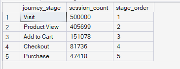
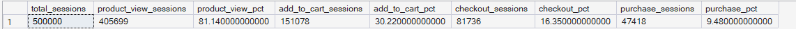

# Phase 5 — Customer Journey Analytics
## 01. Customer Journey Mapping

**SQL Script:** `01_journey_mapping.sql`

---

## 1. Business Question

What does the actual sequence of customer interactions look like, and how many sessions reach each stage of the journey?

---

## 2. Objective

Map the major customer journey stages using session-level behavioral data and determine how many unique sessions reach each stage.

The journey is represented as:

**Visit → Product View → Add to Cart → Checkout → Purchase**

This analysis establishes the overall shape of customer journey engagement before detailed funnel conversion and drop-off analysis.

---

## 3. Data Sources

The analysis uses the Phase 3 Enterprise SQL Data Warehouse:

- `dbo.Fact_Events`
- `dbo.Fact_Sessions`

The analysis deliberately remains within the synthetic behavioral dataset.

`Fact_Order_Items` is not cross-referenced because session-level `purchase_interaction` events were not reconciled against the Olist order rows. Combining the two would introduce a false data-integrity assumption.

---

## 4. Analytical Grain

The analytical grain is **session-level**.

A session can contain multiple events of the same type. Therefore, the analysis first reduces events to one record per `session_id` and identifies whether each session reached each journey stage.

This prevents highly active sessions from being over-counted.

---

## 5. Techniques Used

- Common Table Expressions (CTEs)
- `CASE` expressions
- Conditional aggregation
- `MAX()` for session-level stage flags
- Scalar subqueries
- Percentage calculations
- `UNION ALL`
- Stage ordering

---

# 6. Result Set A — Journey Stage Reach

The first result set measures how many distinct sessions ever produced an event corresponding to each journey stage.

### Output

| Journey Stage | Session Count | Stage Order |
|---|---:|---:|
| Visit | 500,000 | 1 |
| Product View | 405,699 | 2 |
| Add to Cart | 151,078 | 3 |
| Checkout | 81,736 | 4 |
| Purchase | 47,418 | 5 |

### Screenshot

**Displayed rows:** 5  
**Total result rows:** 5

---

# 7. Result Set B — Stage Reach as % of Total Sessions

The second result set measures stage reach as a percentage of the full session population of **500,000 sessions**.

### Output

| Metric | Value |
|---|---:|
| Total Sessions | 500,000 |
| Product View Sessions | 405,699 |
| Product View % | 81.14% |
| Add to Cart Sessions | 151,078 |
| Add to Cart % | 30.22% |
| Checkout Sessions | 81,736 |
| Checkout % | 16.35% |
| Purchase Sessions | 47,418 |
| Purchase % | 9.48% |

### Screenshot

**Displayed rows:** 1  
**Total result rows:** 1

---

# 8. Key Observations

### 8.1 Product discovery is reached by most sessions

405,699 of the 500,000 sessions reached a Product View event, representing **81.14% of all sessions**.

This indicates that the majority of sessions progress beyond the initial visit stage into product exploration.

### 8.2 Add-to-cart engagement is substantially lower

151,078 sessions reached Add to Cart, representing **30.22% of all sessions**.

The journey therefore becomes considerably narrower between product exploration and cart engagement.

### 8.3 Checkout reach is lower still

81,736 sessions reached Checkout, representing **16.35% of all sessions**.

This shows that only a subset of sessions that engage with products progress far enough to initiate checkout.

### 8.4 Purchase reach represents 9.48% of all sessions

47,418 sessions reached the Purchase stage, representing **9.48% of all sessions**.

The overall journey therefore narrows substantially from initial visit through final purchase interaction.

---

# 9. Business Interpretation

The overall journey shows a clear narrowing pattern:

**Visit → Product View → Add to Cart → Checkout → Purchase**

While product exploration is reached by **81.14%** of sessions, only **30.22%** reach Add to Cart and **9.48%** reach Purchase.

The largest structural narrowing in the journey occurs before the Add-to-Cart stage, indicating that the transition from product exploration to cart engagement warrants closer investigation.

However, this analysis measures **stage reach across sessions** rather than sequential stage-to-stage conversion. Detailed stage conversion and drop-off quantification are addressed in the subsequent funnel and drop-off analyses.

---

# 10. Business Implication

The journey mapping establishes that customer engagement decreases materially as sessions progress toward purchase.

The product-view-to-cart transition is therefore an important area for deeper journey analysis. Potential causes should not be assumed from this analysis alone; the next Phase 5 analyses should quantify the exact stage-level conversion and drop-off patterns using the behavioral data.

This provides a basis for identifying the most important customer journey friction point without prematurely attributing a specific cause.

---

# 11. Scope Control

This analysis intentionally does **not** include:

- RFM analysis
- Customer Lifetime Value
- Recommendation intelligence
- A/B testing
- Experimentation
- Power BI
- What-If analysis

These capabilities are addressed in later phases of ORGEE.

---

# 12. Reproducibility

The complete calculation is available in:

`01_journey_mapping.sql`

The SQL script is the authoritative source for the full result set. The screenshots provide visual evidence of the executed output.

---

## Conclusion

The customer journey mapping successfully establishes the session-level reach of the five core journey stages:

**Visit → Product View → Add to Cart → Checkout → Purchase**

Across 500,000 sessions:

- **81.14%** reach Product View
- **30.22%** reach Add to Cart
- **16.35%** reach Checkout
- **9.48%** reach Purchase

These results establish the baseline journey shape for the detailed funnel conversion and drop-off analyses that follow.