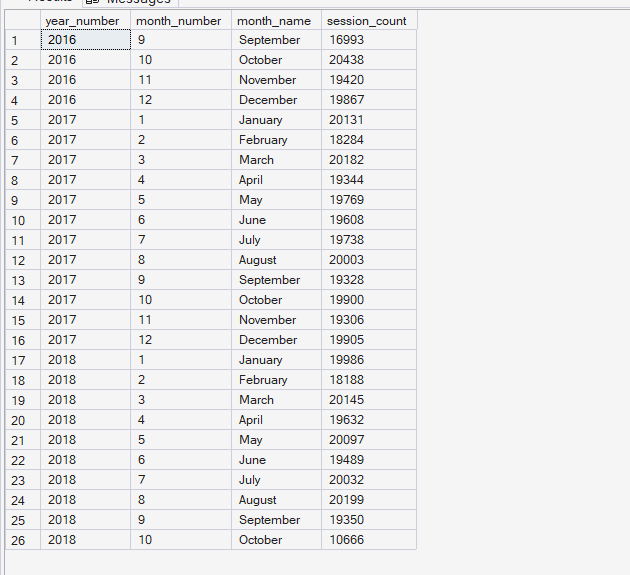
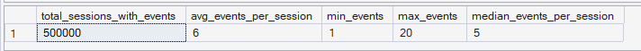
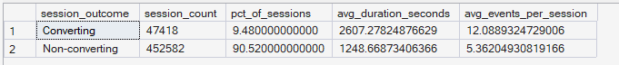
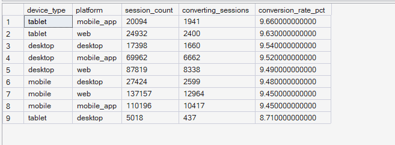

# Phase 5 — Customer Journey Analytics
## 02. Session Analysis

**SQL Script:** `02_session_analysis.sql`

---

## 1. Business Question

How do sessions behave — how much activity, how much time spent, and how does that differ between sessions that convert and sessions that don't?

---

## 2. Objective

Analyze session-level behavior across the behavioral dataset by examining:

- Monthly session volume
- Events per session
- Session engagement distribution
- Converting versus non-converting session behavior
- Device and platform conversion performance

A converting session is defined as a session that produced a `purchase_interaction` event.

---

## 3. Data Sources

The analysis uses the Phase 3 Enterprise SQL Data Warehouse:

- `dbo.Fact_Sessions`
- `dbo.Fact_Events`
- `dbo.Dim_Date`
- `dbo.Dim_Device`

No raw CSV files are used.

---

## 4. Analytical Grain

The primary analytical grain is **session-level**.

Events are first aggregated by `session_id` where required so that multiple events within the same session do not cause sessions to be over-counted.

Conversion is also determined at the session level based on the presence of a `purchase_interaction` event.

---

## 5. Techniques Used

- Common Table Expressions (CTEs)
- `CASE` expressions
- Conditional aggregation
- Correlated subqueries
- `EXISTS`
- `PERCENTILE_CONT`
- Window functions
- Date-dimension analysis
- Session-level aggregation
- Device/platform segmentation
- Conversion-rate calculation

---

# 6. Result Set A — Monthly Session Volume

The first result set measures total session volume by year and month using the session start date and the warehouse date dimension.

### Output

The analysis returned **26 monthly rows**.

The majority of months contain approximately 18,000–20,000 sessions, while the final observed month, October 2018, contains 10,666 sessions.

### Screenshot

**Displayed rows:** 26  
**Total result rows:** 26

---

# 7. Result Set B — Events per Session Distribution

The second result set summarizes behavioral activity at the session level.

### Output

| Metric | Result |
|---|---:|
| Total Sessions with Events | 500,000 |
| Average Events per Session | 6 |
| Minimum Events per Session | 1 |
| Maximum Events per Session | 20 |
| Median Events per Session | 5 |

### Screenshot

**Displayed rows:** 1  
**Total result rows:** 1

---

# 8. Result Set C — Converting vs Non-Converting Sessions

The third result set compares session engagement between sessions that produced a purchase interaction and sessions that did not.

### Output

| Session Outcome | Session Count | % of Sessions | Avg Duration (sec) | Avg Events per Session |
|---|---:|---:|---:|---:|
| Converting | 47,418 | 9.48% | 2,607.28 | 12.09 |
| Non-converting | 452,582 | 90.52% | 1,248.67 | 5.36 |

### Screenshot

**Displayed rows:** 2  
**Total result rows:** 2

---

# 9. Result Set D — Device / Platform Session Behavior

The fourth result set compares session volume and conversion performance across device and platform combinations.

### Output

| Device Type | Platform | Session Count | Converting Sessions | Conversion Rate |
|---|---|---:|---:|---:|
| Tablet | mobile_app | 20,094 | 1,941 | 9.66% |
| Tablet | web | 24,932 | 2,400 | 9.63% |
| Desktop | desktop | 17,398 | 1,660 | 9.54% |
| Desktop | mobile_app | 69,962 | 6,662 | 9.52% |
| Desktop | web | 87,879 | 8,338 | 9.49% |
| Mobile | desktop | 27,424 | 2,599 | 9.48% |
| Mobile | web | 137,157 | 12,964 | 9.45% |
| Mobile | mobile_app | 110,196 | 10,417 | 9.45% |
| Tablet | desktop | 5,018 | 437 | 8.71% |

### Screenshot

**Displayed rows:** 9  
**Total result rows:** 9

---

# 10. Key Observations

## 10.1 Session activity averages 6 events

Across 500,000 sessions with events, the average session contains approximately **6 events**, with a median of **5 events**.

Session activity ranges from **1 to 20 events**.

This establishes a meaningful behavioral range for subsequent journey analysis.

---

## 10.2 Converting sessions are substantially more engaged

Converting sessions average:

- **2,607.28 seconds** of session duration
- **12.09 events per session**

Non-converting sessions average:

- **1,248.67 seconds**
- **5.36 events per session**

Therefore, converting sessions show materially higher engagement in both time spent and event activity.

---

## 10.3 Conversion behavior is relatively consistent across device/platform combinations

Conversion rates range from **8.71% to 9.66%** across the observed device/platform combinations.

The highest observed combination is:

**Tablet / mobile_app — 9.66%**

The lowest is:

**Tablet / desktop — 8.71%**

The overall spread is relatively small, so the results do not indicate a dominant device/platform conversion problem.

---

## 10.4 Session volume is concentrated in later-period months

Most months in the observed period contain approximately 18,000–20,000 sessions.

The final observed month, October 2018, contains 10,666 sessions, reflecting the shorter final period represented in the behavioral data.

---

# 11. Business Interpretation

Session behavior shows a strong relationship between engagement and conversion.

Sessions that convert are substantially longer and contain substantially more events than sessions that do not convert. This indicates that higher-engagement sessions are associated with a greater likelihood of reaching the purchase interaction stage.

The device/platform analysis, however, shows relatively similar conversion rates across combinations. Therefore, device type or platform alone does not appear to explain a major portion of the conversion difference observed in this dataset.

The stronger signal from this analysis is therefore **session engagement**, rather than device/platform differences.

This should be treated as an observed association rather than a causal conclusion.

---

# 12. Business Implication

The results suggest that understanding the behavioral journey of highly engaged versus low-engagement sessions is more important than focusing exclusively on device/platform differences.

The strong engagement difference between converting and non-converting sessions provides a basis for deeper analysis of:

- Product View engagement
- Add-to-Cart progression
- Checkout progression
- Purchase progression
- Stage-level conversion
- Journey drop-off

These are examined in the subsequent Phase 5 analyses.

No specific UX cause is assumed from this analysis alone.

---

# 13. Scope Control

This analysis intentionally does **not** include:

- RFM analysis
- Customer Lifetime Value
- Recommendation intelligence
- A/B testing
- Experimentation
- Power BI
- What-If analysis

These capabilities are addressed in later phases of ORGEE.

---

# 14. Reproducibility

The complete analysis is available in:

`02_session_analysis.sql`

The SQL script is the authoritative source for the full result sets. The screenshots provide visual evidence of the executed outputs.

---

## Conclusion

The session analysis establishes three important behavioral patterns:

1. The behavioral dataset contains **500,000 sessions**, averaging approximately **6 events per session**.
2. Converting sessions are materially more engaged, averaging **2,607.28 seconds and 12.09 events**, compared with **1,248.67 seconds and 5.36 events** for non-converting sessions.
3. Device/platform conversion rates are relatively consistent, ranging from **8.71% to 9.66%**.

The strongest signal is therefore the relationship between **session engagement and conversion**, providing a foundation for the detailed funnel and drop-off analysis that follows.