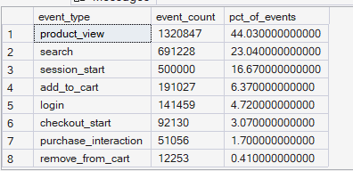
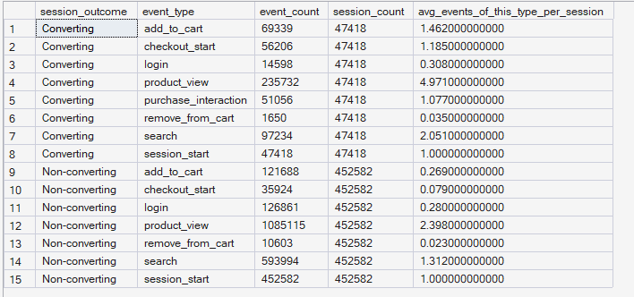
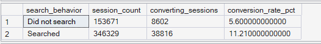
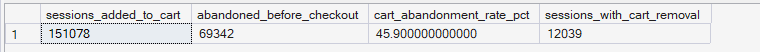

# Phase 5 — Customer Journey Analytics
## 03. Event / Behavioral Analysis

**SQL Script:** `03_event_behavioral_analysis.sql`

---

## 1. Business Question

Which behaviors within a session are associated with a successful (converting) journey versus an unsuccessful one?

---

## 2. Objective

Analyze behavioral event patterns within sessions and compare converting versus non-converting sessions.

The analysis focuses on:

- Overall event-type distribution
- Behavioral differences between converting and non-converting sessions
- Search behavior and conversion
- Cart abandonment behavior
- Cart removal behavior

A converting session is defined as a session that produced a `purchase_interaction` event.

---

## 3. Data Sources

The analysis uses the Phase 3 Enterprise SQL Data Warehouse:

- `dbo.Fact_Events`
- `dbo.Fact_Sessions`

No raw CSV files are used.

---

## 4. Analytical Grain

The primary analytical grain is **session-level** for behavioral comparisons.

For overall event distribution, the grain is the individual event row.

For converting versus non-converting comparisons, events are classified according to the session outcome and then summarized by outcome.

For search and cart behavior, each session is represented once to prevent multiple events from causing session-level over-counting.

---

## 5. Techniques Used

- Common Table Expressions (CTEs)
- `CASE` expressions
- Conditional aggregation
- Correlated subqueries
- `EXISTS`
- Window functions
- Session-level behavioral classification
- Event-level aggregation
- Conversion-rate calculation

---

# 6. Result Set A — Overall Event Type Distribution

The first result set measures the volume and percentage contribution of each event type across the behavioral event dataset.

### Output

| Event Type | Event Count | % of Events |
|---|---:|---:|
| Product View | 1,320,847 | 44.03% |
| Search | 691,228 | 23.04% |
| Session Start | 500,000 | 16.67% |
| Add to Cart | 191,027 | 6.37% |
| Login | 141,459 | 4.72% |
| Checkout Start | 92,130 | 3.07% |
| Purchase Interaction | 51,056 | 1.70% |
| Remove from Cart | 12,253 | 0.41% |

### Screenshot

**Displayed rows:** 8  
**Total result rows:** 8

---

# 7. Result Set B — Converting vs Non-Converting Behavioral Comparison

The second result set compares the frequency of individual event types across converting and non-converting sessions.

### Output

| Session Outcome | Event Type | Event Count | Session Count | Avg Events of This Type per Session |
|---|---|---:|---:|---:|
| Converting | add_to_cart | 69,339 | 47,418 | 1.462 |
| Converting | checkout_start | 56,206 | 47,418 | 1.185 |
| Converting | login | 14,598 | 47,418 | 0.308 |
| Converting | product_view | 235,732 | 47,418 | 4.971 |
| Converting | purchase_interaction | 51,056 | 47,418 | 1.077 |
| Converting | remove_from_cart | 1,650 | 47,418 | 0.035 |
| Converting | search | 97,234 | 47,418 | 2.050 |
| Converting | session_start | 47,418 | 47,418 | 1.000 |
| Non-converting | add_to_cart | 121,688 | 452,582 | 0.269 |
| Non-converting | checkout_start | 35,924 | 452,582 | 0.079 |
| Non-converting | login | 126,861 | 452,582 | 0.280 |
| Non-converting | product_view | 1,085,115 | 452,582 | 2.398 |
| Non-converting | remove_from_cart | 10,603 | 452,582 | 0.023 |
| Non-converting | search | 593,994 | 452,582 | 1.312 |
| Non-converting | session_start | 452,582 | 452,582 | 1.000 |

### Screenshot

**Displayed rows:** 15  
**Total result rows:** 15

### Interpretation Note

The average event-type frequency is calculated across **all sessions within each outcome group**, not only sessions that performed that event type.

For example, `4.971` product-view events per converting session represents total product-view events among converting sessions divided by the total number of converting sessions.

---

# 8. Result Set C — Search Behavior and Conversion

The third result set compares conversion performance between sessions that searched and sessions that did not search.

### Output

| Search Behavior | Session Count | Converting Sessions | Conversion Rate |
|---|---:|---:|---:|
| Did not search | 153,671 | 8,602 | 5.60% |
| Searched | 346,329 | 38,816 | 11.21% |

### Screenshot

**Displayed rows:** 2  
**Total result rows:** 2

---

# 9. Result Set D — Cart Abandonment Signal

The fourth result set identifies sessions that added products to the cart but did not initiate checkout.

### Output

| Metric | Result |
|---|---:|
| Sessions Added to Cart | 151,078 |
| Abandoned Before Checkout | 69,342 |
| Cart Abandonment Rate | 45.90% |
| Sessions With Cart Removal | 12,039 |

### Screenshot

**Displayed rows:** 1  
**Total result rows:** 1

---

# 10. Key Observations

## 10.1 Product viewing dominates behavioral activity

Product-view events account for **44.03%** of all behavioral events, making product exploration the largest event category in the dataset.

Search is the second-largest event category at **23.04%**.

---

## 10.2 Converting sessions show substantially higher purchase-path engagement

Converting sessions average:

- **4.971 product views**
- **2.050 searches**
- **1.462 add-to-cart events**
- **1.185 checkout-start events**

Non-converting sessions average:

- **2.398 product views**
- **1.312 searches**
- **0.269 add-to-cart events**
- **0.079 checkout-start events**

The strongest behavioral differences occur around **Add to Cart and Checkout**, indicating that purchase-path engagement is substantially higher among converting sessions.

---

## 10.3 Search behavior is associated with higher conversion

Sessions that searched converted at **11.21%**, compared with **5.60%** for sessions that did not search.

The observed conversion rate among search sessions is therefore approximately twice the rate among non-search sessions.

This identifies search behavior as a potentially important customer-journey signal.

However, this result represents an association and does not establish that searching itself causes higher conversion.

---

## 10.4 Cart abandonment is material

Of the **151,078 sessions** that added an item to the cart, **69,342** did not start checkout.

This produces a cart-abandonment rate of **45.90%** under the definition used in this analysis.

This represents a meaningful point for deeper funnel and drop-off investigation.

---

## 10.5 Cart removal is a secondary behavioral signal

**12,039 sessions** contained at least one `remove_from_cart` event.

This provides an additional behavioral signal that can be examined alongside cart abandonment and later-stage journey behavior.

---

# 11. Business Interpretation

The behavioral data shows clear differences between converting and non-converting sessions.

Converting sessions exhibit substantially higher activity across the purchase journey, particularly in Add to Cart and Checkout behavior. They also show higher levels of product viewing and searching.

Search behavior is associated with a materially higher conversion rate, with searching sessions converting at **11.21%** versus **5.60%** among sessions that did not search.

The cart analysis also identifies a substantial abandonment signal, with **45.90% of cart-adding sessions not reaching checkout**.

These findings suggest that the transition from product engagement to purchase-path engagement is an important area for deeper customer journey analysis.

The analysis does not establish causal relationships between individual behaviors and conversion.

---

# 12. Business Implication

The results suggest several areas for deeper investigation:

- Product-to-cart progression
- Search-to-product engagement
- Cart-to-checkout progression
- Cart abandonment
- Checkout progression
- Behavioral differences between converting and non-converting sessions

The **45.90% cart-abandonment signal** provides a particularly important input for the dedicated funnel and drop-off analyses that follow.

Potential interventions such as cart-recovery messaging or improved search experience should be treated as hypotheses at this stage rather than confirmed solutions.

---

# 13. Scope Control

This analysis intentionally does **not** include:

- RFM analysis
- Customer Lifetime Value
- Recommendation intelligence
- A/B testing
- Experimentation
- Power BI
- What-If analysis

These capabilities are addressed in later phases of ORGEE.

---

# 14. Reproducibility

The complete analysis is available in:

`03_event_behavioral_analysis.sql`

The SQL script is the authoritative source for the full result sets. The screenshots provide visual evidence of the executed outputs.

---

## Conclusion

The behavioral analysis identifies three important signals:

1. **Converting sessions exhibit substantially higher behavioral engagement**, especially in Add to Cart and Checkout activity.
2. **Search sessions convert at 11.21% versus 5.60% for non-search sessions**, indicating a strong association between search behavior and conversion.
3. **45.90% of cart-adding sessions do not start checkout**, establishing a significant cart-abandonment signal for further funnel and drop-off analysis.

These findings provide the behavioral foundation for the next stage of Customer Journey Analytics.