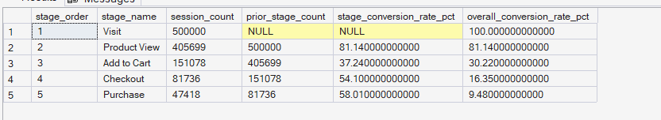
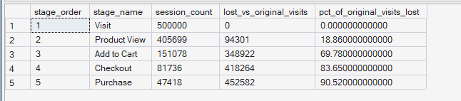

# Phase 5 — Customer Journey Analytics
## 04. Funnel Analysis ⭐ Signature Analysis

**SQL Script:** `04_funnel_analysis.sql`

---

## 1. Business Question

What does the core customer funnel look like — Visit → Product View → Add to Cart → Checkout → Purchase — and what is the conversion rate at each stage?

---

## 2. Objective

Construct the core customer journey funnel and quantify:

- Session reach at each funnel stage
- Stage-over-stage conversion
- Overall conversion relative to the original Visit population
- Absolute session loss relative to the original Visit population

The core funnel is:

**Visit → Product View → Add to Cart → Checkout → Purchase**

---

## 3. Data Source

The analysis uses the Phase 3 Enterprise SQL Data Warehouse:

- `dbo.Fact_Events`
- `dbo.Fact_Sessions`

No raw CSV files are used.

---

## 4. Analytical Grain

The funnel is analyzed at the **session level**.

Every stage count represents distinct sessions rather than raw event rows.

This prevents sessions containing multiple events of the same type from being over-counted.

The funnel logic was also validated for chronological stage progression.

---

## 5. Funnel Definition

The customer journey consists of five stages:

| Stage Order | Stage |
|---:|---|
| 1 | Visit |
| 2 | Product View |
| 3 | Add to Cart |
| 4 | Checkout |
| 5 | Purchase |

The funnel measures both stage-over-stage conversion and cumulative conversion relative to the original Visit population.

---

## 6. Techniques Used

- Common Table Expressions (CTEs)
- `CASE` expressions
- Conditional aggregation
- `LAG()`
- `FIRST_VALUE()`
- Window functions
- Session-level aggregation
- Stage-over-stage conversion calculation
- Overall conversion calculation
- Funnel loss calculation

---

# 7. Result Set A — Core Funnel Conversion

The first result set measures session counts at each funnel stage, conversion from the previous stage, and overall conversion relative to the original Visit population.

### Output

| Stage Order | Stage Name | Session Count | Prior Stage Count | Stage Conversion Rate | Overall Conversion Rate |
|---:|---|---:|---:|---:|---:|
| 1 | Visit | 500,000 | NULL | NULL | 100.00% |
| 2 | Product View | 405,699 | 500,000 | 81.14% | 81.14% |
| 3 | Add to Cart | 151,078 | 405,699 | 37.24% | 30.22% |
| 4 | Checkout | 81,736 | 151,078 | 54.10% | 16.35% |
| 5 | Purchase | 47,418 | 81,736 | 58.00% | 9.48% |

### Screenshot

**Displayed rows:** 5  
**Total result rows:** 5

---

# 8. Result Set B — Funnel Loss Relative to Original Visits

The second result set measures how many sessions have been lost relative to the original **500,000 Visit sessions** at each stage.

### Output

| Stage Order | Stage Name | Session Count | Lost vs Original Visits | % of Original Visits Lost |
|---:|---|---:|---:|---:|
| 1 | Visit | 500,000 | 0 | 0.00% |
| 2 | Product View | 405,699 | 94,301 | 18.86% |
| 3 | Add to Cart | 151,078 | 348,922 | 69.78% |
| 4 | Checkout | 81,736 | 418,264 | 83.65% |
| 5 | Purchase | 47,418 | 452,582 | 90.50% |

### Screenshot

**Displayed rows:** 5  
**Total result rows:** 5

---

# 9. Key Observations

## 9.1 Product View reach is high

**405,699 of 500,000 sessions** reach Product View.

This represents an **81.14% Visit-to-Product View conversion rate**.

Therefore, most sessions progress from an initial visit into product exploration.

---

## 9.2 Product View → Add to Cart is the largest stage-level conversion challenge

Of the **405,699 sessions** reaching Product View, **151,078** reach Add to Cart.

The Product View → Add to Cart conversion rate is:

**37.24%**

This is the lowest stage-over-stage conversion rate in the core funnel.

---

## 9.3 Add to Cart → Checkout conversion is stronger

Of the **151,078 sessions** reaching Add to Cart, **81,736** reach Checkout.

The Add to Cart → Checkout conversion rate is:

**54.10%**

More than half of the sessions reaching Add to Cart progress to Checkout.

---

## 9.4 Checkout → Purchase conversion is 58.00%

Of the **81,736 sessions** reaching Checkout, **47,418** reach Purchase.

The Checkout → Purchase conversion rate is:

**58.00%**

This is the highest stage-over-stage conversion rate after the initial Visit → Product View transition.

---

## 9.5 Overall Visit-to-Purchase conversion is 9.48%

The funnel begins with **500,000 Visit sessions** and ends with **47,418 Purchase sessions**.

The overall Visit → Purchase conversion rate is therefore:

**9.48%**

This means **452,582 sessions**, or **90.50% of the original Visit population**, are lost before reaching Purchase.

---

# 10. Funnel Loss Analysis

Relative to the original 500,000 Visit sessions:

| Stage | Sessions Lost vs Visit | % of Original Visits Lost |
|---|---:|---:|
| Product View | 94,301 | 18.86% |
| Add to Cart | 348,922 | 69.78% |
| Checkout | 418,264 | 83.65% |
| Purchase | 452,582 | 90.50% |

The cumulative loss increases as sessions progress deeper into the funnel.

By the Add to Cart stage, **348,922 sessions** have already been lost relative to the original Visit population.

---

# 11. Business Interpretation

The funnel shows a clear narrowing pattern:

**Visit → Product View → Add to Cart → Checkout → Purchase**

Product exploration has relatively strong reach at **81.14%**, but the journey narrows substantially at the transition from Product View to Add to Cart, where stage conversion falls to **37.24%**.

The subsequent transitions are comparatively stronger:

- Add to Cart → Checkout: **54.10%**
- Checkout → Purchase: **58.00%**

The overall Visit-to-Purchase conversion rate is **9.48%**.

Therefore, the **Product View → Add to Cart transition** represents the primary stage-level friction point identified by the core funnel.

---

# 12. Business Implication

The funnel suggests that optimization efforts should pay particular attention to the **Product View → Add to Cart** transition.

Potential areas for further investigation include:

- Product-page experience
- Product information clarity
- Price and value perception
- Add-to-cart visibility and usability
- Product availability
- Customer confidence signals

These are hypotheses for further investigation rather than confirmed causes.

The funnel identifies **where** the major conversion reduction occurs; subsequent customer journey analysis should investigate **why** it occurs.

---

# 13. Signature Finding ⭐

The core funnel identifies the **Product View → Add to Cart transition** as the primary stage-level friction point.

| Transition | Conversion Rate |
|---|---:|
| Visit → Product View | 81.14% |
| Product View → Add to Cart | **37.24%** |
| Add to Cart → Checkout | 54.10% |
| Checkout → Purchase | 58.00% |

The overall **Visit → Purchase conversion rate is 9.48%**.

The Product View → Add to Cart transition has the lowest stage-over-stage conversion rate in the funnel.

---

# 14. Scope Control

This analysis intentionally does **not** include:

- RFM analysis
- Customer Lifetime Value
- Recommendation intelligence
- A/B testing
- Experimentation
- Power BI
- What-If analysis

These capabilities are addressed in later phases of ORGEE.

---

# 15. Reproducibility

The complete analysis is available in:

`04_funnel_analysis.sql`

The SQL script is the authoritative source for the full result sets.

The screenshots provide visual evidence of the executed outputs.

---

## Conclusion

The ORGEE customer funnel contains **500,000 Visit sessions** and **47,418 Purchase sessions**, producing an overall **Visit-to-Purchase conversion rate of 9.48%**.

The major stage-level conversion reduction occurs between:

**Product View → Add to Cart**

where conversion is **37.24%**.

Later transitions perform comparatively better:

- **Add to Cart → Checkout: 54.10%**
- **Checkout → Purchase: 58.00%**

The funnel therefore establishes the **Product View → Add to Cart transition as the primary customer-journey friction point** for deeper investigation.

The funnel has also been validated for chronological progression, distinct-session grain, non-increasing stage counts, and referential integrity.