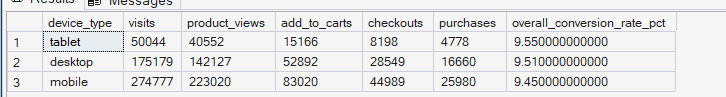
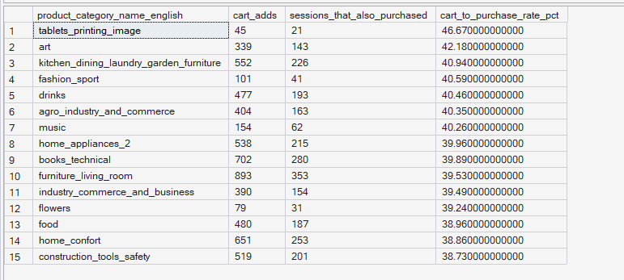

# Phase 5 — Customer Journey Analytics
## 05. Funnel Conversion by Dimension

**SQL Script:** `05_funnel_conversion_by_dimension.sql`

---

## 1. Business Question

Does the funnel convert differently across device types? Do certain product categories see a stronger add-to-cart-to-purchase rate than others?

---

## 2. Objective

Analyze funnel performance across key dimensions to determine:

- Whether customer conversion differs across device types
- Whether conversion varies across platforms
- Which product categories show stronger cart-to-purchase session-level association

This analysis extends the core funnel by introducing dimensional comparisons.

---

## 3. Data Sources

The analysis uses the Phase 3 Enterprise SQL Data Warehouse:

- `dbo.Fact_Events`
- `dbo.Dim_Device`
- `dbo.Dim_Product`

No raw CSV files are used.

---

## 4. Analytical Grain

### Device / Platform Analysis

The device and platform analyses operate at the **session level**.

Each session is evaluated for whether it reached the relevant funnel stages.

### Product Category Analysis

The category analysis uses distinct session-level cart additions by product category.

Because the synthetic behavioral dataset does not associate a `purchase_interaction` event with a specific `product_sk`, the category metric represents a **session-level association**:

> A session that added a product from the category and also produced a purchase interaction somewhere in that session.

It should therefore not be interpreted as a strict product-level or item-level conversion rate.

---

## 5. Techniques Used

- Common Table Expressions (CTEs)
- `CASE` expressions
- Conditional aggregation
- `DISTINCT`
- Dimension joins
- Session-level funnel flags
- Conversion-rate calculation
- `RANK()`
- Category-level aggregation
- Session-level behavioral association

---

# 6. Result Set A — Funnel by Device Type

The first result set compares funnel reach and overall Visit-to-Purchase conversion across device types.

### Output

| Device Type | Visits | Product Views | Add to Carts | Checkouts | Purchases | Overall Conversion Rate |
|---|---:|---:|---:|---:|---:|---:|
| Tablet | 50,044 | 40,552 | 15,166 | 8,198 | 4,778 | 9.55% |
| Desktop | 175,179 | 142,127 | 52,892 | 28,549 | 16,660 | 9.51% |
| Mobile | 274,777 | 223,020 | 83,020 | 44,989 | 25,980 | 9.45% |

### Screenshot

**Displayed rows:** 3  
**Total result rows:** 3

---

# 7. Result Set B — Funnel by Platform

The second result set compares Visit-to-Purchase conversion across platforms and ranks the platforms by conversion rate.

### Output

| Platform | Visits | Purchases | Conversion Rate | Conversion Rank |
|---|---:|---:|---:|---:|
| Mobile App | 200,252 | 19,020 | 9.50% | 1 |
| Web | 249,988 | 23,702 | 9.48% | 2 |
| Desktop | 49,840 | 4,696 | 9.42% | 3 |

### Screenshot

**Displayed rows:** 3  
**Total result rows:** 3

---

# 8. Result Set C — Cart-to-Purchase Association by Product Category

The third result set identifies the top 15 product categories by cart-to-purchase session-level association among categories with at least 30 cart-adding sessions.

### Output

| Product Category | Cart Adds | Sessions That Also Purchased | Cart-to-Purchase Rate |
|---|---:|---:|---:|
| tablets_printing_image | 45 | 21 | 46.67% |
| art | 339 | 143 | 42.18% |
| kitchen_dining_laundry_garden_furniture | 552 | 226 | 40.94% |
| fashion_sport | 101 | 41 | 40.59% |
| drinks | 477 | 193 | 40.46% |
| agro_industry_and_commerce | 404 | 163 | 40.35% |
| music | 154 | 62 | 40.26% |
| home_appliances_2 | 538 | 215 | 39.96% |
| books_technical | 702 | 280 | 39.89% |
| furniture_living_room | 893 | 353 | 39.53% |
| industry_commerce_and_business | 390 | 154 | 39.49% |
| flowers | 79 | 31 | 39.24% |
| food | 480 | 187 | 38.96% |
| home_confort | 651 | 253 | 38.86% |
| construction_tools_safety | 519 | 201 | 38.73% |

### Screenshot

**Displayed rows:** 15  
**Total result rows:** 15

**Selection:** Top 15 categories by cart-to-purchase rate among categories with at least 30 cart-adding sessions.

---

# 9. Key Observations

## 9.1 Device-level conversion is relatively stable

Visit-to-Purchase conversion rates across the three device types are:

- Tablet: **9.55%**
- Desktop: **9.51%**
- Mobile: **9.45%**

The difference between the highest and lowest observed device conversion rate is only **0.10 percentage points**.

This indicates that conversion performance is relatively consistent across device types in the analyzed behavioral dataset.

---

## 9.2 Mobile generates the largest session and purchase volume

Mobile accounts for the largest observed session volume:

**274,777 visits**

and the largest number of purchases:

**25,980 purchases**.

However, its conversion rate of **9.45%** is slightly below Desktop and Tablet.

This indicates that high volume and highest conversion rate are not necessarily the same thing.

---

## 9.3 Platform conversion is also relatively stable

Platform conversion rates are:

- Mobile App: **9.50%**
- Web: **9.48%**
- Desktop: **9.42%**

The difference between the highest and lowest platform conversion rate is only **0.08 percentage points**.

Therefore, the results do not indicate a large platform-specific conversion gap.

---

## 9.4 Product categories show variation in cart-to-purchase association

Among the top 15 categories shown, the observed cart-to-purchase rates range from:

**46.67%** for `tablets_printing_image`

to:

**38.73%** for `construction_tools_safety`.

The results therefore show some variation across categories.

However, categories with very small sample sizes should be interpreted cautiously. The SQL applies a minimum threshold of **30 cart-adding sessions** to reduce extremely small category samples.

---

## 9.5 Category results are session-level associations

The category analysis should not be interpreted as proof that a specific cart-added product was purchased.

A purchase interaction is associated with the session rather than a specific product.

Therefore:

**Cart-to-Purchase Rate = percentage of sessions that added a product from the category and also produced a purchase interaction somewhere in the session.**

This limitation is explicitly documented in the SQL.

---

# 10. Business Interpretation

The dimensional funnel analysis shows that the overall conversion problem is relatively consistent across devices and platforms.

Device conversion ranges only from **9.45% to 9.55%**, while platform conversion ranges from **9.42% to 9.50%**.

Therefore, the core funnel friction identified earlier does not appear to be isolated to one major device or platform group.

The category analysis provides a different perspective by showing variation in the relationship between category-level cart engagement and session-level purchase behavior.

These category results can be used to identify areas for deeper product and journey investigation, while recognizing that the metric is a session-level association rather than a strict product conversion measure.

---

# 11. Business Implication

The relatively flat device and platform conversion rates suggest that broad device-specific or platform-specific optimization should not automatically be treated as the primary funnel opportunity.

Instead, the results support deeper investigation into **journey-stage behavior that is common across dimensions**, particularly the Product View → Add to Cart transition identified in the core funnel analysis.

The category-level results can also help identify product groups where cart engagement is more strongly associated with purchase behavior.

Potential follow-up areas include:

- Product-page experience
- Category-specific customer behavior
- Product information and merchandising
- Add-to-cart experience
- Cross-category differences in purchase intent

These should be treated as investigation areas rather than confirmed causes.

---

# 12. Scope Control

This analysis intentionally does **not** include:

- RFM analysis
- Customer Lifetime Value
- Recommendation intelligence
- A/B testing
- Experimentation
- Power BI
- What-If analysis

These capabilities are addressed in later phases of ORGEE.

---

# 13. Reproducibility

The complete analysis is available in:

`05_funnel_conversion_by_dimension.sql`

The SQL script is the authoritative source for the full result sets.

The screenshots provide visual evidence of the executed outputs.

---

## Conclusion

The dimensional funnel analysis shows that conversion is relatively stable across both device types and platforms.

Device conversion rates range from **9.45% to 9.55%**, while platform conversion rates range from **9.42% to 9.50%**.

The category analysis shows variation in cart-to-purchase session-level association, with the highest observed rate among the displayed categories being **46.67%** for `tablets_printing_image`.

Overall, the results suggest that the major funnel opportunity identified earlier is not strongly isolated to a particular device or platform and should instead be investigated at the broader customer-journey and behavioral level.