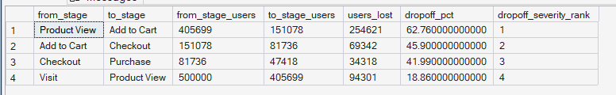

# Phase 5 — Customer Journey Analytics
## 06. Drop-Off Analysis ⭐ Signature Analysis

**SQL Script:** `06_dropoff_analysis.sql`

---

## 1. Business Question

Where, specifically, are we losing the most customers in the journey?

This analysis identifies the single largest stage-to-stage drop-off point and ranks the major funnel transitions by drop-off severity.

---

## 2. Objective

Quantify customer loss between consecutive stages of the core journey:

**Visit → Product View → Add to Cart → Checkout → Purchase**

The analysis calculates:

- Users entering each stage
- Users reaching the next stage
- Users lost between stages
- Stage-to-stage drop-off percentage
- Drop-off severity ranking

---

## 3. Data Source

The analysis uses the Phase 3 Enterprise SQL Data Warehouse:

- `dbo.Fact_Events`

No raw CSV files are used.

---

## 4. Analytical Grain

The analysis operates at the **session level**.

Every stage count represents distinct sessions that reach the corresponding journey stage rather than raw event rows.

This prevents sessions containing multiple events of the same type from being over-counted.

The funnel logic used for the stage counts has also been validated for chronological progression.

---

## 5. Techniques Used

- Common Table Expressions (CTEs)
- `CASE` expressions
- Conditional aggregation
- `LAG()`
- Window functions
- Session-level aggregation
- Stage-to-stage comparison
- Drop-off percentage calculation
- `RANK()`
- Drop-off severity ranking

---

# 6. Result Set A — Stage-to-Stage Drop-Off

The analysis compares each consecutive funnel transition and ranks the transitions according to their drop-off percentage.

### Output

| From Stage | To Stage | From Stage Users | To Stage Users | Users Lost | Drop-Off % | Drop-Off Severity Rank |
|---|---|---:|---:|---:|---:|---:|
| Product View | Add to Cart | 405,699 | 151,078 | 254,621 | **62.76%** | **1** |
| Add to Cart | Checkout | 151,078 | 81,736 | 69,342 | **45.90%** | 2 |
| Checkout | Purchase | 81,736 | 47,418 | 34,318 | **41.99%** | 3 |
| Visit | Product View | 500,000 | 405,699 | 94,301 | **18.86%** | 4 |

### Screenshot

**Displayed rows:** 4  
**Total result rows:** 4

---

# 7. Key Observations

## 7.1 Product View → Add to Cart is the largest drop-off

The largest drop-off occurs between:

**Product View → Add to Cart**

Of the **405,699 sessions** reaching Product View, only **151,078** progress to Add to Cart.

This represents a drop-off of:

**62.76%**

A total of:

**254,621 sessions**

are lost at this transition.

---

## 7.2 Add to Cart → Checkout has the second-largest drop-off

Of the **151,078 sessions** reaching Add to Cart, **81,736** progress to Checkout.

The resulting drop-off is:

**45.90%**

This represents:

**69,342 sessions lost**

between Add to Cart and Checkout.

---

## 7.3 Checkout → Purchase has a 41.99% drop-off

Of the **81,736 sessions** reaching Checkout, **47,418** progress to Purchase.

The resulting drop-off is:

**41.99%**

A total of:

**34,318 sessions**

are lost between Checkout and Purchase.

---

## 7.4 Visit → Product View has the lowest drop-off

The initial transition from Visit to Product View has a drop-off of:

**18.86%**

This represents:

**94,301 sessions lost**

from the original 500,000 Visit sessions.

Compared with the later transitions, this is the smallest stage-to-stage drop-off in the funnel.

---

# 8. Drop-Off Severity Ranking

The transitions rank as follows:

| Rank | Transition | Drop-Off |
|---:|---|---:|
| **1** | **Product View → Add to Cart** | **62.76%** |
| 2 | Add to Cart → Checkout | 45.90% |
| 3 | Checkout → Purchase | 41.99% |
| 4 | Visit → Product View | 18.86% |

The ranking clearly identifies the Product View → Add to Cart transition as the largest single point of customer loss.

---

# 9. Signature Insight ⭐

> **The largest customer drop-off occurs between Product View and Add to Cart, where 62.76% of sessions fail to progress.**

This represents:

**254,621 sessions lost**

from the **405,699 sessions** that reached Product View.

This is the primary customer-journey friction point identified by the Phase 5 funnel and drop-off analysis.

---

# 10. Business Interpretation

The drop-off pattern is not evenly distributed across the funnel.

The largest loss occurs relatively early in the purchase journey:

**Product View → Add to Cart**

where **62.76%** of sessions do not progress.

The later transitions show lower, although still material, drop-off rates:

- Add to Cart → Checkout: **45.90%**
- Checkout → Purchase: **41.99%**

The initial Visit → Product View transition has the lowest drop-off at **18.86%**.

This indicates that the primary stage-level friction occurs when customers move from product exploration into active cart engagement.

---

# 11. Business Implication

The results suggest that the highest-leverage area for customer journey investigation is the **Product View → Add to Cart** transition.

Potential areas for investigation include:

- Product-page usability
- Product information clarity
- Price and value perception
- Product availability
- Add-to-cart visibility
- Product confidence signals
- Customer decision friction

These are investigation hypotheses rather than confirmed causes.

The analysis identifies **where the largest loss occurs**, but additional analysis is required to determine **why** customers fail to progress.

---

# 12. Relationship to Previous Funnel Analysis

Script 04 identified Product View → Add to Cart as the lowest stage-over-stage conversion point at:

**37.24% conversion**

Script 06 provides the corresponding drop-off perspective:

**62.76% drop-off**

These values are complementary:

**100% − 37.24% = 62.76%**

Therefore, the two analyses independently express the same funnel transition from opposite perspectives.

---

# 13. Scope Control

This analysis intentionally does **not** include:

- RFM analysis
- Customer Lifetime Value
- Recommendation intelligence
- A/B testing
- Experimentation
- Power BI
- What-If analysis

These capabilities are addressed in later phases of ORGEE.

---

# 14. Reproducibility

The complete analysis is available in:

`06_dropoff_analysis.sql`

The SQL script is the authoritative source for the full result set.

The screenshot provides visual evidence of the executed output.

---

## Conclusion

The drop-off analysis identifies the primary customer-journey friction point:

**Product View → Add to Cart**

At this transition:

- From-stage sessions: **405,699**
- To-stage sessions: **151,078**
- Sessions lost: **254,621**
- Drop-off: **62.76%**
- Severity rank: **#1**

The finding confirms that the largest stage-level customer loss occurs during the transition from product exploration to cart engagement.

This becomes the primary customer journey friction point for subsequent interpretation and business recommendation work.