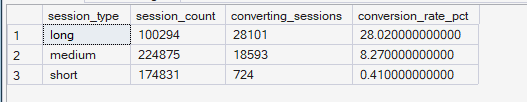
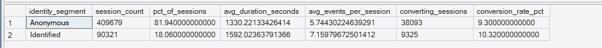
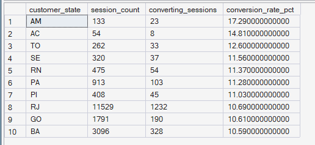

# Phase 5 — Customer Journey Analytics
## 07. Device & Segment Comparison

**SQL Script:** `07_device_segment_comparison.sql`

---

## 1. Business Question

Beyond device and platform, are there other meaningful segment differences in journey behavior — particularly session length category and identified vs anonymous traffic?

---

## 2. Objective

Compare customer journey behavior across:

- Session length categories
- Identified vs anonymous sessions
- Customer geographic segments

The objective is to determine whether meaningful conversion differences exist across these behavioral and customer segments.

---

## 3. Data Sources

The analysis uses the Phase 3 Enterprise SQL Data Warehouse:

- `dbo.Fact_Sessions`
- `dbo.Fact_Events`
- `dbo.Dim_Customer`

No raw CSV files are used.

---

## 4. Analytical Grain

The primary analysis operates at the **session level**.

Each session is classified according to:

- `session_type`
- Identified vs anonymous status
- Customer state where customer identity is available

A converting session is defined as a session containing at least one `purchase_interaction` event.

---

## 5. Techniques Used

- Common Table Expressions (CTEs)
- `CASE` expressions
- Conditional aggregation
- `EXISTS`
- Session-level aggregation
- Conversion-rate calculation
- Segment comparison
- Ranking through ordered output

---

# 6. Result Set A — Conversion by Session Type

The first result set compares conversion across short, medium, and long sessions.

### Output

| Session Type | Session Count | Converting Sessions | Conversion Rate |
|---|---:|---:|---:|
| Long | 100,294 | 28,101 | **28.02%** |
| Medium | 224,875 | 18,593 | **8.27%** |
| Short | 174,831 | 724 | **0.41%** |

### Screenshot

**Displayed rows:** 3  
**Total result rows:** 3

---

# 7. Result Set B — Identified vs Anonymous Sessions

The second result set compares identified and anonymous sessions using session volume, engagement, and conversion.

### Output

| Identity Segment | Session Count | % of Sessions | Avg Duration (sec) | Avg Events / Session | Converting Sessions | Conversion Rate |
|---|---:|---:|---:|---:|---:|---:|
| Anonymous | 409,679 | 81.94% | 1,330.22 | 5.74 | 38,093 | **9.30%** |
| Identified | 90,321 | 18.06% | 1,592.02 | 7.16 | 9,325 | **10.30%** |

### Screenshot

**Displayed rows:** 2  
**Total result rows:** 2

---

# 8. Result Set C — Conversion by Customer State

The third result set evaluates conversion by customer state for identified sessions.

Only states with at least 30 sessions are included, and the output returns the top 10 states by conversion rate.

### Output

| Customer State | Session Count | Converting Sessions | Conversion Rate |
|---|---:|---:|---:|
| AM | 133 | 23 | **17.29%** |
| AC | 54 | 8 | **14.81%** |
| TO | 262 | 33 | **12.60%** |
| SE | 320 | 37 | **11.56%** |
| RN | 475 | 54 | **11.37%** |
| PA | 913 | 103 | **11.28%** |
| PI | 408 | 45 | **11.03%** |
| RJ | 11,529 | 1,232 | **10.69%** |
| GO | 1,791 | 190 | **10.61%** |
| BA | 3,096 | 328 | **10.59%** |

### Screenshot

**Displayed rows:** 10  
**Total result rows:** 10

**Selection:** Top 10 states by conversion rate among states with at least 30 sessions.

---

# 9. Key Observations

## 9.1 Session length is strongly associated with conversion

Long sessions have a conversion rate of **28.02%**, compared with:

- Medium sessions: **8.27%**
- Short sessions: **0.41%**

The difference is substantial.

Long sessions therefore show much stronger purchase interaction than short sessions in the analyzed behavioral dataset.

This is an observed association and does not establish that longer sessions cause higher conversion.

---

## 9.2 Identified sessions show higher engagement and conversion

Identified sessions represent:

**18.06% of all sessions**

while anonymous sessions represent:

**81.94%**.

Identified sessions have:

- Average duration: **1,592.02 seconds**
- Average events per session: **7.16**
- Conversion rate: **10.30%**

Anonymous sessions have:

- Average duration: **1,330.22 seconds**
- Average events per session: **5.74**
- Conversion rate: **9.30%**

Identified sessions therefore show both higher engagement and a higher observed conversion rate.

---

## 9.3 Geographic conversion varies across states

Among states meeting the minimum 30-session threshold, the top observed conversion rate is:

**17.29% in AM**

while the tenth-ranked state in the displayed output, BA, has:

**10.59%**.

The state-level results show that conversion performance can vary geographically.

However, smaller states have substantially smaller session counts than high-volume states, so these rates should be interpreted with sample size in mind.

---

# 10. Business Interpretation

The strongest segment difference in this analysis is associated with **session length**.

Long sessions convert at **28.02%**, substantially above medium sessions at **8.27%** and short sessions at **0.41%**.

The identified-versus-anonymous comparison also shows a meaningful difference:

**10.30% vs 9.30% conversion**

along with higher average duration and event engagement for identified sessions.

These results indicate that deeper engagement and customer identification are associated with stronger conversion behavior in the dataset.

The geographic analysis also shows variation across states, although smaller sample sizes require caution when interpreting individual state rates.

---

# 11. Business Implication

The segment analysis suggests several areas for further investigation:

- Understand what behaviors create long, highly engaged sessions.
- Investigate whether engagement-supporting UX elements can help customers progress through the journey.
- Evaluate the role of customer identification and login behavior in the customer journey.
- Consider geographic differences when prioritizing localized investigation.

The identified-versus-anonymous result should not be interpreted as evidence that forcing earlier login will increase conversion. The analysis establishes an observed association, not causation.

---

# 12. Scope Control

This analysis intentionally does not include:

- RFM analysis
- Customer Lifetime Value
- Recommendation intelligence
- A/B testing
- Experimentation
- Power BI
- What-If analysis

These capabilities are addressed in later phases of ORGEE.

---

# 13. Reproducibility

The complete analysis is available in:

`07_device_segment_comparison.sql`

The SQL script is the authoritative source for the complete result sets.

The screenshots provide visual evidence of the executed outputs.

---

## Conclusion

The segment analysis identifies substantial behavioral differences across session types.

Long sessions convert at **28.02%**, compared with **8.27%** for medium sessions and **0.41%** for short sessions.

Identified sessions also show higher engagement and conversion than anonymous sessions:

**10.30% vs 9.30%**

while representing only **18.06%** of total sessions.

Geographic results show additional variation across customer states.

Overall, the analysis indicates that **session engagement and customer identification are associated with differences in observed conversion**, while further analysis would be required to establish causal relationships.