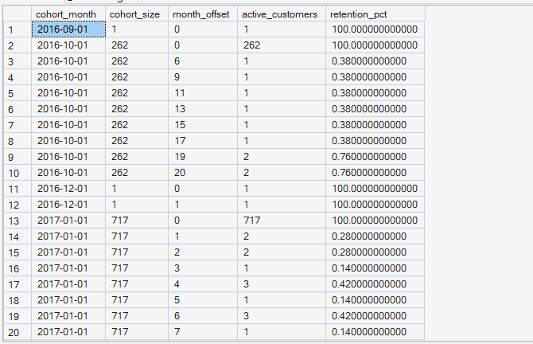
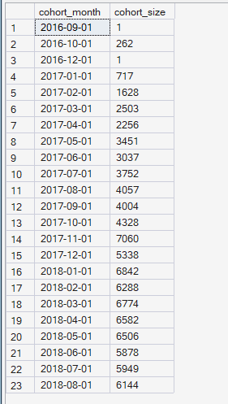

# Phase 5 — Customer Journey Analytics
## 08. Cohort Analysis

**SQL Script:** `08_cohort_analysis.sql`

---

## 1. Business Question

When customers are grouped by the month of their first purchase (their cohort), how many come back to purchase again in each subsequent month?

---

## 2. Objective

Analyze repeat-purchase behavior by grouping customers according to the month of their first delivered order and tracking how many customers remain active in subsequent purchase months.

The analysis is designed to understand:

- Cohort size
- Repeat-purchase activity over time
- Retention percentage by month offset
- Differences in retention behavior across acquisition cohorts

---

## 3. Data Source

The analysis deliberately uses the real order data in the Phase 3 Enterprise SQL Data Warehouse:

- `dbo.Fact_Order_Items`
- `dbo.Dim_Customer`
- `dbo.Dim_Date`

`Fact_Sessions` is not used for cohort construction because only a minority of sessions resolve to known customers, which would produce thin and noisy customer cohorts.

---

## 4. Customer Grain

The analysis uses:

`customer_unique_id`

as the customer-level identifier.

This is important because `customer_id` in the Olist foundation is effectively order-level, while `customer_unique_id` represents the persistent person across orders.

Using `customer_unique_id` allows customers with multiple delivered orders to appear across multiple purchase months and therefore makes retention analysis meaningful.

---

## 5. Cohort Definition

Each customer is assigned to the month of their **first delivered order**.

For each customer, subsequent delivered-order months are identified and converted into a `month_offset` using `DATEDIFF(MONTH, ...)`.

Therefore:

- `month_offset = 0` → customer's cohort month
- `month_offset = 1` → one month after cohort
- `month_offset = 2` → two months after cohort
- etc.

Retention is calculated as:

**Active Customers / Cohort Size × 100**

---

## 6. Techniques Used

- Common Table Expressions (CTEs)
- `MIN()` for first-order identification
- `DATEFROMPARTS()`
- `DATEDIFF(MONTH)`
- Distinct customer-month activity
- Cohort bucketing
- Aggregation
- Retention percentage calculation
- Temporary table
- Customer-level cohort analysis

---

# 7. Result Set A — Cohort Retention Activity

The first result set provides the cohort retention table, including:

- Cohort month
- Cohort size
- Month offset
- Active customers
- Retention percentage

### Output

The complete query returns **219 rows**.

The screenshot below shows a representative **20 rows** from the result set.

| Cohort Month | Cohort Size | Month Offset | Active Customers | Retention % |
|---|---:|---:|---:|---:|
| 2016-09-01 | 1 | 0 | 1 | 100.00% |
| 2016-10-01 | 262 | 0 | 262 | 100.00% |
| 2016-10-01 | 262 | 6 | 1 | 0.38% |
| 2016-10-01 | 262 | 9 | 1 | 0.38% |
| 2016-10-01 | 262 | 11 | 1 | 0.38% |
| 2016-10-01 | 262 | 13 | 1 | 0.38% |
| 2016-10-01 | 262 | 15 | 1 | 0.38% |
| 2016-10-01 | 262 | 17 | 1 | 0.38% |
| 2016-10-01 | 262 | 19 | 1 | 0.38% |
| 2016-10-01 | 262 | 20 | 2 | 0.76% |
| 2016-12-01 | 1 | 0 | 1 | 100.00% |
| 2016-12-01 | 1 | 0 | 1 | 100.00% |
| 2017-01-01 | 717 | 0 | 717 | 100.00% |
| 2017-01-01 | 717 | 1 | 2 | 0.28% |
| 2017-01-01 | 717 | 2 | 2 | 0.28% |
| 2017-01-01 | 717 | 3 | 1 | 0.14% |
| 2017-01-01 | 717 | 4 | 3 | 0.42% |
| 2017-01-01 | 717 | 5 | 1 | 0.14% |
| 2017-01-01 | 717 | 6 | 3 | 0.42% |
| 2017-01-01 | 717 | 7 | 1 | 0.14% |

### Screenshot

**Displayed rows:** 20  
**Total result rows:** 219

---

# 8. Result Set B — Cohort Sizes

The second result set shows the number of customers entering each acquisition cohort.

### Output

**Total result rows:** 23

| Cohort Month | Cohort Size |
|---|---:|
| 2016-09-01 | 1 |
| 2016-10-01 | 262 |
| 2016-12-01 | 1 |
| 2017-01-01 | 717 |
| 2017-02-01 | 1,628 |
| 2017-03-01 | 2,503 |
| 2017-04-01 | 2,256 |
| 2017-05-01 | 3,451 |
| 2017-06-01 | 3,037 |
| 2017-07-01 | 3,752 |
| 2017-08-01 | 4,057 |
| 2017-09-01 | 4,004 |
| 2017-10-01 | 4,328 |
| 2017-11-01 | 7,060 |
| 2017-12-01 | 5,338 |
| 2018-01-01 | 6,842 |
| 2018-02-01 | 6,288 |
| 2018-03-01 | 6,774 |
| 2018-04-01 | 6,582 |
| 2018-05-01 | 6,506 |
| 2018-06-01 | 5,878 |
| 2018-07-01 | 5,949 |
| 2018-08-01 | 6,144 |

### Screenshot

**Displayed rows:** 23  
**Total result rows:** 23

---

# 9. Key Observations

## 9.1 Cohort retention falls sharply after the initial purchase month

The cohort month represents the customer's first delivered purchase and therefore has:

**100% retention**

by definition.

Subsequent month offsets show substantially smaller active-customer counts.

For example, the January 2017 cohort contains **717 customers** at month 0.

At month 1, only **2 customers** remain active, representing:

**0.28% retention**

---

## 9.2 Repeat purchasing is relatively limited

The cohort output shows a steep decline from month 0 to subsequent purchase months.

This is consistent with the broader Phase 4 finding that only approximately **3% of customers are repeat purchasers**.

Therefore, the steep retention curve is consistent with the observed purchasing behavior in the underlying order dataset.

---

## 9.3 Cohort sizes increase substantially through the dataset

The cohort-size output shows customer acquisition volume increasing over time.

Examples include:

- May 2017: 3,451 customers
- October 2017: 4,328 customers
- November 2017: 7,060 customers
- January 2018: 6,842 customers
- August 2018: 6,144 customers

This provides useful context when interpreting retention because larger cohorts carry more customers and therefore more business weight.

---

# 10. Important Output Interpretation

The retention result set does not generate rows for months in which a cohort has **zero active customers**.

For example, if a cohort has no customers purchasing in a particular month offset, that month does not appear as a row in the result.

Therefore, the output represents **observed cohort activity months**, rather than a fully populated retention matrix containing explicit zeroes for every possible month offset.

The complete 219-row SQL result remains the authoritative dataset.

---

# 11. Business Interpretation

The cohort analysis demonstrates a very steep decline in repeat-purchase activity after the initial purchase month.

The strongest retention concentration occurs at:

**Month 0 = 100%**

because all cohort members are active by definition.

Subsequent activity is sparse, with many cohorts showing extremely low retention percentages in later months.

This indicates that repeat purchasing is concentrated among a small subset of customers rather than being broadly distributed across the customer base.

---

# 12. Business Implication

The observed retention pattern suggests that the immediate post-purchase period is an important area for retention investigation.

Potential areas for later business analysis include:

- Post-purchase engagement
- Repeat-purchase incentives
- Customer reactivation
- Personalized offers
- Product/category cross-sell opportunities
- Timing of retention interventions

These are potential intervention areas, not confirmed causal drivers.

The cohort analysis identifies **the retention pattern**, while subsequent analysis is required to understand the underlying reasons and determine which interventions would be most effective.

---

# 13. Relationship to Previous Phase Findings

The cohort results are consistent with the customer-level purchasing behavior identified in Phase 4.

Phase 4 established that repeat purchasing is relatively limited.

Phase 5 cohort analysis adds the **time dimension**, showing how repeat activity is distributed after the customer's first delivered purchase.

Together, these analyses provide both:

- The overall repeat-customer picture
- The timing of repeat-purchase activity

---

# 14. Scope Control

This analysis intentionally does not include:

- RFM analysis
- Customer Lifetime Value
- Recommendation intelligence
- A/B testing
- Experimentation
- Power BI
- What-If analysis

These capabilities are addressed in later phases of ORGEE.

---

# 15. Reproducibility

The complete analysis is available in:

`08_cohort_analysis.sql`

The SQL script is the authoritative source for the complete 219-row cohort activity result.

The screenshots provide visual evidence of the executed outputs.

---

## Conclusion

The cohort analysis shows a pronounced decline in repeat-purchase activity after customers' first delivered purchase.

The cohort month begins at **100% retention by definition**, while subsequent purchase activity is generally sparse.

For example, the January 2017 cohort contains **717 customers**, but only **2 customers (0.28%)** are active again one month later.

The results reinforce the importance of retention as a customer-growth opportunity and provide the foundation for the dedicated retention-curve analysis in Script 09.