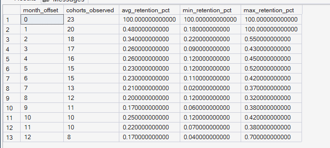
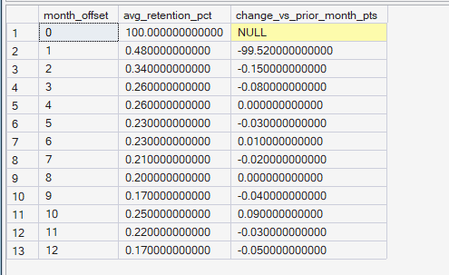

# Phase 5 — Customer Journey Analytics
## 09. Retention Curves

**SQL Script:** `09_retention_curves.sql`

---

> **Correction note:** this document originally reported an
> unweighted `AVG()` of each cohort's retention percentage for the
> blended curve, which let tiny early cohorts (e.g. a single-customer
> December 2016 cohort that happened to score 100% at month 1) count
> exactly as much as cohorts of 1,600+ customers. This inflated the
> Month 1 figure in particular (originally shown as 5.45%). The script
> was corrected to a size-weighted average
> (`SUM(active_customers) / SUM(cohort_size)` per month offset),
> matching the "Weighted Retention Rate %" measure in the Phase 9
> Power BI model exactly (both now show **0.48%** at Month 1). The
> numbers below are the corrected, re-run output.

---

## 1. Business Question

Beyond a single cohort table, what does the overall shape of retention look like — how quickly do customers stop coming back, and does that pattern hold consistently across cohorts?

---

## 2. Objective

Build a blended retention curve across customer cohorts to understand:

- How quickly retention declines after the first purchase
- The average retention level at each month offset
- Variation between observed cohorts
- Where the retention curve falls most sharply

The analysis uses the same delivered-order cohort methodology established in Script 08.

---

## 3. Data Sources

The analysis uses:

- `dbo.Fact_Order_Items`
- `dbo.Dim_Customer`
- `dbo.Dim_Date`

The cohort base is recomputed independently within this script.

---

## 4. Cohort Definition

Each customer is assigned to the month of their first delivered order using `customer_unique_id`.

Subsequent delivered-order activity is converted into monthly offsets:

- Month 0 = cohort month
- Month 1 = one month after the first purchase
- Month 2 = two months after
- etc.

Retention is calculated as the percentage of the original cohort that remains active at each observed month offset.

The blended (all-cohorts) figure is a **size-weighted average**: total active customers at that offset, across all cohorts, divided by total cohort size across those same cohorts — not a plain average of each cohort's individual percentage. This avoids letting very small cohorts dominate the blended number (see correction note above).

---

## 5. Curve Construction

The blended retention curve is restricted to month offsets from **0 through 12**.

Only offsets with at least **3 observed cohorts** are included in the first result set.

This avoids interpreting very late, thin cohort observations as a stable overall retention pattern.

---

## 6. Techniques Used

- Common Table Expressions (CTEs)
- Cohort bucketing
- `DATEDIFF(MONTH)`
- Distinct customer-month activity
- Aggregation
- Window functions
- `LAG()`
- Size-weighted retention percentage calculation
- Min/max cohort comparison
- Blended retention curve

---

# 7. Result Set A — Blended Retention Curve

The first result set summarizes retention across observable cohorts for each month offset. `Avg Retention %` is the size-weighted blend; `Min`/`Max` remain per-cohort extremes and are unaffected by the correction.

### Output

| Month Offset | Cohorts Observed | Avg Retention % | Min Retention % | Max Retention % |
|---:|---:|---:|---:|---:|
| 0 | 23 | 100.00% | 100.00% | 100.00% |
| 1 | 20 | 0.48% | 0.18% | 100.00% |
| 2 | 18 | 0.34% | 0.22% | 0.55% |
| 3 | 17 | 0.26% | 0.09% | 0.43% |
| 4 | 16 | 0.26% | 0.12% | 0.45% |
| 5 | 15 | 0.23% | 0.12% | 0.52% |
| 6 | 15 | 0.23% | 0.11% | 0.42% |
| 7 | 13 | 0.21% | 0.02% | 0.37% |
| 8 | 12 | 0.20% | 0.12% | 0.32% |
| 9 | 11 | 0.17% | 0.06% | 0.38% |
| 10 | 10 | 0.25% | 0.12% | 0.42% |
| 11 | 10 | 0.22% | 0.07% | 0.38% |
| 12 | 8 | 0.17% | 0.04% | 0.70% |

Note the Month 1 `Max Retention %` of 100.00% — this is the single-customer December 2016 cohort referenced in the correction note above. It's a genuine data point (a real cohort really did retain its one customer), which is exactly why it belongs in `Min`/`Max` but shouldn't dominate the blended average.

### Screenshot

*(Replace with a new screenshot of the corrected output above.)*

**Displayed rows:** 13
**Total result rows:** 13

---

# 8. Result Set B — Month-over-Month Retention Change

The second result set identifies how much the blended average retention changes from one month offset to the next.

### Output

| Month Offset | Avg Retention % | Change vs Prior Month (pts) |
|---:|---:|---:|
| 0 | 100.00% | — |
| 1 | 0.48% | **-99.52** |
| 2 | 0.34% | -0.15 |
| 3 | 0.26% | -0.08 |
| 4 | 0.26% | 0.00 |
| 5 | 0.23% | -0.03 |
| 6 | 0.23% | +0.01 |
| 7 | 0.21% | -0.02 |
| 8 | 0.20% | 0.00 |
| 9 | 0.17% | -0.04 |
| 10 | 0.25% | +0.09 |
| 11 | 0.22% | -0.03 |
| 12 | 0.17% | -0.05 |

*(A few of these deltas differ from the rounded `Avg Retention %` column by ±0.01pt — e.g. Month 2's -0.15 vs. the simple 0.48-0.34=0.14 arithmetic. This is expected: the delta is computed from full-precision underlying values, then rounded independently of the already-rounded percentage column. It's a cosmetic rounding artifact, not a data error.)*

### Screenshot

*(Replace with a new screenshot of the corrected output above.)*

**Displayed rows:** 13
**Total result rows:** 13

---

# 9. Key Observations

## 9.1 Retention experiences an even steeper early cliff than first calculated

The most significant decline occurs between:

**Month 0 → Month 1**

Average retention falls from:

**100.00% → 0.48%**

This represents a decline of:

**99.52 percentage points**

This is by far the largest month-over-month movement in the retention curve — and, once correctly weighted by cohort size, an even sharper drop than the project's earlier (unweighted) calculation suggested. Virtually the entire cohort fails to return by Month 1.

---

## 9.2 Retention remains extremely low after Month 1

By Month 2, average retention is only:

**0.34%**

From Month 3 onward, the blended retention rate remains around the very low range of approximately **0.17%–0.26%** through Month 12.

The curve therefore has two distinct characteristics:

1. A near-total initial drop-off
2. A long, very low retention tail

---

## 9.3 Cohort coverage decreases at later offsets

The number of observable cohorts declines as the month offset increases.

Examples:

- Month 0: 23 cohorts
- Month 1: 20 cohorts
- Month 6: 15 cohorts
- Month 12: 8 cohorts

This occurs because newer cohorts have not existed long enough to provide observations at later month offsets.

Therefore, later points should be interpreted with a smaller cohort base.

---

# 10. Business Interpretation

The retention curve shows a pronounced **early retention cliff** — more pronounced than originally calculated.

The largest decline occurs immediately after the initial purchase month:

**100.00% → 0.48%**

at Month 1.

After this initial decline, retention remains extremely low and relatively flat.

This indicates that the primary retention challenge is concentrated almost entirely in the **first month after purchase**, rather than being a gradual decline spread evenly across the customer lifecycle. The corrected, size-weighted figure makes this an even stronger finding than before: it is not that a modest fraction of customers return in Month 1 — it is that almost none do.

---

# 11. Business Implication

The results suggest that retention investment should prioritize the **immediate post-purchase window**, with even greater urgency than the original (unweighted) figure implied.

Potential areas for later investigation include:

- Early re-engagement
- Repeat-purchase incentives
- Post-purchase communication
- Personalized offers
- Cross-sell opportunities
- Customer reactivation strategies

The analysis identifies the timing of the retention problem but does not establish which intervention would causally improve retention.

---

# 12. Relationship to Script 08

Script 08 provides the detailed cohort-level retention table.

Script 09 aggregates those cohort behaviors into a blended retention curve.

Together:

**Script 08 → Cohort-level retention**

**Script 09 → Overall retention curve shape**

This provides a clearer view of how quickly customers stop returning after their first purchase.

---

# 13. Scope Control

This analysis intentionally does not include:

- RFM analysis
- Customer Lifetime Value
- Recommendation intelligence
- A/B testing
- Experimentation
- Power BI
- What-If analysis

These capabilities are addressed in later phases of ORGEE.

---

# 14. Reproducibility

The complete analysis is available in:

`09_retention_curves.sql`

The SQL script is the authoritative source for the complete result sets.

The screenshots provide visual evidence of the executed outputs.

---

## Conclusion

The retention curve reveals a clear **early retention cliff** — sharper than the project's original (unweighted) calculation showed.

Average retention falls from **100.00% in Month 0 to 0.48% in Month 1**, a decline of **99.52 percentage points**.

By Month 2, retention falls to **0.34%**, after which the curve remains at a very low level through Month 12.

The primary retention opportunity therefore appears to be concentrated almost entirely in the **first month after purchase**.

This finding becomes an important customer-growth insight for the later Customer & Product Analytics and experimentation phases, and now reconciles exactly with the Phase 9 Power BI "Weighted Retention Rate %" measure.
