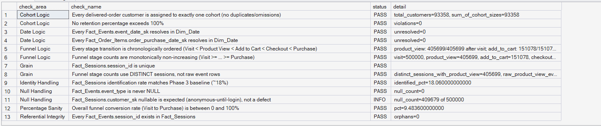
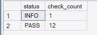

# Phase 5 — Customer Journey Analytics
## 10. Phase 5 Validation

**SQL Script:** `10_phase5_validation.sql`

---

## 1. Purpose

The Phase 5 validation script validates the assumptions, calculations, data relationships, and analytical logic used across Scripts 01–09.

The validation follows the same PASS / FAIL / INFO pattern used in the earlier ORGEE phases.

---

## 2. Validation Areas

The validation covers:

- Session grain
- Event/session referential integrity
- Funnel grain
- Identity handling
- Date relationships
- Funnel stage ordering
- Funnel monotonicity
- Conversion percentage sanity
- Cohort assignment
- Retention percentage sanity
- NULL handling

---

## 3. Validation Result

The executed validation produced:

| Status | Check Count |
|---|---:|
| PASS | 12 |
| INFO | 1 |
| FAIL | 0 |

### Overall Status

**PHASE 5 VALIDATION: PASS**

The validation completed successfully with no failed checks.

---

## 4. Detailed Validation Output

### Result Set A — Validation Checks

The validation returned **13 checks** in total.

**Displayed rows:** 13  
**Total result rows:** 13

### Validation Summary

- **12 checks:** PASS
- **1 check:** INFO
- **0 checks:** FAIL

---

## 5. Key Validation Findings

### 5.1 Session Grain

`Fact_Sessions.session_id` is unique.

This confirms that the session-level analysis operates at the intended session grain.

**Status:** PASS

---

### 5.2 Event / Session Referential Integrity

Every `Fact_Events.session_id` exists in `Fact_Sessions`.

The validation returned:

`orphans = 0`

**Status:** PASS

---

### 5.3 Funnel Grain

Funnel stage counts use distinct sessions rather than raw event rows.

The validation confirms that product-view session counts are based on distinct sessions and do not accidentally count repeated event rows multiple times.

**Status:** PASS

---

### 5.4 Identity Handling

The identified-session percentage is:

**18.06%**

This is consistent with the Phase 3 baseline and the anonymous-until-login identity model.

**Status:** PASS**

---

### 5.5 Date Relationships

Both event and order purchase date keys successfully resolve to `Dim_Date`.

- `Fact_Events.event_date_sk`: unresolved = 0
- `Fact_Order_Items.order_purchase_date_sk`: unresolved = 0

**Status:** PASS**

---

### 5.6 Funnel Logic

The funnel stage counts remain chronologically ordered:

**Visit → Product View → Add to Cart → Checkout → Purchase**

The validation confirms that stage counts are monotonically non-increasing.

The chronological stage-order validation also passed.

**Status:** PASS**

---

### 5.7 Funnel Conversion Sanity

The overall Visit-to-Purchase conversion rate is:

**9.4836%**

The value falls within the valid **0–100%** range.

**Status:** PASS**

---

### 5.8 Cohort Logic

Every delivered-order customer is assigned to exactly one cohort.

The validation returned:

- Total customers = **93,358**
- Sum of cohort sizes = **93,358**

No retention percentage exceeds 100%.

**Status:** PASS**

---

### 5.9 NULL Handling

`Fact_Events.event_type` contains no NULL values.

**Status:** PASS**

`Fact_Sessions.customer_sk` contains NULL values, but this is expected because anonymous sessions remain unresolved until login.

**Status:** INFO**

This is an expected characteristic of the Phase 2/3 identity model, not a data-quality failure.

---

## 6. Result Set B — Validation Summary

The final summary confirms:

| Status | Check Count |
|---|---:|
| PASS | 12 |
| INFO | 1 |

**Displayed rows:** 2  
**Total result rows:** 2

---

## 7. Validation Conclusion

Phase 5 passes validation with:

**12 PASS / 1 INFO / 0 FAIL**

The INFO result is expected and documents the presence of anonymous sessions whose `customer_sk` has not yet been resolved.

The validation confirms that the Phase 5 customer journey, funnel, segmentation, cohort, and retention analyses are operating on the intended data relationships and analytical grain.

---

## 8. Scope Control

The validation covers the analytical logic used in Phase 5 only.

It does not introduce:

- RFM
- Customer Lifetime Value
- Recommendation Intelligence
- A/B Testing
- Power BI
- What-If Analysis

These belong to later ORGEE phases.

---

## 9. Reproducibility

The complete validation logic is available in:

`10_phase5_validation.sql`

The SQL script is the authoritative source for all validation checks.

The screenshots provide visual evidence of the executed validation results.

---

# Phase 5 Final Validation Status

**PASS**

**12 PASS | 1 INFO | 0 FAIL**