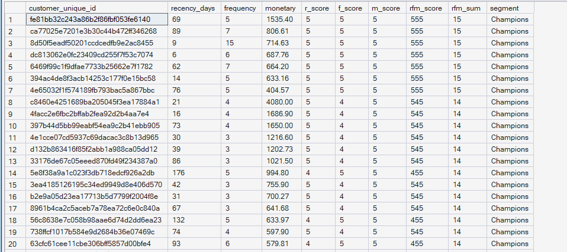
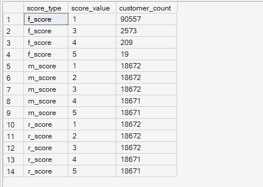
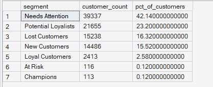

# Phase 6 — Customer & Product Analytics
## 01. RFM Analysis

**SQL Script:** `01_rfm_analysis.sql`

---

## 1. Business Question

Who are our most valuable and most engaged customers, based on how recently, how often, and how much they've purchased?

---

## 2. Objective

Apply **RFM (Recency, Frequency, Monetary) analysis** at the persistent customer level to understand customer purchasing behavior and identify meaningful customer segments.

The analysis evaluates:

- **Recency** — How recently the customer purchased
- **Frequency** — How often the customer purchased
- **Monetary** — How much the customer spent

The resulting RFM scores are used to classify customers into business-facing segments for subsequent customer analytics and value analysis.

---

## 3. Data Source

All analysis is performed from the **Phase 3 Enterprise SQL Data Warehouse**.

### Primary Tables

- `dbo.Fact_Order_Items`
- `dbo.Dim_Customer`
- `dbo.Dim_Date`

### Customer Grain

> **One row per `customer_unique_id` (person-level).**

`customer_id` is not used as the customer grain because it is effectively one-per-order in the Olist dataset.

---

## 4. Methodology

### 4.1 Snapshot Date

Recency is measured relative to the **latest delivered order date present in the dataset**, rather than the current system date.

The snapshot date is calculated dynamically using the maximum delivered-order date.

This is necessary because the underlying dataset represents historical activity from 2016–2018. Using today's date would incorrectly make historical customers appear highly inactive.

### 4.2 Recency

Recency is the number of days between the customer's last delivered order and the dataset snapshot date.

**Scoring convention:**

- **R5** = most recent
- **R1** = least recent

Standard `NTILE(5)` quintile scoring is used.

### 4.3 Frequency

Frequency is the **number of distinct delivered orders per customer**.

A standard quintile split is deliberately **not** used because the actual distribution is extremely skewed:

- **90,557 of 93,358 customers (97.00%)** placed exactly one delivered order.
- **2,801 customers (3.00%)** repeat-purchased.

Business-meaningful frequency buckets are therefore used:

| Frequency | F Score |
|---|---:|
| 1 order | 1 |
| 2 orders | 3 |
| 3–4 orders | 4 |
| 5+ orders | 5 |

**Scoring convention:** 5 = best, 1 = worst.

### 4.4 Monetary

Monetary is the **total delivered-order item price per customer** during the observation period.

Standard `NTILE(5)` quintile scoring is used:

- **M5** = highest spend
- **M1** = lowest spend

### 4.5 Combined RFM Score

Each customer receives:

- R Score
- F Score
- M Score

Two combined measures are produced:

- **RFM Score**, e.g. `555`
- **RFM Sum**, e.g. `15`

---

## 5. Result Set 1 — Customer-Level RFM

The SQL produces the complete customer-level `#RFM` table and returns the **top 50 customers** for inspection, ordered by RFM Sum descending and Monetary descending.

**Total underlying RFM customers:** 93,358  
**Rows returned by SQL:** 50  
**Rows visible in screenshot:** 20

The screenshot shows the first **20 rows of the 50-row SQL result set**.

The displayed output confirms that customers with strong Recency, Frequency, and Monetary scores are classified as **Champions**.

## 6. Result Set 2 — RFM Score Distribution

### Recency

| R Score | Customers |
|---:|---:|
| 1 | 18,672 |
| 2 | 18,672 |
| 3 | 18,672 |
| 4 | 18,671 |
| 5 | 18,671 |

### Frequency

| F Score | Customers |
|---:|---:|
| 1 | 90,557 |
| 3 | 2,573 |
| 4 | 209 |
| 5 | 19 |

### Monetary

| M Score | Customers |
|---:|---:|
| 1 | 18,672 |
| 2 | 18,672 |
| 3 | 18,672 |
| 4 | 18,671 |
| 5 | 18,671 |

Recency and Monetary form near-equal quintiles, while Frequency remains highly concentrated because the underlying purchase distribution is highly skewed.

---

## 7. Result Set 3 — Customer Segment Distribution

| Segment | Customers | % of Customers |
|---|---:|---:|
| Needs Attention | 39,337 | 42.14% |
| Potential Loyalists | 21,655 | 23.20% |
| Lost Customers | 15,238 | 16.32% |
| New Customers | 14,486 | 15.52% |
| Loyal Customers | 2,413 | 2.58% |
| At Risk | 116 | 0.12% |
| Champions | 113 | 0.12% |

**Total:** 93,358 customers

---

## 8. Segment Definitions

| Segment | Rule |
|---|---|
| Champions | R ≥ 4, F ≥ 4, M ≥ 4 |
| Loyal Customers | F ≥ 3, M ≥ 3 |
| Potential Loyalists | F = 1, R ≥ 4, M ≥ 3 |
| New Customers | F = 1, R ≥ 4, M < 3 |
| At Risk | F ≥ 3, R ≤ 2 |
| Lost Customers | R ≤ 2, F = 1, M ≤ 2 |
| Needs Attention | Remaining customers |

---

## 9. Observations

### Observation 1 — One-time purchasing dominates

**90,557 of 93,358 customers (97.00%)** placed exactly one delivered order. Only **2,801 customers (3.00%)** repeat-purchased.

This extreme concentration is the key reason Frequency uses business-defined buckets rather than equal-sized quintiles.

### Observation 2 — Needs Attention is the largest segment

**39,337 customers (42.14%)** fall into **Needs Attention**.

This segment should be examined further using customer value and behavioral metrics before deciding its business priority.

### Observation 3 — Champions are very small

Only **113 customers (0.12%)** qualify as Champions.

This is consistent with the very small population exhibiting strong repeat-purchase behavior together with strong Recency and Monetary scores.

### Observation 4 — R and M scores behave as intended

Both Recency and Monetary produce approximately equal-sized five-way distributions, confirming that the NTILE-based scoring is behaving as intended for these dimensions.

---

## 10. Interpretation

The RFM analysis reveals a customer base dominated by **one-time purchasing behavior**, with only a small population showing strong repeat-purchase characteristics.

The large **Needs Attention**, **Potential Loyalists**, **Lost Customers**, and **New Customers** populations provide the basis for deeper analysis of:

- Customer value
- Retention opportunity
- Reactivation opportunity
- Repeat-purchase behavior
- Segment-level revenue contribution

RFM alone does not determine which segments have the greatest financial impact. That question is addressed by combining RFM with **Historical Customer Lifetime Value (CLV)** in the subsequent analysis.

---

## 11. Business Implication

The strongest implication is that **repeat-purchase behavior is scarce**.

Customer strategy should therefore distinguish between:

- Protecting the small high-value repeat-purchase population
- Converting promising customers into repeat purchasers
- Reactivating inactive customers
- Understanding whether large lower-engagement segments contain meaningful revenue opportunity

These conclusions will be tested further using customer-value analysis rather than assuming that segment size equals business value.

---

## 12. Scope Control

This script intentionally does **not** include:

- Predictive CLV
- Machine-learning customer scoring
- Recommendation modeling
- A/B testing
- Power BI
- What-If analysis

The purpose of this script is strictly:

> **RFM measurement and customer segmentation foundation.**

---

## 13. Techniques Used

- CTEs
- Aggregation
- `COUNT(DISTINCT)`
- `SUM`
- `MAX`
- `DATEDIFF`
- `NTILE(5)`
- `CASE`
- Window functions
- Temporary table
- Dynamic historical snapshot date

---

## 14. Validation Notes

The output confirms:

- Customer population = **93,358**
- Recency scores are distributed across five near-equal groups
- Monetary scores are distributed across five near-equal groups
- Frequency distribution reflects the actual highly skewed purchase behavior
- Segment counts reconcile to the complete 93,358-customer population
- No artificial equal-frequency segmentation was imposed on the Frequency metric

Final technical validation for the complete Phase 6 workflow will be performed in the dedicated Phase 6 validation script.

---

## 15. Signature Insight

> **97.00% of customers placed only one delivered order, leaving just 3.00% as repeat purchasers.**

This makes **repeat-purchase conversion and customer retention** a critical area for deeper Phase 6 investigation.

---

## 16. Next Step

**Next script:** `02_customer_segmentation.sql`

The next analysis will deepen the segment-level view and examine the business characteristics of the RFM customer groups.
