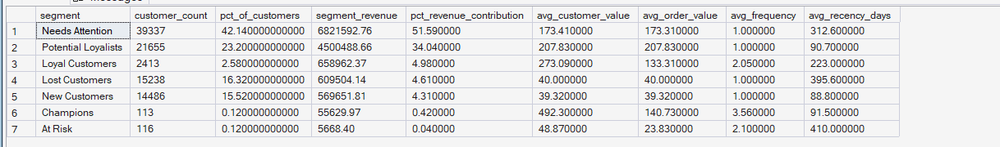
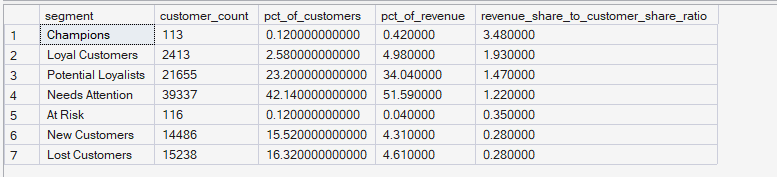

# Phase 6 — Customer & Product Analytics
## 02. Customer Segmentation

**SQL Script:** `02_customer_segmentation.sql`

---

## 1. Business Question

How big is each RFM segment, how much revenue does it drive, and what distinguishes its purchasing behavior?

---

## 2. Objective

Extend the RFM foundation from Script 01 into a business-oriented segment profile.

The analysis evaluates each RFM segment across:

- Customer population
- Customer share
- Segment revenue
- Revenue contribution
- Average customer value
- Average order value
- Average purchase frequency
- Average recency

A second analysis compares each segment's **revenue share with its customer share** to identify segments that contribute disproportionately more or less revenue than their population size would suggest.

---

## 3. Data Source

All analysis is performed from the **Phase 3 Enterprise SQL Data Warehouse**.

### Primary tables

- `dbo.Fact_Order_Items`
- `dbo.Dim_Customer`
- `dbo.Dim_Date`

The script independently recomputes the same RFM foundation established in `01_rfm_analysis.sql`, preserving the Phase 6 convention that each SQL script can run independently.

---

## 4. Customer Grain

The underlying RFM dataset is:

> **One row per `customer_unique_id` (person-level).**

Frequency is the number of distinct delivered orders per customer.

Monetary is the customer's total delivered-order item price during the observation period.

---

## 5. RFM Methodology Reused

The segmentation logic uses the same methodology established in Script 01:

### Recency

Recency is measured against the latest delivered order date present in the historical dataset.

### Frequency

Frequency uses business-meaningful buckets because 97.00% of customers have exactly one delivered order:

| Frequency | F Score |
|---|---:|
| 1 order | 1 |
| 2 orders | 3 |
| 3–4 orders | 4 |
| 5+ orders | 5 |

### Monetary

Monetary is scored using five quintiles.

### Segment Rules

| Segment | Rule |
|---|---|
| Champions | R ≥ 4, F ≥ 4, M ≥ 4 |
| Loyal Customers | F ≥ 3, M ≥ 3 |
| Potential Loyalists | F = 1, R ≥ 4, M ≥ 3 |
| New Customers | F = 1, R ≥ 4, M < 3 |
| At Risk | F ≥ 3, R ≤ 2 |
| Lost Customers | R ≤ 2, F = 1, M ≤ 2 |
| Needs Attention | Remaining customers |

---

## 6. Result Set 1 — Segment Profile

The first result set provides the core Phase 6 segmentation table.

### Actual Output

| Segment | Customers | % Customers | Segment Revenue | % Revenue | Avg Customer Value | Avg Order Value | Avg Frequency | Avg Recency Days |
|---|---:|---:|---:|---:|---:|---:|---:|---:|
| Needs Attention | 39,337 | 42.14% | $6,821,592.76 | 51.59% | $173.41 | $173.31 | 1.00 | 312.6 |
| Potential Loyalists | 21,655 | 23.20% | $4,504,888.68 | 34.04% | $207.83 | $207.83 | 1.00 | 90.7 |
| Loyal Customers | 2,413 | 2.58% | $658,962.37 | 4.98% | $273.09 | $133.31 | 2.05 | 223.0 |
| Lost Customers | 15,238 | 16.32% | $609,504.14 | 4.61% | $40.00 | $40.00 | 1.00 | 395.6 |
| New Customers | 14,486 | 15.52% | $569,651.81 | 4.31% | $39.32 | $39.32 | 1.00 | 88.8 |
| Champions | 113 | 0.12% | $55,629.97 | 0.42% | $492.30 | $140.73 | 3.56 | 91.5 |
| At Risk | 116 | 0.12% | $5,668.40 | 0.04% | $48.87 | $23.83 | 2.10 | 410.0 |

**Total customers:** 93,358

### Screenshot

---

## 7. Observations — Segment Profile

### Observation 1 — Needs Attention is the largest segment and the largest revenue contributor

**39,337 customers (42.14%)** are classified as Needs Attention and contribute **51.59% of segment revenue**.

This is the largest customer population and also the largest revenue pool in the segmentation analysis.

Because Needs Attention is the residual segment, it should not automatically be treated as a homogeneous customer group. Its size makes it important to investigate further, but the segment definition itself is intentionally broad.

---

### Observation 2 — Potential Loyalists are a major opportunity population

Potential Loyalists contain **21,655 customers (23.20%)** and contribute **34.04% of revenue**.

Their average customer value is **$207.83**, while their average recency is only **90.7 days**.

This combination indicates a relatively recent and financially meaningful one-order customer population that may be important for future repeat-purchase analysis.

---

### Observation 3 — Champions have the highest average customer value

Champions have an average customer value of **$492.30**, the highest among all segments.

They also have:

- Average frequency: **3.56 orders**
- Average recency: **91.5 days**
- Average order value: **$140.73**

However, Champions represent only **0.12% of customers** and **0.42% of revenue**.

Therefore, their high individual value does not mean they are the largest revenue pool.

---

### Observation 4 — Loyal Customers show meaningful repeat purchasing

Loyal Customers have:

- **2.05 average orders**
- **$273.09 average customer value**
- **$133.31 average order value**

They represent **2.58% of customers** and **4.98% of revenue**.

This segment demonstrates materially stronger repeat-purchase behavior than the one-order segments.

---

### Observation 5 — Lost Customers have low realized customer value

Lost Customers contain **15,238 customers (16.32%)** but contribute only **4.61% of revenue**.

Their average customer value is **$40.00**, with an average recency of **395.6 days**.

This indicates a large inactive population with relatively low realized value under the historical observation period.

---

## 8. Result Set 2 — Revenue Efficiency

The second result set compares:

> **Revenue share ÷ Customer share**

A ratio above 1 means a segment contributes a larger share of revenue than its share of customers.

A ratio below 1 means the segment contributes less revenue than its population share.

### Actual Output

| Segment | Customers | % Customers | % Revenue | Revenue Share / Customer Share |
|---|---:|---:|---:|---:|
| Champions | 113 | 0.12% | 0.42% | 3.48 |
| Loyal Customers | 2,413 | 2.58% | 4.98% | 1.93 |
| Potential Loyalists | 21,655 | 23.20% | 34.04% | 1.47 |
| Needs Attention | 39,337 | 42.14% | 51.59% | 1.22 |
| At Risk | 116 | 0.12% | 0.04% | 0.35 |
| New Customers | 14,486 | 15.52% | 4.31% | 0.28 |
| Lost Customers | 15,238 | 16.32% | 4.61% | 0.28 |

### Screenshot

---

## 9. Revenue Efficiency Interpretation

### Champions — strongest revenue concentration

Champions have a revenue-share-to-customer-share ratio of **3.48**.

Their **0.12% customer share** produces **0.42% of revenue**.

This means Champions contribute revenue at roughly 3.5 times the rate implied by their population share.

---

### Loyal Customers — strong disproportionate contribution

Loyal Customers have a ratio of **1.93**.

They represent only **2.58% of customers**, but contribute **4.98% of revenue**.

This reinforces the importance of repeat purchasing to customer value.

---

### Potential Loyalists — large and financially meaningful

Potential Loyalists have a ratio of **1.47**.

They represent **23.20% of customers** while contributing **34.04% of revenue**.

This is particularly important because the segment combines substantial population size with disproportionate revenue contribution.

---

### New and Lost Customers — below population-weighted revenue contribution

Both New Customers and Lost Customers have a ratio of **0.28**.

Their revenue contribution is therefore substantially lower than their respective customer shares.

This does not mean these segments have no business value; rather, their realized historical revenue contribution is relatively low compared with their population size.

---

## 10. Key Business Findings

### Finding 1 — Revenue is concentrated in a small set of behaviorally stronger segments

The strongest revenue-share-to-customer-share ratios belong to:

1. **Champions — 3.48**
2. **Loyal Customers — 1.93**
3. **Potential Loyalists — 1.47**
4. **Needs Attention — 1.22**

All four segments contribute revenue above their population-weighted share.

---

### Finding 2 — Potential Loyalists are more important by scale than Champions

Champions have the highest individual customer value and the highest revenue efficiency ratio, but only **113 customers** qualify.

Potential Loyalists have **21,655 customers** and contribute **34.04% of revenue**.

Therefore, Potential Loyalists represent a much larger scalable customer opportunity.

---

### Finding 3 — Customer value and segment size tell different stories

The largest segment is **Needs Attention**, while the highest average customer value belongs to **Champions**.

This demonstrates why segment size alone should not be used to determine business priority.

Both **customer scale** and **economic value** need to be considered.

---

## 11. Business Implication

The segmentation analysis suggests three distinct strategic priorities for deeper analysis:

### 1. Protect high-value repeat purchasers

Champions and Loyal Customers have strong repeat-purchase behavior and disproportionate revenue contribution.

Their behavior should be protected and understood further.

### 2. Convert Potential Loyalists

Potential Loyalists are particularly important because they combine:

- Large population: **21,655**
- High revenue contribution: **34.04%**
- Strong revenue efficiency: **1.47**
- Recent average activity: **90.7 days**

This makes them a potentially important repeat-purchase conversion population.

### 3. Investigate the large Needs Attention population

Needs Attention represents **42.14% of customers** and **51.59% of revenue**.

Because it is the residual segment, deeper customer-value analysis is required before determining how to prioritize it.

---

## 12. Important Analytical Limitation

The revenue efficiency ratio is a **descriptive allocation metric**, not a causal measure.

A ratio above 1 means the segment contributes more revenue relative to its population share. It does **not** prove that the segment itself causes higher revenue.

Likewise, segment membership is based on RFM behavior during the observation period and should not be interpreted as a prediction of future customer value.

---

## 13. Scope Control

This script intentionally does **not** include:

- Predictive CLV
- Recommendation modeling
- A/B testing
- Power BI
- What-If analysis

Those capabilities belong to later ORGEE phases.

This script focuses exclusively on:

> **RFM segment profiling and revenue contribution analysis.**

---

## 14. Techniques Used

- CTEs
- `COUNT(DISTINCT)`
- `SUM`
- `AVG`
- `MAX`
- `DATEDIFF`
- `CASE`
- Window functions
- Aggregation
- Temporary table
- Revenue-share calculations
- Revenue-share-to-customer-share ratio

---

## 15. Validation Notes

The output reconciles to the complete **93,358-customer** population.

The segment counts are:

- Needs Attention: 39,337
- Potential Loyalists: 21,655
- Loyal Customers: 2,413
- Lost Customers: 15,238
- New Customers: 14,486
- Champions: 113
- At Risk: 116

These sum to **93,358 customers**.

The seven segment revenue contributions also sum to approximately 100% after rounding.

---

## 16. Signature Insight

> **Potential Loyalists represent 23.20% of customers but contribute 34.04% of revenue, making them a large and disproportionately valuable population for potential repeat-purchase conversion.**

---

## 17. Next Step

**Next script:** `03_historical_clv.sql`

The next analysis will move from RFM-based segmentation into **Historical Customer Lifetime Value**, using the locked ORGEE definition:

> **Total completed purchase value per customer during the observation period.**
