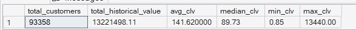
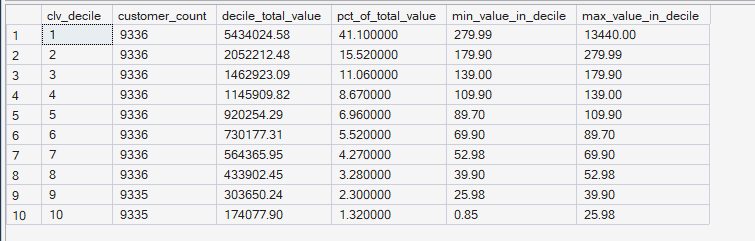
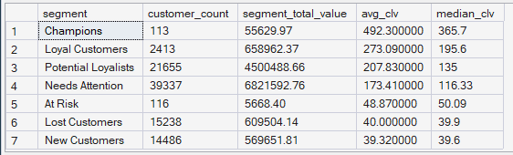
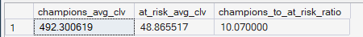

# Phase 6 — Customer & Product Analytics
## 03. Historical Customer Lifetime Value (CLV)

**SQL Script:** `03_historical_clv.sql`

---

## 1. Business Question

What is each customer actually worth, based on realized historical purchase value — and how is that value distributed and concentrated across customers and RFM segments?

---

## 2. Objective

Measure **Historical Customer Lifetime Value (CLV)** using the locked ORGEE methodology:

> **Historical CLV = Total Completed Purchase Value per Customer during the Observation Period**

This is a **realized historical value metric**, not a predictive CLV model.

The analysis examines:

- Overall customer-value distribution
- Mean, median, minimum, and maximum CLV
- CLV distribution by decile
- CLV by RFM segment
- Champions vs At-Risk average CLV

---

## 3. Locked CLV Methodology

Historical CLV is calculated as the customer's total delivered-order item price during the observation period.

The calculation uses:

```text
SUM(Fact_Order_Items.price)
```

for delivered orders, grouped by:

```text
customer_unique_id
```

This is consistent with the Monetary measure used in the preceding RFM analysis, but this script presents the same realized value specifically as the dedicated **Historical CLV** metric and analyzes its distribution and linkage to RFM segments.

### Important Scope Boundary

This is **not predictive CLV**.

No assumptions are made about:

- Future purchases
- Expected retention
- Discount rates
- Customer survival probability
- Future revenue
- Machine-learning predictions

---

## 4. Data Source

All analysis is performed from the **Phase 3 Enterprise SQL Data Warehouse**.

### Primary Tables

- `dbo.Fact_Order_Items`
- `dbo.Dim_Customer`
- `dbo.Dim_Date`

### Customer Grain

> **One row per `customer_unique_id` (person-level).**

Only delivered orders are included.

---

## 5. Result Set 1 — Overall CLV Summary

### Actual Output

| Metric | Value |
|---|---:|
| Total Customers | 93,358 |
| Total Historical Value | $13,221,498.11 |
| Average CLV | $141.62 |
| Median CLV | $89.73 |
| Minimum CLV | $0.85 |
| Maximum CLV | $13,440.00 |

### Screenshot



---

## 6. Observations — Overall Customer Value

### Observation 1 — Average CLV is materially above median CLV

Average CLV is **$141.62**, while median CLV is **$89.73**.

The mean being substantially higher than the median indicates a **right-skewed customer-value distribution**, where a relatively smaller number of high-value customers pull the average upward.

---

### Observation 2 — Customer value has a very wide range

CLV ranges from **$0.85** to **$13,440.00**.

This large range reinforces that customer value is not evenly distributed across the customer base.

---

## 7. Result Set 2 — CLV Distribution by Decile

Customers are divided into ten CLV deciles using `NTILE(10)`, ordered from highest historical value to lowest historical value.

### Actual Output

| CLV Decile | Customers | Total Value | % of Total Value | Value Range |
|---:|---:|---:|---:|---:|
| 1 | 9,336 | $5,434,024.58 | 41.10% | $279.99–$13,440.00 |
| 2 | 9,336 | $2,052,212.48 | 15.52% | $179.90–$279.99 |
| 3 | 9,336 | $1,462,923.09 | 11.06% | $139.00–$179.90 |
| 4 | 9,336 | $1,145,909.82 | 8.67% | $109.90–$139.00 |
| 5 | 9,336 | $920,254.29 | 6.96% | $89.70–$109.90 |
| 6 | 9,336 | $730,177.31 | 5.52% | $69.90–$89.70 |
| 7 | 9,336 | $564,365.95 | 4.27% | $52.98–$69.90 |
| 8 | 9,336 | $433,902.45 | 3.28% | $39.90–$52.98 |
| 9 | 9,335 | $303,650.24 | 2.30% | $25.98–$39.90 |
| 10 | 9,335 | $174,077.90 | 1.32% | $0.85–$25.98 |

### Screenshot



---

## 8. CLV Concentration Finding

The **top 10% of customers by historical CLV generate 41.10% of total historical customer value**.

This demonstrates substantial customer-value concentration.

The concentration is especially notable because the top decile contains only approximately one-tenth of the customer population while contributing more than two-fifths of total historical value.

---

## 9. Result Set 3 — CLV by RFM Segment

### Actual Output

| Segment | Customers | Segment Total Value | Avg CLV | Median CLV |
|---|---:|---:|---:|---:|
| Champions | 113 | $55,629.97 | $492.30 | $365.70 |
| Loyal Customers | 2,413 | $658,962.37 | $273.09 | $195.60 |
| Potential Loyalists | 21,655 | $4,504,888.68 | $207.83 | $135.00 |
| Needs Attention | 39,337 | $6,821,592.76 | $173.41 | $116.33 |
| At Risk | 116 | $5,668.40 | $48.87 | $50.09 |
| Lost Customers | 15,238 | $609,504.14 | $40.00 | $39.90 |
| New Customers | 14,486 | $569,651.81 | $39.32 | $39.60 |

### Screenshot



---

## 10. Observations — CLV by Segment

### Observation 1 — Champions have the highest average CLV

Champions have an average historical CLV of **$492.30**, the highest among all RFM segments.

Their median CLV is **$365.70**.

This confirms that the strongest RFM customers also have the highest realized historical customer value.

---

### Observation 2 — Loyal Customers have the second-highest average CLV

Loyal Customers have:

- Average CLV: **$273.09**
- Median CLV: **$195.60**
- Customer count: **2,413**

Their higher CLV is consistent with their stronger repeat-purchase behavior.

---

### Observation 3 — Potential Loyalists combine scale and high customer value

Potential Loyalists have:

- **21,655 customers**
- **$4.50M** total historical value
- **$207.83** average CLV
- **$135.00** median CLV

This makes them important from both a **population-scale** and **customer-value** perspective.

---

### Observation 4 — Needs Attention is the largest value pool

Needs Attention contributes **$6,821,592.76** in total historical value and has an average CLV of **$173.41**.

Although its average CLV is below Champions and Loyal Customers, its very large customer population makes its total value substantial.

---

### Observation 5 — Lost and New Customers have the lowest average CLV

Lost Customers have an average CLV of **$40.00**, while New Customers have an average CLV of **$39.32**.

These values are substantially below the higher-value RFM segments.

---

## 11. Result Set 4 — Champions vs At-Risk CLV

The final result calculates the ratio between average historical CLV for Champions and At-Risk customers.

### Actual Output

| Metric | Value |
|---|---:|
| Champions Avg CLV | $492.300619 |
| At-Risk Avg CLV | $48.86517 |
| Champions / At-Risk Ratio | **10.07×** |

### Screenshot



---

## 12. Signature Finding

> **Champions have 10.07× higher average historical CLV than At-Risk customers ($492.30 vs $48.87).**

This is the strongest direct connection in this analysis between **RFM behavioral quality and realized customer value**.

---

## 13. Business Interpretation

Customer value is highly concentrated and strongly differentiated across RFM segments.

The analysis shows two important dimensions of customer value:

### Individual value

Champions and Loyal Customers have the highest average historical CLV.

### Population-scale value

Potential Loyalists and Needs Attention contain much larger customer populations and therefore represent much larger total historical-value pools.

This distinction is important for business decision-making:

> **The highest-value customer is not necessarily the largest revenue opportunity.**

Both **value per customer** and **segment scale** must be considered.

---

## 14. Business Implications

### 1. Protect high-value customers

Champions and Loyal Customers have substantially higher realized historical value.

Retention strategies should therefore pay particular attention to customers demonstrating strong repeat-purchase behavior.

### 2. Potential Loyalists represent a scalable opportunity

Potential Loyalists combine:

- Large population
- High average CLV
- Large total historical value
- Recent purchasing behavior

They are therefore a strong candidate for deeper repeat-purchase analysis.

### 3. Customer value concentration supports differentiated treatment

Because the top CLV decile contributes **41.10% of total historical value**, treating every customer identically would ignore substantial differences in realized customer value.

---

## 15. Analytical Limitation

Historical CLV measures **realized value during the observation period only**.

It does not tell us:

- What the customer will spend in the future
- Whether a customer will return
- Expected future lifetime
- Incremental value from a campaign
- Causal impact of retention activity

Therefore, the CLV metric should be used as a **historical business-value measure**, not as a prediction.

---

## 16. Relationship to Previous Phase 6 Analysis

Script 01 introduced **Monetary** as one component of RFM.

Script 02 analyzed **segment-level revenue and revenue efficiency**.

This script deliberately takes the same underlying realized customer value and analyzes it from a different perspective:

> **Per-customer value distribution + CLV percentiles/deciles + linkage to RFM segments.**

This avoids treating CLV as a new predictive model while still providing the dedicated customer-value analysis required by Phase 6.

---

## 17. Scope Control

This analysis intentionally does **not** include:

- Predictive CLV
- Customer churn prediction
- Machine-learning models
- Recommendation modeling
- A/B testing
- Power BI
- What-If analysis

Those capabilities belong to later ORGEE phases.

---

## 18. Techniques Used

- CTEs
- Aggregation
- `COUNT`
- `SUM`
- `AVG`
- `MIN`
- `MAX`
- `PERCENTILE_CONT`
- `NTILE(10)`
- `CASE`
- Window functions
- Temporary table
- Segment-level aggregation

---

## 19. Validation Notes

The output confirms:

- **93,358 customers** are included.
- Total historical value = **$13,221,498.11**.
- Average CLV = **$141.62**.
- Median CLV = **$89.73**.
- Minimum CLV = **$0.85**.
- Maximum CLV = **$13,440.00**.
- Ten CLV deciles contain approximately equal customer populations.
- Segment-level CLV results align with the RFM segments established in Scripts 01–02.
- Champions have substantially higher average CLV than At-Risk customers.

---

## 20. Signature Insight

> **The top 10% of customers by historical CLV generate 41.10% of total historical customer value, while Champions have 10.07× higher average CLV than At-Risk customers.**

Together, these findings show that customer value is both **highly concentrated** and **strongly differentiated by customer behavior**.

---

## 21. Next Step

**Next script:** `04_rfm_clv_combined.sql`

The next analysis will explicitly combine **RFM segment + Historical CLV** to identify which customer groups offer the strongest combination of behavioral quality and realized economic value.
