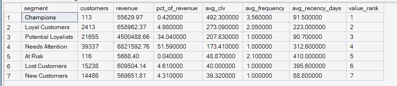
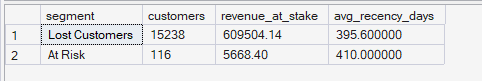

# Phase 6 — Customer & Product Analytics
## 04. RFM + Historical CLV Combined Analysis

**SQL Script:** `04_rfm_clv_combined.sql`

---

## 1. Business Question

Bringing RFM behavior and historical customer value together — which segments should the business retain, grow, win back, or deprioritize?

---

## 2. Objective

Combine the customer-behavior view from **RFM** with the economic-value view from **Historical CLV**.

The analysis evaluates each segment by:

- Customer population
- Revenue / historical customer value
- Revenue contribution
- Average historical CLV
- Average purchase frequency
- Average recency
- Value rank

A second result isolates **At Risk** and **Lost Customers** to quantify the historical revenue associated with these inactive/declining segments.

---

## 3. Data Source

All analysis is performed from the **Phase 3 Enterprise SQL Data Warehouse**.

### Primary Tables

- `dbo.Fact_Order_Items`
- `dbo.Dim_Customer`
- `dbo.Dim_Date`

The script independently recomputes the same RFM/CLV customer base established in Scripts 01–03.

---

## 4. Customer Grain

The underlying analysis is:

> **One row per `customer_unique_id` (person-level).**

Only delivered orders are included.

For each customer:

- `frequency` = distinct delivered orders
- `monetary` = total delivered-order item price
- `recency_days` = days since the customer's last delivered order relative to the historical dataset snapshot

Historical CLV is therefore the customer's realized monetary value during the observation period.

---

## 5. RFM Methodology

The same locked RFM methodology from Scripts 01–03 is reused.

### Recency

Five quintile scores using `NTILE(5)`.

- R5 = most recent
- R1 = least recent

### Frequency

Business-defined buckets:

| Frequency | F Score |
|---|---:|
| 1 order | 1 |
| 2 orders | 3 |
| 3–4 orders | 4 |
| 5+ orders | 5 |

### Monetary / Historical CLV

Five quintile scores using `NTILE(5)`.

### Segment Rules

| Segment | Rule |
|---|---|
| Champions | R ≥ 4, F ≥ 4, M ≥ 4 |
| Loyal Customers | F ≥ 3, M ≥ 3 |
| Potential Loyalists | F = 1, R ≥ 4, M ≥ 3 |
| New Customers | F = 1, R ≥ 4, M < 3 |
| At Risk | F ≥ 3, R ≤ 2 |
| Lost Customers | R ≤ 2, F = 1, M ≤ 2 |
| Needs Attention | Remaining customers |

---

## 6. Result Set 1 — Combined RFM + CLV Segment View

### Actual Output

| Segment | Customers | Revenue | % Revenue | Avg CLV | Avg Frequency | Avg Recency Days | Value Rank |
|---|---:|---:|---:|---:|---:|---:|---:|
| Champions | 113 | $55,629.97 | 0.42% | $492.30 | 3.56 | 91.5 | 1 |
| Loyal Customers | 2,413 | $658,962.37 | 4.98% | $273.09 | 2.05 | 223.0 | 2 |
| Potential Loyalists | 21,655 | $4,504,888.66 | 34.04% | $207.83 | 1.00 | 90.7 | 3 |
| Needs Attention | 39,337 | $6,821,592.76 | 51.59% | $173.41 | 1.00 | 312.6 | 4 |
| At Risk | 116 | $5,668.40 | 0.04% | $48.87 | 2.10 | 410.0 | 5 |
| Lost Customers | 15,238 | $609,504.14 | 4.61% | $40.00 | 1.00 | 395.6 | 6 |
| New Customers | 14,486 | $569,651.81 | 4.31% | $39.32 | 1.00 | 88.8 | 7 |

### Screenshot

**Total customers represented:** 93,358

---

## 7. Observations — Combined Analysis

### Observation 1 — Champions rank first on customer value

Champions have the highest average historical CLV:

> **$492.30 per customer**

They also have the highest average frequency at **3.56 orders** and a relatively recent average recency of **91.5 days**.

This confirms the relationship between strong RFM behavior and realized customer value.

---

### Observation 2 — Loyal Customers are the second-highest-value segment

Loyal Customers have:

- Average CLV: **$273.09**
- Average frequency: **2.05 orders**
- Average recency: **223.0 days**
- Total historical value: **$658,962.37**

Their repeat-purchase behavior distinguishes them from the much larger one-order populations.

---

### Observation 3 — Potential Loyalists combine scale and value

Potential Loyalists rank **third** by average customer value at **$207.83**.

More importantly, they contain **21,655 customers** and contribute **34.04% of total revenue**.

Their average recency is only **90.7 days**, while their average frequency is still **1.00 order**.

This makes them a particularly important population for future repeat-purchase conversion analysis.

---

### Observation 4 — Needs Attention is the largest economic pool

Needs Attention contains **39,337 customers**, or roughly 42% of the customer base, and contributes **51.59% of revenue**.

Its average CLV is **$173.41**, while average recency is **312.6 days**.

Because Needs Attention is the residual segment, it should not be treated as a single homogeneous behavioral group without further investigation.

---

### Observation 5 — At Risk is small in both population and historical value

At Risk contains only **116 customers** and contributes **$5,668.40**, or **0.04% of revenue**.

Its average CLV is **$48.87** and average recency is **410.0 days**.

Therefore, despite the strategic importance of retention as a concept, the actual historical value currently represented by the At Risk segment is very small in this dataset.

---

### Observation 6 — Lost Customers represent a much larger historical-value pool than At Risk

Lost Customers contain **15,238 customers** and contribute **$609,504.14**, or **4.61% of revenue**.

Their average CLV is **$40.00**, with average recency of **395.6 days**.

This means the Lost Customer population is substantially larger than the At Risk population and represents a materially larger historical revenue pool.

---

## 8. Result Set 2 — Retention-Priority View

The second result focuses specifically on:

- At Risk
- Lost Customers

### Actual Output

| Segment | Customers | Revenue at Stake | Avg Recency Days |
|---|---:|---:|---:|
| Lost Customers | 15,238 | $609,504.14 | 395.6 |
| At Risk | 116 | $5,668.40 | 410.0 |

### Screenshot

**Combined historical value represented:** $615,172.54

This view is intended to size the historical-value pool associated with customers classified as At Risk or Lost.

---

## 9. Key Business Findings

### Finding 1 — Customer value is strongly differentiated by RFM quality

The value ranking follows a clear pattern:

1. Champions — **$492.30 avg CLV**
2. Loyal Customers — **$273.09**
3. Potential Loyalists — **$207.83**
4. Needs Attention — **$173.41**
5. At Risk — **$48.87**
6. Lost Customers — **$40.00**
7. New Customers — **$39.32**

The strongest RFM segments therefore also show the strongest realized historical customer value.

---

### Finding 2 — Potential Loyalists are the strongest scale opportunity

Potential Loyalists have **21,655 customers** and contribute **34.04% of revenue**.

Their combination of:

- large customer population,
- relatively recent purchasing,
- high average CLV, and
- one-order behavior

makes them a particularly important opportunity for converting first-time purchasers into repeat customers.

---

### Finding 3 — Champions are highly valuable individually but tiny in scale

Champions have the highest average CLV at **$492.30**, but only **113 customers** qualify.

Therefore, protecting Champions is strategically important for customer value, but they are not the largest scalable growth population.

---

### Finding 4 — Lost Customers represent the larger win-back pool

Lost Customers have **$609,504.14** in historical value at an average CLV of **$40.00**.

At Risk customers have only **$5,668.40** in historical value.

Thus, in this particular dataset, a broad Lost Customer reactivation opportunity is materially larger by historical value than the narrowly defined At Risk segment.

---

## 10. Business Prioritization Implication

The combined RFM + CLV view suggests three different strategic motions:

### Protect

**Champions + Loyal Customers**

These segments have the highest average realized customer value and strongest repeat-purchase behavior.

### Grow

**Potential Loyalists**

This segment combines substantial scale, high revenue contribution, and relatively recent purchasing behavior despite having only one average delivered order.

### Win Back / Investigate

**Lost Customers + At Risk**

These segments have long average recency and represent customers who have become inactive.

However, the historical-value sizing shows that Lost Customers represent the materially larger revenue pool in this dataset.

---

## 11. Important Analytical Limitation

“Revenue at stake” here means:

> **Historical realized value associated with customers currently classified as At Risk or Lost.**

It does **not** mean that this amount will definitely be lost in the future.

Likewise, the analysis does not establish that a retention campaign would recover any particular percentage of this value.

Actual incremental impact would need to be tested through experimentation in **Phase 8**.

---

## 12. Scope Control

This script intentionally does **not** include:

- Predictive CLV
- Churn prediction
- Recommendation modeling
- A/B testing
- Power BI
- What-If analysis

Those capabilities belong to later ORGEE phases.

This script focuses on:

> **Combining RFM behavior with realized historical customer value to support business prioritization.**

---

## 13. Techniques Used

- CTEs
- Aggregation
- `COUNT(DISTINCT)`
- `SUM`
- `AVG`
- `MAX`
- `DATEDIFF`
- `CASE`
- Window functions
- Segment ranking
- Revenue-at-stake analysis
- Temporary table

---

## 14. Validation Notes

The combined segment output reconciles to the complete **93,358-customer** population.

The segment revenue values align with the RFM segmentation results established in Scripts 01–03.

The value ranking correctly orders segments by average historical CLV:

> Champions → Loyal Customers → Potential Loyalists → Needs Attention → At Risk → Lost Customers → New Customers

The retention-priority result isolates the intended At Risk and Lost Customer populations.

---

## 15. Signature Insight

> **Potential Loyalists combine 21,655 customers with 34.04% of total revenue and an average historical CLV of $207.83, making them the strongest scalable customer-growth opportunity identified so far.**

At the same time:

> **Lost Customers represent $609,504.14 of historical value, materially larger than the $5,668.40 associated with the At Risk segment.**

---

## 16. Next Step

**Next script:** `05_north_star_metric.sql`

The analysis now moves from **customer value and prioritization** into the Product Analytics block of Phase 6: defining ORGEE's **North Star Metric** and its supporting KPI structure.
