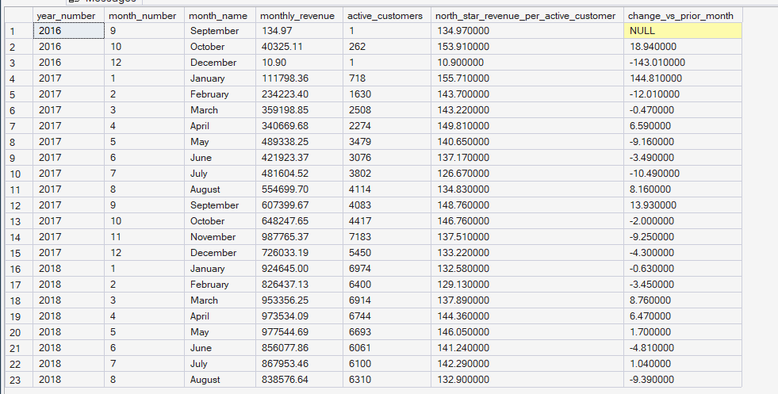
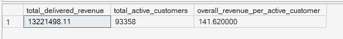

# Phase 6 — Customer & Product Analytics
## 05. North Star Metric

**SQL Script:** `05_north_star_metric.sql`

---

## 1. Business Question

What single metric best represents ORGEE's customer-value growth, and how does that metric behave over the historical observation period?

---

## 2. Objective

Define and measure the ORGEE North Star Metric:

> **Monthly Delivered Revenue per Active Customer**

The metric connects the customer and revenue dimensions of the business by measuring how much delivered revenue is generated, on average, by each customer who completed at least one delivered purchase in a given month.

The analysis provides:

- Monthly North Star trend
- Month-over-month change
- Overall observation-period value
- Supporting context from earlier Phase 4–5 metrics

---

## 3. North Star Metric Definition

### Metric

**Monthly Delivered Revenue per Active Customer**

### Formula

```text
Delivered Revenue in Month
÷
Distinct Customers with at least one Delivered Order in Month
```

### Grain

> **One row per calendar month**

### Customer Definition

An active customer is a `customer_unique_id` with at least one delivered order during that month.

### Revenue Definition

Revenue is the sum of `Fact_Order_Items.price` for delivered orders.

---

## 4. Why This Metric

Total revenue alone primarily reflects overall volume and can increase simply because more customers transact.

Customer count alone ignores the economic value generated by those customers.

Revenue per Active Customer combines both dimensions into a single customer-value measure.

It is also consistent with the ORGEE growth chain:

> **Customer Experience → Conversion → Retention → Revenue → Growth**

The supporting Phase 4–5 context includes:

- Visit-to-Purchase conversion: **9.48%**
- Repeat purchase rate: **3.00%**
- Top 10% of customers by revenue contribution: **41.14% of revenue**

The North Star therefore provides a customer-value lens that complements the funnel, retention, and revenue metrics already established.

---

## 5. Data Source

All analysis is performed from the **Phase 3 Enterprise SQL Data Warehouse**.

### Primary Tables

- `dbo.Fact_Order_Items`
- `dbo.Dim_Customer`
- `dbo.Dim_Date`

---

## 6. Result Set 1 — Monthly North Star Trend

The SQL calculates monthly delivered revenue, active customers, revenue per active customer, and the change versus the prior month.

### Actual Output

**23 calendar months with delivered-order activity are returned.**

| Period | Monthly Revenue | Active Customers | Revenue / Active Customer | Change vs Prior Month |
|---|---:|---:|---:|---:|
| Sep 2016 | $134.97 | 1 | $134.97 | — |
| Oct 2016 | $40,325.11 | 262 | $153.91 | +18.94 |
| Dec 2016 | $10.90 | 1 | $10.90 | -143.01 |
| Jan 2017 | $111,798.36 | 718 | $155.71 | +144.81 |
| Feb 2017 | $234,223.40 | 1,630 | $143.70 | -12.01 |
| Mar 2017 | $359,198.85 | 2,508 | $143.22 | -0.47 |
| Apr 2017 | $340,669.68 | 2,274 | $149.81 | +6.59 |
| May 2017 | $489,338.25 | 3,479 | $140.65 | -9.16 |
| Jun 2017 | $421,923.37 | 3,076 | $137.17 | -3.49 |
| Jul 2017 | $481,604.52 | 3,802 | $126.67 | -10.49 |
| Aug 2017 | $554,699.70 | 4,114 | $134.83 | +8.16 |
| Sep 2017 | $607,399.67 | 4,083 | $148.76 | +13.93 |
| Oct 2017 | $648,247.65 | 4,417 | $146.76 | -2.00 |
| Nov 2017 | $987,765.37 | 7,183 | $137.51 | -9.25 |
| Dec 2017 | $726,033.19 | 5,450 | $133.22 | -4.30 |
| Jan 2018 | $924,645.09 | 6,974 | $132.58 | -0.63 |
| Feb 2018 | $826,437.13 | 6,400 | $129.13 | -3.45 |
| Mar 2018 | $953,356.25 | 6,914 | $137.89 | +8.76 |
| Apr 2018 | $973,534.09 | 6,744 | $144.36 | +6.47 |
| May 2018 | $977,544.69 | 6,693 | $146.05 | +1.70 |
| Jun 2018 | $805,077.68 | 6,061 | $141.24 | -4.81 |
| Jul 2018 | $867,953.46 | 6,100 | $142.29 | +1.04 |
| Aug 2018 | $838,576.64 | 6,310 | $132.90 | -9.39 |

### Screenshot



The output contains **23 rows**, and all 23 returned rows are visible in the screenshot.

---

## 7. Observations — Monthly North Star

### Observation 1 — The metric fluctuates rather than moving in a straight upward trend

Revenue per active customer varies materially from month to month.

The later 2017–2018 period generally sits around the **$130–$150 per active customer** range, with monthly fluctuations rather than a sustained linear increase.

---

### Observation 2 — The earliest months are highly volatile

September 2016 and December 2016 each contain only **one active customer**.

Consequently:

- September 2016 = **$134.97 per active customer**
- December 2016 = **$10.90 per active customer**

These very small denominators make the earliest monthly values unstable and unsuitable for strong trend conclusions.

---

### Observation 3 — November 2017 has the highest monthly revenue, but not the highest North Star value

November 2017 generated:

> **$987,765.37 delivered revenue**

However, revenue per active customer was **$137.51**.

This demonstrates why total revenue and customer-value efficiency should not be treated as the same metric.

---

### Observation 4 — Highest North Star values occur in several lower-volume months

Among the displayed months, January 2017 reaches **$155.71 per active customer**, while October 2016 reaches **$153.91**.

These values are driven by much smaller active-customer populations than later months, so they should not automatically be interpreted as superior business performance.

---

## 8. Result Set 2 — Overall North Star Metric

### Actual Output

| Metric | Value |
|---|---:|
| Total Delivered Revenue | $13,221,498.11 |
| Total Active Customers | 93,358 |
| Overall Revenue per Active Customer | **$141.62** |

### Screenshot



---

## 9. Interpretation

Across the complete observation period:

> **$13.22M of delivered revenue was generated across 93,358 active customers, producing $141.62 of delivered revenue per active customer.**

The monthly view shows that the North Star is not simply a function of total revenue.

As the business grows its active customer population, maintaining or increasing revenue generated per active customer becomes important for sustainable customer-value growth.

---

## 10. Business Implication

The North Star should be monitored alongside its major supporting levers:

- **Conversion** — more visitors becoming purchasers
- **AOV / basket value** — more value per completed order
- **Retention** — repeat customers generating additional revenue

The metric is therefore suitable as the top-level outcome for the ORGEE KPI structure.

---

## 11. Analytical Limitation

The earliest months contain extremely small active-customer populations.

Therefore, month-to-month changes in those periods should not be interpreted as robust business trends.

The North Star is also an aggregate descriptive metric. It does not by itself identify which lever caused a change.

Causal attribution will require the experimentation framework in **Phase 8**.

---

## 12. Scope Control

This analysis intentionally does **not** include:

- Predictive modeling
- Recommendation modeling
- A/B testing
- Power BI
- What-If analysis

Those capabilities belong to later ORGEE phases.

This script focuses exclusively on defining and measuring the North Star Metric.

---

## 13. Techniques Used

- CTE
- Aggregation
- `COUNT(DISTINCT)`
- `SUM`
- `NULLIF`
- `LAG`
- Date dimension logic
- Month-level aggregation
- Month-over-month comparison

---

## 14. Validation Notes

The overall North Star calculation reconciles to the historical customer and revenue totals already established in Phase 6:

- Active customers = **93,358**
- Delivered revenue = **$13,221,498.11**
- Revenue per active customer = **$141.62**

The monthly result correctly uses distinct `customer_unique_id` as the active-customer denominator.

---

## 15. Signature Insight

> **The overall ORGEE North Star is $141.62 of delivered revenue per active customer across the observation period, while monthly values generally fluctuate around the $130–$150 range once the dataset reaches meaningful customer volumes.**

---

## 16. Next Step

**Next script:** `06_kpi_tree.sql`

The next analysis translates the North Star into a structured hierarchy of supporting customer, revenue, retention, AOV, conversion, and funnel metrics.
