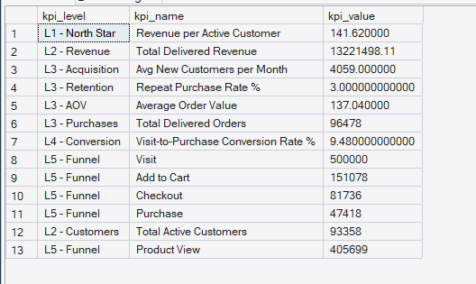

# Phase 6 — Customer & Product Analytics
## 06. KPI Tree

**SQL Script:** `06_kpi_tree.sql`

---

## 1. Business Question

What does the full KPI hierarchy look like, with actual values at every level — from the North Star down to the raw funnel stages that drive it?

---

## 2. Objective

Translate the ORGEE North Star Metric into a structured KPI hierarchy connecting:

**Revenue per Active Customer**
→ Customers / Revenue
→ Acquisition / Retention / AOV / Purchases
→ Conversion
→ Funnel stages

The purpose is to create a single analytical view showing the metrics that explain and support the North Star.

---

## 3. KPI Tree Structure

```text
                         NORTH STAR
                  Revenue per Active Customer
                            |
                 -------------------------
                 |                       |
             Customers                 Revenue
           (active count)        (total delivered)
                 |                       |
          ----------------        --------------
          |              |        |            |
      Acquisition     Retention   AOV      Purchases
      (new/month)    (repeat %)  (avg $)   (order count)
          |
     Conversion Rate
          |
   Visit → View → Cart → Checkout → Purchase
```

---

## 4. Data Source

The KPI tree is built from the **Phase 3 Enterprise SQL Data Warehouse**, while the funnel metrics restate the validated Phase 5 event-funnel metrics.

### Primary Tables

- `dbo.Fact_Order_Items`
- `dbo.Dim_Customer`
- `dbo.Dim_Date`
- `dbo.Fact_Events`

---

## 5. Metric Definitions

### North Star

**Revenue per Active Customer**

```text
Total Delivered Revenue
÷
Total Distinct Active Customers
```

### Acquisition

**Avg New Customers per Month**

A new customer is a `customer_unique_id` whose first delivered purchase occurs in a given month.

The KPI is the average monthly count of customers making their first delivered purchase.

### Retention

**Repeat Purchase Rate**

Percentage of customers with more than one delivered order during the observation period.

### AOV

**Average Order Value**

```text
Delivered Revenue
÷
Distinct Delivered Orders
```

### Purchases

**Total Delivered Orders**

Distinct delivered `order_id` values.

### Conversion

**Visit-to-Purchase Conversion Rate**

```text
Sessions with Purchase Interaction
÷
Sessions with Session Start
```

### Funnel

The raw session-level stages are:

> Visit → Product View → Add to Cart → Checkout → Purchase

---

## 6. Actual KPI Tree Output

The SQL returns **13 KPI rows**.

| KPI Level | KPI | Actual Value |
|---|---|---:|
| L1 - North Star | Revenue per Active Customer | **$141.62** |
| L2 - Revenue | Total Delivered Revenue | **$13,221,498.11** |
| L3 - Acquisition | Avg New Customers per Month | **4,059** |
| L3 - Retention | Repeat Purchase Rate % | **3.00%** |
| L3 - AOV | Average Order Value | **$137.04** |
| L3 - Purchases | Total Delivered Orders | **96,478** |
| L4 - Conversion | Visit-to-Purchase Conversion Rate % | **9.48%** |
| L5 - Funnel | Visit | **500,000** |
| L5 - Funnel | Product View | **405,699** |
| L5 - Funnel | Add to Cart | **151,078** |
| L5 - Funnel | Checkout | **81,736** |
| L5 - Funnel | Purchase | **47,418** |
| L2 - Customers | Total Active Customers | **93,358** |

### Screenshot



---

## 7. North Star Context

The top of the tree is:

- Delivered Revenue = **$13,221,498.11**
- Active Customers = **93,358**
- Revenue per Active Customer = **$141.62**

The North Star therefore reconciles directly to the Phase 6 customer and revenue totals.

---

## 8. Customer Branch

### Acquisition

The average number of new customers per month is:

> **4,059**

This is based on the average monthly count of customers whose first delivered purchase occurred in each observed first-purchase month.

This provides a scale indicator for customer acquisition entering the active customer base.

### Retention

The repeat purchase rate is:

> **3.00%**

This is consistent with the Phase 4/Phase 5 finding that approximately 97% of customers in the delivered-order population purchased only once.

The combination of:

- **4,059 average new customers per month**
- **3.00% repeat purchase rate**

shows a customer base dominated by first-time purchasing behavior.

---

## 9. Revenue Branch

### Average Order Value

AOV is:

> **$137.04**

This provides the order-level value component supporting delivered revenue.

### Purchases

Total delivered orders:

> **96,478**

This is the distinct delivered-order count in the warehouse.

---

## 10. Conversion Branch

The overall Visit-to-Purchase conversion rate is:

> **9.48%**

This is consistent with the validated Phase 5 funnel.

The underlying session counts are:

| Funnel Stage | Sessions |
|---|---:|
| Visit | 500,000 |
| Product View | 405,699 |
| Add to Cart | 151,078 |
| Checkout | 81,736 |
| Purchase | 47,418 |

The funnel therefore provides the behavioral path behind the conversion KPI.

---

## 11. Key Observations

### Observation 1 — The North Star is $141.62

The overall ORGEE North Star is:

> **$141.62 delivered revenue per active customer**

This reconciles to the total delivered revenue and active-customer population.

---

### Observation 2 — Acquisition volume is substantial, but repeat purchasing remains low

The KPI tree shows:

- Average new customers per month: **4,059**
- Repeat purchase rate: **3.00%**

This reinforces the Phase 4–6 customer-growth story: the business is generating first-time customers at scale, but relatively few customers progress into repeat purchasing.

---

### Observation 3 — Conversion is a major supporting node

The funnel produces a:

> **9.48% Visit-to-Purchase conversion rate**

This makes conversion an important operational lever beneath the North Star.

However, the KPI tree itself is descriptive; it does not establish that improving any single node will causally increase the North Star by a specific amount.

---

### Observation 4 — The funnel shows substantial progression loss

The session counts decline from:

**500,000 Visits**

to

**47,418 Purchases**

with the largest absolute loss occurring before purchase.

Phase 5 already established the largest stage-level drop-off as Product View → Add to Cart at **62.76%**.

---

## 12. Business Interpretation

The KPI tree creates a structured way to move from an executive outcome to operational drivers:

### Executive outcome

**Revenue per Active Customer**

### Customer drivers

- Acquisition
- Retention

### Economic drivers

- AOV
- Purchases

### Behavioral driver

- Conversion

### Operational funnel

- Visit
- Product View
- Add to Cart
- Checkout
- Purchase

This hierarchy provides the foundation for subsequent product-metric and feature-prioritization analysis.

---

## 13. Business Implication

The KPI tree indicates that ORGEE should not evaluate growth using total revenue alone.

The business should simultaneously monitor:

1. **Customer acquisition**
2. **Repeat purchasing / retention**
3. **Order value**
4. **Purchase volume**
5. **Funnel conversion**
6. **Stage-level funnel progression**

The strongest product opportunities should ultimately be evaluated according to their expected impact on these supporting metrics and, ultimately, the North Star.

---

## 14. Analytical Limitation

The KPI tree establishes relationships between metrics, but it does not establish causality.

For example:

- A higher conversion rate does not automatically imply a proportional increase in revenue per active customer.
- More active customers can increase total revenue while simultaneously changing the denominator of the North Star.
- The acquisition KPI is an average monthly first-purchase volume, not a marketing-attributed acquisition metric.

Causal measurement and controlled impact estimation belong to later experimentation work.

---

## 15. Scope Control

This script intentionally does **not** include:

- Feature prioritization scoring
- Product recommendations
- A/B testing
- Predictive modeling
- Power BI
- What-If analysis

Those are handled later in ORGEE.

This script's responsibility is:

> **Build the measurable KPI hierarchy that connects the North Star to customer, revenue, conversion, and funnel drivers.**

---

## 16. Techniques Used

- CTEs
- Aggregation
- `COUNT(DISTINCT)`
- `SUM`
- `AVG`
- `MIN`
- `DATEFROMPARTS`
- `GROUP BY`
- `UNION ALL`
- Conditional aggregation
- KPI hierarchy construction

---

## 17. Review / Correction Applied

The original version of the script documented **Acquisition** in the KPI tree but did not query it.

This was corrected by adding:

> **Avg New Customers per Month = 4,059**

The metric is calculated from each customer's first delivered purchase month and then averaged across observed first-purchase months.

The resulting KPI output now contains an actual value for every conceptual node represented in the tree.

---

## 18. Validation Notes

The key KPI values reconcile with previously validated Phase 4–6 results:

- Active Customers = **93,358**
- Delivered Revenue = **$13,221,498.11**
- Revenue per Active Customer = **$141.62**
- Repeat Purchase Rate = **3.00%**
- Average Order Value = **$137.04**
- Delivered Orders = **96,478**
- Visit-to-Purchase Conversion = **9.48%**
- Visit sessions = **500,000**
- Product View sessions = **405,699**
- Add-to-Cart sessions = **151,078**
- Checkout sessions = **81,736**
- Purchase sessions = **47,418**

---

## 19. Signature Insight

> **ORGEE generates an average of 4,059 new customers per month, yet only 3.00% of customers make repeat purchases, highlighting the gap between customer acquisition and retention as a central customer-growth challenge.**

This is a descriptive finding from the current historical dataset; the impact of retention interventions must be tested rather than assumed.

---

## 20. Next Step

**Next script:** `07_product_metrics.sql`

The analysis now moves from the customer/KPI branch into the Product Analytics block of Phase 6.
