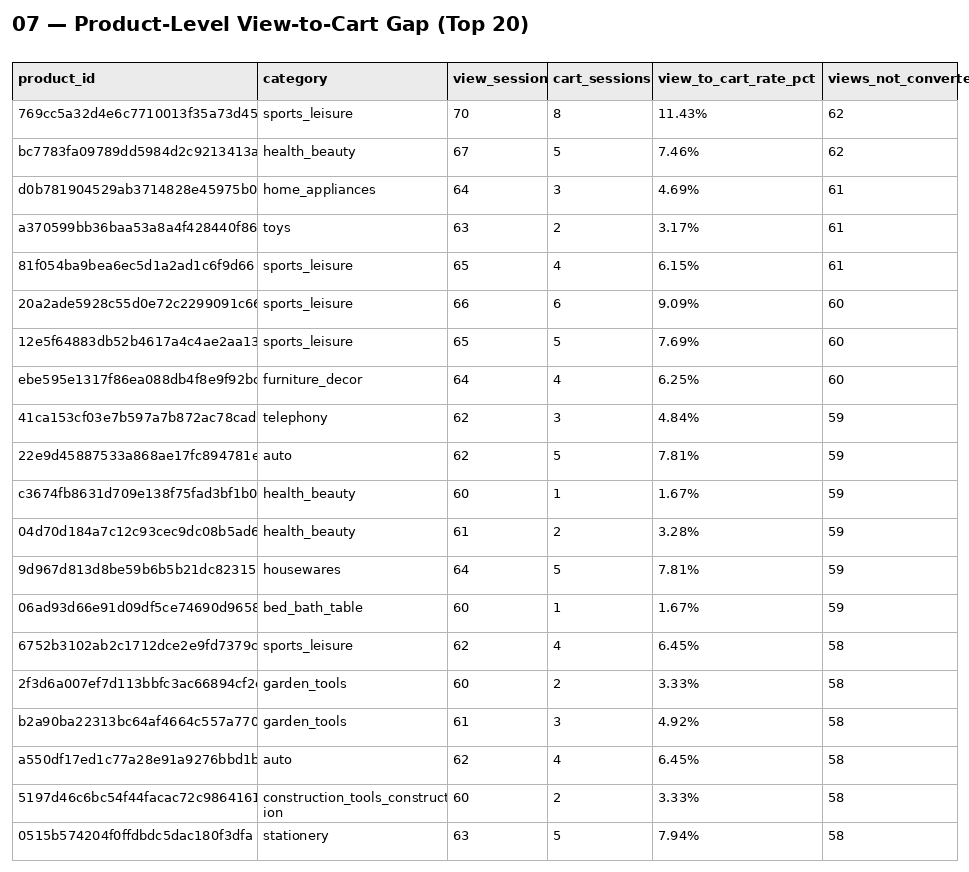
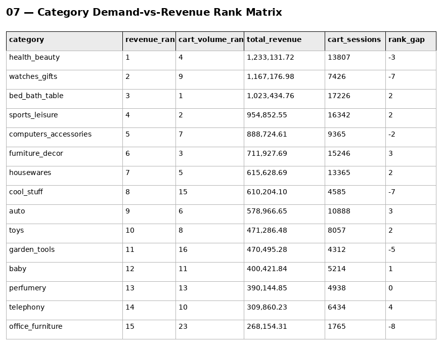

# Phase 6 — Customer & Product Analytics
## 07. Product Metrics

**SQL Script:** `07_product_metrics.sql`

---

## 1. Business Question

Which specific products have a large gap between demand (views) and conversion (adds to cart), providing the most actionable product-level version of the Phase 5 Product View → Add to Cart drop-off finding?

---

## 2. Objective

Move from the phase-level funnel and category-level analysis into a **product-level demand-versus-cart-action view**.

The analysis identifies products that receive meaningful viewing traffic but generate relatively few cart actions, creating concrete product-page candidates for further investigation.

A secondary category-level ranking matrix compares **revenue rank** with **cart-activity volume rank**. This is a prioritization signal only, not a category conversion-rate measure.

---

## 3. Data Source

All analysis is sourced from the Phase 3 Enterprise SQL Data Warehouse:

- `dbo.Fact_Events`
- `dbo.Dim_Product`
- `dbo.Fact_Order_Items`

No raw CSV files are used.

---

## 4. Grain

### Result Set 1 — Product level
One row per product represented in the event data.

Metrics use **distinct sessions**:

- `view_sessions` = distinct sessions with a `product_view`
- `cart_sessions` = distinct sessions with an `add_to_cart`
- `view_to_cart_rate_pct` = cart sessions ÷ view sessions
- `views_not_converted` = view sessions − cart sessions

A minimum threshold of **20 view sessions** is applied before ranking candidates.

### Result Set 2 — Category level
One row per category present in both the delivered-order revenue ranking and cart-activity ranking.

`rank_gap = revenue_rank − cart_volume_rank`.

---

## 5. SQL Techniques

- CTEs
- Aggregation
- `COUNT(DISTINCT ...)`
- `CASE`
- `RANK()`
- Window functions
- Category-level rank comparison

---

## 6. Result Set 1 — Product View-to-Cart Gap

**Total rows:** 20  
**Displayed:** 20

The largest raw gaps among products meeting the 20-view threshold are concentrated in products receiving approximately 60–70 viewing sessions but only a small number of cart sessions.

| Product | Category | Views | Cart Sessions | View→Cart | Views Not Converted |
|---|---|---:|---:|---:|---:|
| `769cc5a32d4e6c7710013f35a73d45e9` | sports_leisure | 70 | 8 | 11.43% | 62 |
| `bc7783fa09789dd5984d2c9213413a97` | health_beauty | 67 | 5 | 7.46% | 62 |
| `d0b781904529ab3714828e45975b0f2` | home_appliances | 64 | 3 | 4.69% | 61 |
| `a370599bb36baa53a8a4f428440f860` | toys | 63 | 2 | 3.17% | 61 |
| `81f054ba9bea6ec5d1a2ad1c6f9d66` | sports_leisure | 65 | 4 | 6.15% | 61 |

The full 20-row SQL output is preserved in the evidence image.

### Screenshot

---

## 7. Result Set 2 — Category Demand-vs-Revenue Rank Matrix

**Total rows:** 15  
**Displayed:** 15

Selected results include:

| Category | Revenue Rank | Cart Volume Rank | Revenue | Cart Sessions | Rank Gap |
|---|---:|---:|---:|---:|---:|
| health_beauty | 1 | 4 | $1,233,131.72 | 13,807 | -3 |
| watches_gifts | 2 | 9 | $1,167,176.98 | 7,426 | -7 |
| bed_bath_table | 3 | 1 | $1,023,434.76 | 17,226 | 2 |
| sports_leisure | 4 | 2 | $954,852.55 | 16,342 | 2 |
| computers_accessories | 5 | 7 | $888,724.61 | 9,365 | -2 |
| furniture_decor | 6 | 3 | $711,927.69 | 15,246 | 3 |

### Screenshot

---

## 8. Interpretation

The product-level output makes the Phase 5 funnel finding actionable at SKU level.

The strongest candidates are products with high view volume but relatively few cart actions. These are appropriate candidates for product-page investigation rather than proof of a specific root cause.

Possible areas for follow-up include:

- Cart-add prominence
- Price/value clarity
- Product information
- Urgency or availability signals
- Cross-sell presentation
- Product-page usability

The category rank matrix should not be interpreted as a conversion metric. A rank gap can reflect price point, AOV, product mix, or differences between demand and revenue economics.

---

## 9. Business Implication

The output provides the product-level evidence base for `08_feature_prioritization.sql` and supports prioritizing specific SKUs rather than addressing the entire catalog uniformly.

---

## 10. Scope Control

This script does **not** perform:

- RFM
- CLV
- Recommendation modeling
- A/B testing
- Power BI analysis

Those are handled by other Phase 6 or later phases.

---

## 11. Phase 6 Linkage

`07_product_metrics.sql` → `08_feature_prioritization.sql` → `09_product_recommendations.sql` → `10_business_impact_analysis.sql`.

