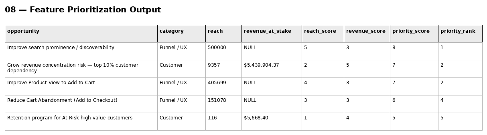

# Phase 6 — Customer & Product Analytics
## 08. Feature Prioritization

**SQL Script:** `08_feature_prioritization.sql`

---

## 1. Business Question

Of the opportunities surfaced across Phases 4–6, what should the business work on first when prioritization considers **reach** and **revenue-at-stake**, rather than simply selecting the metric with the largest percentage gap?

---

## 2. Objective

Create a transparent prioritization framework where every candidate opportunity is backed by an actual warehouse-derived quantity.

The scoring combines:

- **Reach score** — relative reach across the five opportunities
- **Revenue score** — applied only where revenue-at-stake is directly quantified
- **Priority score** = reach score + revenue score

Opportunities without a defensible quantified revenue-at-stake receive a neutral revenue score of 3 rather than being artificially ranked against revenue-quantified opportunities.

---

## 3. Key Methodology Fixes

### At-Risk segment alignment

The At-Risk opportunity now applies the **complete RFM segmentation CASE first** and then filters to `segment = 'At Risk'`.

This preserves the branch precedence used by the core RFM segmentation and reconciles to:

- **116 At-Risk customers**
- **$5,668.40 historical monetary value**

### Revenue concentration alignment

The revenue-concentration opportunity now computes the actual top-10%-by-revenue customer population using `PERCENT_RANK()`.

The same population supplies both:

- Reach = **9,357 customers**
- Revenue-at-stake = **$5,439,904.37**

This avoids using the rounded Phase 4 41.14% share as a hardcoded multiplication of total revenue.

---

## 4. Data Source

Phase 3 Enterprise SQL Data Warehouse:

- `dbo.Fact_Events`
- `dbo.Fact_Order_Items`
- `dbo.Dim_Customer`
- `dbo.Dim_Date`

Phase 4 and Phase 5 findings are referenced as evidence where appropriate.

---

## 5. Result

**Total rows:** 5  
**Displayed:** 5

| Opportunity | Category | Reach | Revenue at Stake | Reach Score | Revenue Score | Priority Score | Rank |
|---|---|---:|---:|---:|---:|---:|---:|
| Improve search prominence / discoverability | Funnel / UX | 500,000 | NULL | 5 | 3 | 8 | 1 |
| Grow revenue concentration risk — top 10% customer dependency | Customer | 9,357 | $5,439,904.37 | 2 | 5 | 7 | 2 |
| Improve Product View to Add to Cart | Funnel / UX | 405,699 | NULL | 4 | 3 | 7 | 2 |
| Reduce Cart Abandonment (Add to Checkout) | Funnel / UX | 151,078 | NULL | 3 | 3 | 6 | 4 |
| Retention program for At-Risk high-value customers | Customer | 116 | $5,668.40 | 1 | 4 | 5 | 5 |

### Screenshot

---

## 6. Interpretation

The highest-priority opportunity is **Improve search prominence / discoverability**, with a priority score of 8.

**Product View → Add to Cart** and **revenue concentration risk** tie at a priority score of 7, so SQL `RANK()` correctly assigns both **priority rank 2**.

This is an important distinction: the prioritization model is not simply selecting the largest funnel drop-off. It evaluates reach and quantified economic exposure together.

---

## 7. Business Implication

The ranking provides the direct prioritization input for `09_product_recommendations.sql`.

It creates a defensible bridge from descriptive analytics to concrete product/business recommendations.

---

## 8. Important Interpretation Boundary

The `revenue_at_stake` values are **historical revenue exposure/opportunity proxies**, not guaranteed incremental revenue.

In particular, no causal lift or recovery rate is assumed in this script.

---

## 9. Scope Control

No fabricated impact assumptions are introduced.

No experimentation results are claimed.

The purpose is prioritization, not causal measurement.

---

