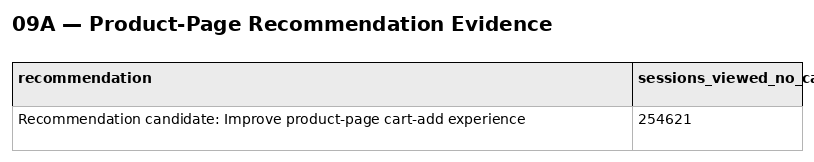
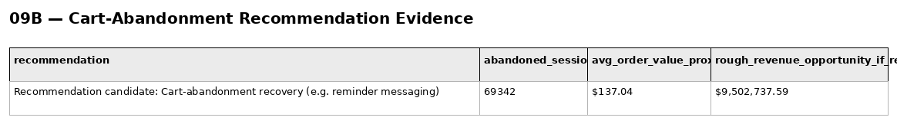
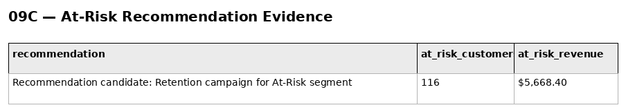
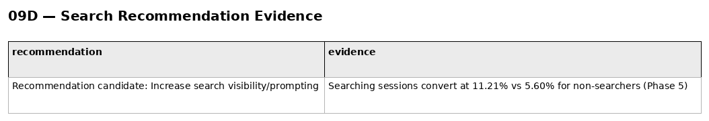

# Phase 6 — Customer & Product Analytics
## 09. Product Recommendations

**SQL Script:** `09_product_recommendations.sql`

---

## 1. Business Question

How can the findings from Phases 4–6 be translated into concrete, evidence-backed product recommendations?

---

## 2. Objective

Produce recommendation candidates supported by warehouse-derived evidence.

The script does not invent recommendations independently of the analysis. It connects the prioritized opportunities from `08_feature_prioritization.sql` with direct supporting evidence.

---

## 3. Data Sources

- `dbo.Fact_Events`
- `dbo.Fact_Order_Items`
- `dbo.Dim_Customer`
- `dbo.Dim_Date`

---

## 4. Recommendation Evidence

### Recommendation 1 — Improve Product-Page Cart-Add Experience

**Evidence:**

- **254,621 sessions** viewed a product but did not add a product to cart.

This directly quantifies the product-page opportunity identified in Phase 5 and further localized by `07_product_metrics.sql`.

### Screenshot

---

### Recommendation 2 — Cart-Abandonment Recovery

**Evidence:**

- Abandoned sessions: **69,342**
- Average order value proxy: **$137.04**
- Rough recovery opportunity if all abandoned sessions converted at the proxy AOV: **$9,502,737.59**

The $9.50M figure is explicitly a **rough opportunity proxy**, not forecasted incremental revenue.

Abandoned carts do not contain recorded order revenue in this dataset, so delivered-order AOV is used only as a stand-in.

### Screenshot

---

### Recommendation 3 — Retention Campaign for At-Risk Customers

**Evidence:**

- At-Risk customers: **116**
- Historical monetary value: **$5,668.40**

The segment is based on the same RFM segmentation logic used elsewhere in Phase 6.

### Screenshot

---

### Recommendation 4 — Increase Search Visibility / Prompting

**Evidence:**

- Sessions that searched converted at **11.21%**
- Sessions that did not search converted at **5.60%**

This is an observed association from Phase 5, not a causal estimate.

### Screenshot

---

## 5. Interpretation

The recommendations convert analytical findings into actions that can later be tested or operationalized.

The strongest evidence themes are:

1. Search behavior is associated with substantially higher observed conversion.
2. Product-view sessions contain a large view-without-cart population.
3. Cart abandonment represents a substantial recoverable-session opportunity.
4. The At-Risk segment is small but contains measurable historical customer value.

---

## 6. Causal Interpretation Boundary

The analysis is observational.

For example, the 11.21% versus 5.60% search conversion gap does **not** prove that forcing more users to search will cause conversion to increase.

That hypothesis should be tested experimentally in a later experimentation phase.

---

## 7. Business Implication

The output provides the evidence layer for `10_business_impact_analysis.sql`, where the recommendations are structured into:

**Finding → Problem → Action → Target → Expected Business Impact → Success Metric**

---

## 8. Scope Control

No recommendation is presented as a guaranteed causal improvement.

No A/B test is performed in Phase 6.

No recommendation model is built here; Recommendation Intelligence is Phase 7.

