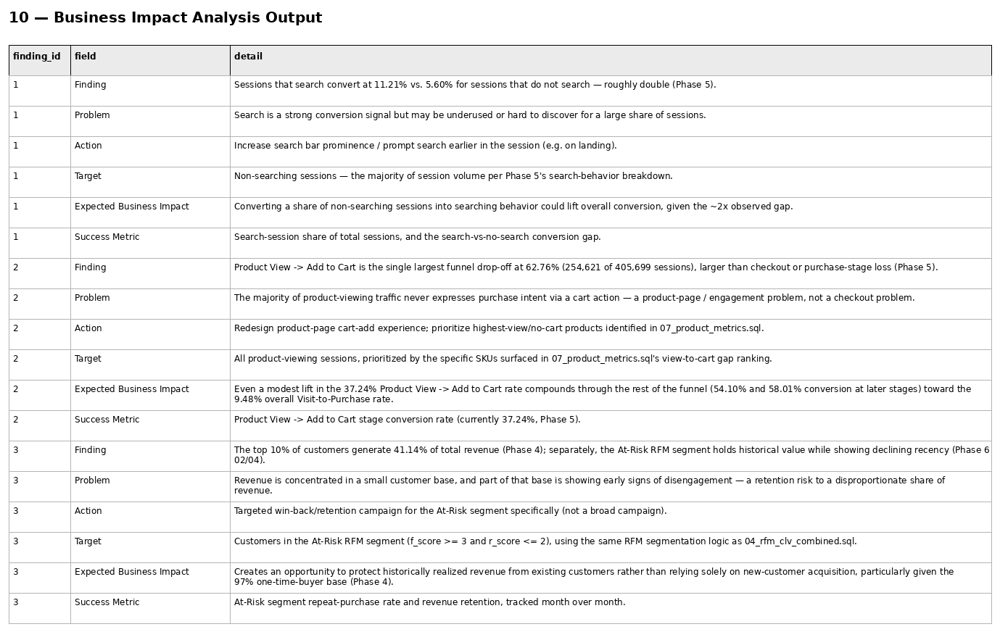

# Phase 6 — Customer & Product Analytics
## 10. Business Impact Analysis

**SQL Script:** `10_business_impact_analysis.sql`

---

## 1. Business Question

For each major recommendation, what is the finding, business problem, recommended action, target population, expected business impact, and success metric?

---

## 2. Objective

Translate analytical evidence into an executive-ready decision structure:

**Finding → Problem → Action → Target → Expected Business Impact → Success Metric**

The script intentionally does not re-derive the underlying analytics. It references validated findings from Phases 4–6.

---

## 3. Final Business Impact Prioritization

The business-impact presentation is aligned to the actual priority ranking from `08_feature_prioritization.sql`:

### Priority 1 — Improve Search Prominence / Discoverability

**Finding**

Sessions that search convert at **11.21%** versus **5.60%** for sessions that do not search.

**Problem**

Search is a strong observed conversion signal but may be underused or difficult to discover.

**Action**

Increase search-bar prominence and/or prompt search earlier in the session.

**Target**

Non-searching sessions.

**Expected Business Impact**

Converting a share of non-searching sessions into searching behavior could improve overall conversion, subject to causal validation.

**Success Metric**

Search-session share and the search-versus-no-search conversion gap.

---

### Priority 2 — Improve Product View → Add to Cart

**Finding**

Product View → Add to Cart is the largest funnel drop-off at **62.76%**, with **254,621 of 405,699 sessions** failing to progress.

**Problem**

Most product-viewing traffic does not express purchase intent through a cart action.

**Action**

Redesign the product-page cart-add experience and prioritize the high-view/no-cart products identified in `07_product_metrics.sql`.

**Target**

Product-viewing sessions, prioritized at SKU level.

**Expected Business Impact**

An improvement in the current **37.24% Product View → Add to Cart** rate can compound through later funnel stages.

**Success Metric**

Product View → Add to Cart stage conversion rate.

---

### Priority 3 — Retention / Revenue Concentration Risk

**Finding**

The top 10% of customers generate **41.14% of total revenue** in the Phase 4 analysis, while the At-Risk RFM segment contains historically valuable customers with declining recency.

**Problem**

Revenue concentration creates exposure if valuable customers disengage.

**Action**

Run a targeted win-back / retention program for the At-Risk segment.

**Target**

Customers assigned to the At-Risk RFM segment using the established Phase 6 segmentation logic.

**Expected Business Impact**

The opportunity is to protect historically realized customer value rather than relying exclusively on new-customer acquisition.

**Success Metric**

At-Risk repeat-purchase rate and revenue retention over time.

---

## 4. Output

**Total rows:** 18  
**Displayed:** 18

The final SQL output is structured as three six-row business-impact blocks:

- Finding
- Problem
- Action
- Target
- Expected Business Impact
- Success Metric

### Screenshot

---

## 5. Interpretation Boundary

The expected-impact statements describe **business opportunities and hypotheses**, not guaranteed incremental revenue.

The observational search gap and funnel relationships should be validated through controlled experimentation before claiming causality.

---

## 6. Business Implication

This script is the bridge between analytical findings and later experimentation/decision-support work.

It establishes what should be tested, who should be targeted, and which metric should be monitored.

---

## 7. Scope Control

No causal lift is claimed.

No experiment is run here.

No Power BI scenario modeling is performed here.

Those activities belong to later phases.

