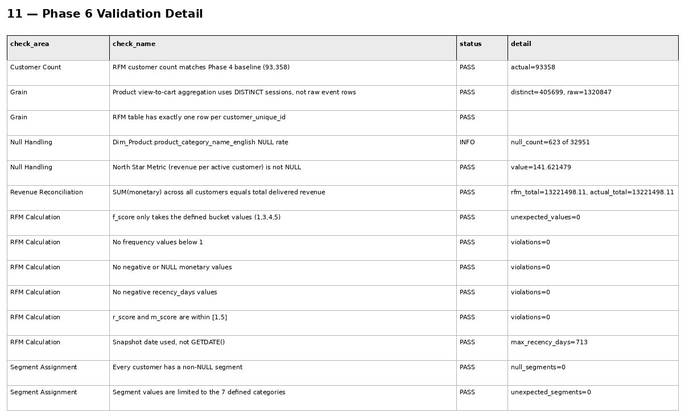
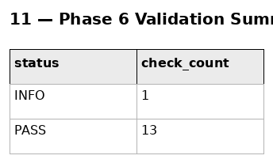

# Phase 6 — Customer & Product Analytics
## 11. Phase 6 Validation

**SQL Script:** `11_phase6_validation.sql`

---

## 1. Objective

Validate the assumptions, grain, calculations, reconciliation logic, segmentation, and critical KPI outputs used throughout Phase 6.

The validation follows the established ORGEE pattern: every check is classified as **PASS**, **FAIL**, or **INFO**.

---

## 2. Final Validation Status

| Status | Checks |
|---|---:|
| PASS | **13** |
| INFO | **1** |
| FAIL | **0** |

### Overall Result

**Phase 6 validation: PASS**

The single INFO item is an expected source-data condition rather than a Phase 6 calculation defect.

---

## 3. Validation Checks

### Customer and Grain Integrity

- RFM customer count = **93,358**
- RFM table has exactly one row per `customer_unique_id`
- Product view-to-cart aggregation uses **DISTINCT sessions**, not raw event rows
- Product-view diagnostic:
  - distinct sessions = **405,699**
  - raw product-view events = **1,320,847**

### RFM Calculation Integrity

- No negative recency values
- Maximum recency = **713 days**
- No frequency values below 1
- No negative or NULL monetary values
- `r_score` and `m_score` remain within 1–5
- `f_score` contains only the defined values: 1, 3, 4, 5

### Segment Integrity

- No NULL segment assignments
- Segment values are restricted to the seven defined categories

### Revenue Reconciliation

Customer-level monetary totals reconcile to delivered revenue:

- RFM total = **$13,221,498.11**
- Actual delivered total = **$13,221,498.11**

### North Star Metric Integrity

Revenue per active customer is non-NULL:

- **$141.621479**

---

## 4. INFO Check

`Dim_Product.product_category_name_english` contains:

- **623 NULL values**
- Out of **32,951 products**

This is a known source-data gap and is therefore classified as **INFO**, not FAIL.

---

## 5. Evidence

### Validation Detail

### Screenshot

### Validation Summary

### Screenshot

---

## 6. Interpretation

All Phase 6 validation checks pass.

The validation confirms that:

- Customer-level RFM grain is controlled.
- Revenue reconciliation is exact.
- RFM scores are within the intended ranges.
- Segmentation produces valid categories.
- Product-level event analysis is based on distinct sessions.
- Critical KPI calculations are non-NULL.
- The known product-category translation gap is explicitly documented.

---

## 7. Final Phase 6 Status

**VALIDATED — 13 PASS / 1 INFO / 0 FAIL**

Phase 6 is complete and ready for final README documentation and progression to Phase 7.

