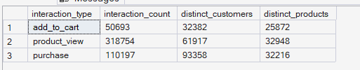
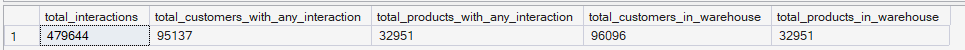
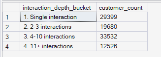

# Phase 7 — Recommendation Intelligence
## 01. Recommendation Data Preparation

**SQL Script:** `01_recommendation_data_preparation.sql`

---

## 1. Business Question

Do we have sufficient customer-product interaction data to build a content-based recommendation engine?

---

## 2. Objective

Prepare a recommendation-ready customer-product interaction dataset from the **Phase 3 Enterprise SQL Data Warehouse**.

The dataset combines:

- Delivered purchases as the primary customer-product signal
- Identified product views as secondary behavioral enrichment
- Identified add-to-cart activity as secondary behavioral enrichment

Because ORGEE uses an anonymous-until-login identity design, behavioral events from anonymous sessions cannot be attributed to an individual customer profile. The identified-event layer therefore uses only events with a resolved `customer_sk`.

---

## 3. Locked Recommendation Design

### Primary Signal — Purchases

Delivered order items from `Fact_Order_Items` form the backbone of customer preference profiles.

Purchase interactions are associated with an identified customer and provide coverage across the **93,358 customers with delivered purchases**.

### Secondary Signal — Identified Behavioral Events

Product views and add-to-cart events are included only when `customer_sk` is available.

This preserves the login-event-based identity resolution design and avoids assigning anonymous activity to the wrong customer.

The Phase 2/3 identity design means that only a minority of sessions are identified; therefore, identified event signals enrich only the customer profiles for which that linkage exists.

### Interaction Weights

| Interaction | Weight | Interpretation |
|---|---:|---|
| Product View | 1.0 | Low-strength preference signal |
| Add to Cart | 2.0 | Medium-strength preference signal |
| Purchase | 3.0 | Strong preference signal |

The weighting is an explicit analytical design choice reflecting ordinal interaction strength. It is not statistically fitted.

---

## 4. Product Price Treatment

`Dim_Product` does not contain a transaction price.

For purchase interactions, the actual delivered transaction price from `Fact_Order_Items` is retained.

For product-view and add-to-cart interactions, the product's average observed delivered transaction price is used as the available product-level price feature.

This avoids inventing a transaction price for non-purchase events.

---

## 5. Recommendation Interaction Dataset

The prepared dataset is stored in:

`reco.interactions`

### Grain

> **One row per customer-product interaction**

### Key Fields

- `customer_unique_id`
- `product_id`
- `product_sk`
- `interaction_type`
- `interaction_weight`
- `interaction_date`
- `product_category_name_english`
- `price`

---

## 6. Result Set 1 — Interaction Summary

The SQL summarizes the usable interaction dataset by interaction type, customer coverage, and product coverage.

### Actual Output

| Interaction Type | Interaction Count | Distinct Customers | Distinct Products |
|---|---:|---:|---:|
| Add to Cart | 50,693 | 32,382 | 25,872 |
| Product View | 318,754 | 61,917 | 32,948 |
| Purchase | 110,197 | 93,358 | 32,216 |
| **Total** | **479,644** | **95,137*** | **32,951** |

\*Distinct customers with at least one interaction across all three interaction types.

### Screenshot



---

## 7. Result Set 2 — Overall Interaction Coverage

### Actual Output

| Metric | Value |
|---|---:|
| Total Interactions | 479,644 |
| Customers with Any Interaction | 95,137 |
| Products with Any Interaction | 32,951 |
| Person-Level Customers in Warehouse | 96,096 |
| Products in Warehouse | 32,951 |

### Coverage

The interaction dataset covers:

- **95,137 of 96,096 person-level customers**
- Approximately **99.00%** of person-level customers in the warehouse
- **32,951 of 32,951 products**

This provides broad coverage for the recommendation preparation layer.

### Screenshot



---

## 8. Result Set 3 — Interaction Depth

The SQL measures how much interaction history is available for each customer with at least one usable interaction.

### Actual Output

| Interaction Depth | Customer Count |
|---|---:|
| 1. Single interaction | 29,399 |
| 2. 2–3 interactions | 19,680 |
| 3. 4–10 interactions | 33,532 |
| 4. 11+ interactions | 12,526 |
| **Total** | **95,137** |

### Screenshot



---

## 9. Observations — Interaction Data Sufficiency

### Observation 1 — Purchase history is the broadest identified signal

The purchase layer contains **110,197 delivered purchase interactions across 93,358 customers**, making it the backbone of the recommendation profile construction.

### Observation 2 — Identified browsing/cart behavior adds secondary enrichment

The prepared dataset includes **318,754 identified product-view interactions** and **50,693 identified add-to-cart interactions**.

These signals provide additional behavioral evidence for customers whose sessions have been successfully linked to an identified customer.

### Observation 3 — Customer interaction depth varies substantially

The **95,137 customers** with at least one usable interaction are distributed across single, moderate, and deeper interaction histories.

Customers with only one interaction have relatively thin preference profiles, while customers with multiple interactions provide richer behavioral evidence for downstream preference modeling.

---

## 10. Business Interpretation

The prepared dataset provides sufficient breadth to support the content-based recommendation engine:

- **479,644** usable customer-product interactions are available.
- **95,137** customers have at least one usable interaction.
- All **32,951 products** are represented in the interaction dataset.
- Purchase history provides the strongest and most broadly identified preference signal.
- Identified product-view and add-to-cart activity provides secondary behavioral enrichment where customer identity is available.

The interaction-depth distribution also establishes an important implementation constraint: recommendation profiles will differ in richness across customers.

---

## 11. Analytical Guardrails

### No Anonymous Customer Attribution

Anonymous sessions are not forced onto customer profiles.

Only events with a resolved `customer_sk` are used for customer-level behavioral enrichment.

### No Invented Product Attributes

Only product attributes actually available in the enterprise warehouse are used.

### No Raw CSV Bypass

The recommendation preparation layer consumes the Phase 3 enterprise SQL warehouse.

### Weighting Transparency

Interaction weights are documented explicitly and treated as an analytical design choice rather than a fitted ML parameter.

### No Causal Claim

This preparation step establishes recommendation inputs. It does not claim that recommendations will improve conversion or revenue. Causal business impact is evaluated separately in the experimentation framework.

---

## 12. Technical Techniques

- SQL Server schema creation
- Temporary table
- CTE
- `UNION ALL`
- Aggregation
- `COUNT(DISTINCT ...)`
- Conditional weighting
- Warehouse joins
- Data sufficiency profiling

---

## 13. Validation Notes

The three result sets reconcile internally:

- Interaction counts sum to **479,644**.
- Interaction-depth buckets sum to **95,137 customers**.
- Product coverage equals the full warehouse product population of **32,951**.
- Person-level customer coverage is measured against **96,096 distinct `customer_unique_id` values**, avoiding the order-level row grain of `Dim_Customer`.

---

## 14. Transition to Script 02

The prepared interaction dataset will be used to construct the product feature representation required for content-based similarity.

### Flow

```text
Customer Interactions
        ↓
Recommendation Data Preparation
        ↓
Product Feature Engineering
        ↓
Customer Preference Profiles
        ↓
Content-Based Recommendation Engine
```

---

## 15. Final Status

**Status: ✅ COMPLETE**

The recommendation interaction dataset has been successfully prepared and provides sufficient customer and product coverage to proceed to product feature engineering.

**Next Script:** `02_product_feature_engineering.sql`
