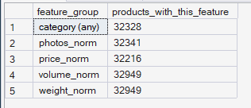
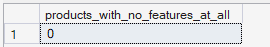
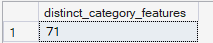

# Phase 7 — Recommendation Intelligence
## 02. Product Feature Engineering

**SQL Script:** `02_product_feature_engineering.sql`

---

## 1. Business Question

How do we represent products so that similar products can be identified mathematically?

---

## 2. Objective

Build a product feature representation that can be used by the content-based recommendation engine to compare products mathematically.

The feature set uses product attributes that are actually available in the ORGEE enterprise warehouse:

- Category
- Average observed delivered price
- Product weight
- Physical volume
- Photo count

The representation is stored in a long-format feature table so that the later similarity calculations can operate consistently across categorical and numeric features.

---

## 3. Product Feature Design

### Feature 1 — Category

Product category is represented as a one-hot feature:

```text
cat_<category> = 1.0
```

Products without an English category value do not receive a category feature.

---

### Feature 2 — Average Price

Average product price is calculated from delivered transactions in `Fact_Order_Items`.

The resulting product-level average price is min-max normalized.

Products with no delivered purchase history do not receive a price feature. No price is fabricated for these products.

---

### Feature 3 — Weight

`product_weight_g` is min-max normalized across products with a non-null weight.

---

### Feature 4 — Physical Volume

Physical size is represented as:

```text
length_cm × height_cm × width_cm
```

The resulting volume is min-max normalized.

The three dimensions are combined into one feature rather than being represented as three separate dimensions, preventing physical size from receiving excessive representation in the similarity calculation.

---

### Feature 5 — Photo Count

`product_photos_qty` is min-max normalized across products with an available photo-count value.

---

## 4. Feature Representation

The feature table is:

`reco.product_features`

### Grain

> One row represents one product-feature combination.

### Columns

- `product_sk`
- `feature_name`
- `feature_value`

The long-format representation avoids creating a wide table containing a separate column for every product category.

Missing features are represented by the absence of a row rather than by explicitly storing zero-valued rows.

---

## 5. Feature Coverage Summary

### Actual Output

| Feature Group | Products with Feature |
|---|---:|
| category (any) | 32,328 |
| photos_norm | 32,341 |
| price_norm | 32,216 |
| volume_norm | 32,949 |
| weight_norm | 32,949 |

### Screenshot



The feature coverage confirms that all five intended feature groups are represented in the generated feature table.

---

## 6. Products with No Features

### Actual Output

| Metric | Value |
|---|---:|
| Products with no features at all | **0** |

### Screenshot



No product has a completely empty feature representation.

Every product has at least one usable feature and can therefore participate in the recommendation feature space, subject to the recommendation and similarity rules implemented in later scripts.

---

## 7. Category Feature Coverage

### Actual Output

| Metric | Value |
|---|---:|
| Distinct category features represented | **71** |

### Screenshot



The product feature table represents **71 distinct category features**.

The result reflects the category values actually present in the warehouse rather than introducing unsupported categories.

---

## 8. Feature Coverage Interpretation

The feature coverage shows that:

- Category information is available for **32,328 products**.
- Photo-count information is available for **32,341 products**.
- Delivered transaction price history is available for **32,216 products**.
- Weight information is available for **32,949 products**.
- Complete physical dimensions are available for **32,949 products**.
- **0 products** have no features at all.

Products with incomplete attributes can still participate in the feature representation through the attributes that are available for them.

---

## 9. Similarity Design

The resulting feature representation is designed for later similarity calculations.

Category features use a value of `1.0`, while numerical attributes are min-max normalized.

No additional hidden feature weighting is introduced in this script.

The intended effect is that sharing the same category provides a strong common feature while numeric characteristics provide additional similarity information.

---

## 10. Data Source

All product features are derived from the **Phase 3 Enterprise SQL Data Warehouse**.

### Primary Tables

- `dbo.Dim_Product`
- `dbo.Fact_Order_Items`

No raw public CSV files are used directly in this script.

---

## 11. Business Interpretation

The feature engineering step produces a usable mathematical representation of the product catalog.

The catalog has broad feature coverage, with no products lacking all features.

Price coverage is lower than physical-attribute coverage because average price depends on delivered transaction history.

Category coverage is also incomplete because a subset of products does not have an English category value.

These gaps are handled through feature availability rather than fabricated values.

---

## 12. Analytical Guardrails

### No Fabricated Price

Products without delivered purchase history do not receive an invented price value.

### No Invented Product Attributes

Only attributes available in the enterprise warehouse are used.

### No Hidden Category Expansion

The engine uses the categories actually represented in the warehouse.

### Long-Format Feature Storage

Features are stored in a normalized long-format table rather than as an unnecessarily wide category matrix.

---

## 13. Technical Techniques

- Long-format feature table
- CTE
- Min-max normalization
- Window functions
- Aggregation
- Feature coverage profiling
- Product-level joins
- Temporary table for average price derivation

---

## 14. Validation Notes

The feature coverage outputs confirm:

- **32,328** products have a category feature.
- **32,341** products have a photo-count feature.
- **32,216** products have a normalized price feature.
- **32,949** products have a normalized volume feature.
- **32,949** products have a normalized weight feature.
- **0** products have zero features.
- **71** distinct category features are represented.

The feature table therefore provides a usable foundation for product similarity calculations.

---

## 15. Signature Insight

> **All 32,951 products have at least one usable feature, while the strongest physical-attribute coverage reaches 32,949 products and delivered transaction price is available for 32,216 products.**

---

## 16. Next Step

**Next script:** `03_customer_preference_profiles.sql`

The next step converts customer interaction history into customer preference profiles that can be compared against these product feature representations.
