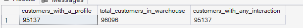
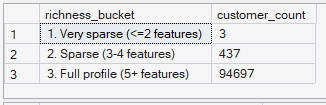
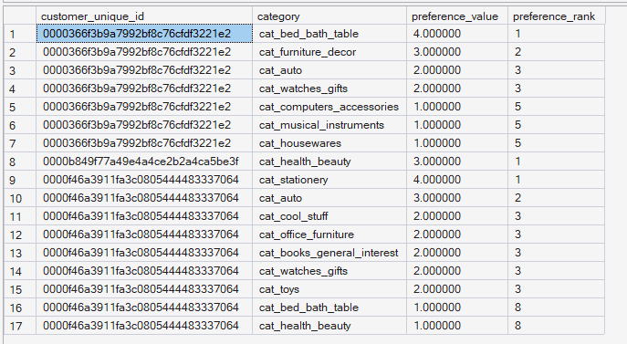

# Phase 7 — Recommendation Intelligence
## 03. Customer Preference Profiles

**SQL Script:** `03_customer_preference_profiles.sql`

---

## 1. Business Question

What does each customer appear to prefer, based on observed behavior?

The analysis infers customer preferences from customer-product interactions. It does not represent stated customer preferences.

---

## 2. Objective

Convert the recommendation interaction dataset from Script 01 into a customer preference profile using the same feature space created in Script 02.

The resulting profiles are designed to be directly comparable with product feature vectors in the content-based recommendation engine.

---

## 3. Preference Methodology

### Step 1 — Customer-Product Interest Weight

For each `(customer_unique_id, product_sk)` pair, all interaction weights are summed.

This means repeated or varied engagement with the same product produces stronger evidence.

Example:

```text
Product View    = 1.0
Add to Cart     = 2.0
Purchase        = 3.0

Combined interest weight = 6.0
```

---

### Step 2 — Weighted Customer Preference Profile

For each customer, the product feature vectors are weighted by the customer's combined interest weight and summed by feature.

Conceptually:

```text
Customer Interactions
        ↓
Combined Product Interest
        ↓
Weighted Product Features
        ↓
Customer Preference Vector
```

The preference profile uses the same `feature_name` space as `reco.product_features`.

---

## 4. Output Table

The generated preference profile is stored in:

`reco.customer_preferences`

### Grain

> One row represents one customer-feature combination.

### Columns

- `customer_unique_id`
- `feature_name`
- `preference_value`

---

## 5. Profile Coverage

### Actual Output

| Metric | Value |
|---|---:|
| Customers with a profile | **95,137** |
| Person-level customers in warehouse | **96,096** |
| Customers with any interaction | **95,137** |

### Screenshot



All customers with at least one usable interaction receive a preference profile.

---

## 6. Profile Richness

### Actual Output

| Richness Bucket | Customer Count |
|---|---:|
| Very sparse (≤2 features) | 3 |
| Sparse (3–4 features) | 437 |
| Full profile (5+ features) | 94,697 |
| **Total** | **95,137** |

### Screenshot



The large majority of profiled customers span at least five features, while only a small number have very sparse feature representations.

---

## 7. Sample Customer Preferences

A sample of customer preference profiles is returned as a human-readable illustration.

The output shows:

- Customer identifier
- Category feature
- Preference value
- Preference rank

Higher `preference_value` indicates stronger inferred preference for that feature within the customer's profile.

### Screenshot



The sample demonstrates that customers can have multiple category preferences with different strengths rather than being assigned to only one category at the profile-building stage.

---

## 8. Interpretation

The preference-building step provides a customer vector in the same feature space as the product vectors.

This is the critical bridge between:

```text
Customer Behavior
        ↓
Customer Preference Profile
        ↓
Product Feature Representation
        ↓
Similarity
```

The profile is behavioral and inferred. It should not be interpreted as an explicit customer statement.

---

## 9. Business Implication

The richness distribution indicates that the recommendation engine has substantial profile information for most customers with usable interactions.

A small sparse-profile population remains, so Script 04 must handle the possibility that some customers do not have enough feature overlap or suitable candidate products to produce recommendations.

---

## 10. Analytical Guardrails

### Behavioral Inference

Preferences are inferred from observed interaction weights and are not treated as stated preferences.

### Same Feature Space

Customer preferences use the same feature names as `reco.product_features`, enabling direct mathematical comparison.

### Weighted Sum

A weighted sum is intentionally used rather than a simple average. The raw profile scale is normalized later by cosine similarity.

### No Future Signal

The profile is constructed only from the interactions stored in the recommendation interaction layer.

---

## 11. Technical Techniques

- CTE
- Temporary table
- Aggregation
- Weighted summation
- `SUM`
- `COUNT(DISTINCT)`
- Customer-product grouping
- Feature-level aggregation

---

## 12. Validation Notes

The profile output reconciles with the recommendation interaction population:

- Customers with any interaction = **95,137**
- Customers with a generated profile = **95,137**
- Profile richness buckets = **95,137**

This confirms that all customers represented in the interaction layer receive a customer preference profile.

---

## 13. Signature Insight

> **95,137 customers receive preference profiles, and 94,697 of them span at least five features, providing a rich feature representation for the content-based recommendation engine.**

---

## 14. Next Step

**Next script:** `04_content_based_recommendation_engine.sql`

The next step compares customer preference vectors with product feature vectors using cosine similarity, applies candidate filtering, excludes already-purchased products, and generates Top-5 personalized recommendations.
