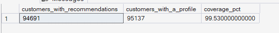
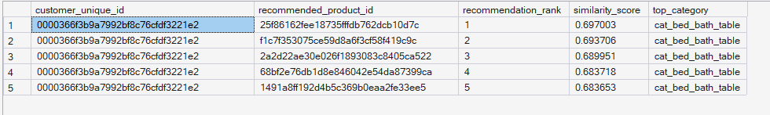
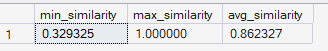

# Phase 7 — Recommendation Intelligence
## 04. Content-Based Recommendation Engine

**SQL Script:** `04_content_based_recommendation_engine.sql`

---

## 1. Business Question

Which products are most relevant to each customer?

---

## 2. Objective

Generate personalized Top-5 product recommendations by comparing:

- Customer preference profiles from Script 03
- Product feature vectors from Script 02

The engine uses cosine similarity to rank candidate products.

---

## 3. Candidate Generation Strategy

Directly comparing every customer against every product would create an extremely large comparison space.

The implementation therefore uses a two-stage candidate strategy.

### Step 1 — Customer Top Category

Each customer is assigned one highest-preference category for candidate generation.

Ties are resolved deterministically using the category feature name.

### Step 2 — Category Popularity Shortlist

Within each category, the top 100 products by total recommendation-layer interaction count are retained as the candidate shortlist.

This shortlist is computed once per category before customer-level scoring.

The approach substantially reduces the candidate space while retaining popular products within the customer's strongest inferred category.

---

## 4. Similarity Method

The engine uses cosine similarity.

### Formula

```text
Cosine Similarity
=
Dot Product
÷
(Customer Vector Magnitude × Product Vector Magnitude)
```

### Dot Product

The dot product is calculated over feature names shared by the customer preference vector and product feature vector.

A missing feature contributes zero naturally.

### Vector Magnitude

Customer and product vector magnitudes are precomputed independently before pairwise comparison.

This keeps the normalization mathematically consistent across candidate products.

---

## 5. Recommendation Filtering

The engine applies two key filters.

### Already Purchased Products

Products already purchased by the customer are excluded.

The recommendation output therefore focuses on discovery rather than re-suggesting completed purchases.

### Products Without Usable Features

Products with no feature representation cannot be scored and are naturally excluded from the similarity join.

Script 02 established that no catalog product has zero features.

---

## 6. Top-N Recommendation

The engine generates:

> **Top 5 recommendations per customer**

Recommendations are ranked by descending cosine similarity, with product key used as a deterministic tie-breaker.

---

## 7. Recommendation Coverage

### Actual Output

| Metric | Value |
|---|---:|
| Customers with recommendations | **94,691** |
| Customers with a profile | **95,137** |
| Coverage | **99.53%** |

### Screenshot



The engine produces recommendations for 94,691 of the 95,137 customers with a usable preference profile.

---

## 8. Sample Recommendations

The example output displays Top-5 recommendations for sample customers.

### Actual Example

For customer `0000366f3b9a7992bf8c76cdf3221e2`:

| Rank | Recommended Product | Similarity Score | Top Category |
|---:|---|---:|---|
| 1 | `25f86162fe18735ffbd762dcb10d7c` | 0.697003 | `cat_bed_bath_table` |
| 2 | `f1cf73530fce59d8a6f3cf58f419c9c` | 0.693706 | `cat_bed_bath_table` |
| 3 | `2a2d22ae30e026f1893083c8405ca522` | 0.689951 | `cat_bed_bath_table` |
| 4 | `68bfe2e76bd1d8e846042e54ad87399c` | 0.683178 | `cat_bed_bath_table` |
| 5 | `1491a8ff192d4b5c369b0eaa2fe33ee5` | 0.683653 | `cat_bed_bath_table` |

### Screenshot



The sample output confirms that recommendations are ranked and that the customer's top inferred category drives the candidate-generation stage.

---

## 9. Similarity Score Distribution

### Actual Output

| Metric | Value |
|---|---:|
| Minimum similarity | 0.329325 |
| Maximum similarity | 1.000000 |
| Average similarity | **0.863227** |

### Screenshot



All observed similarity scores are non-negative, which is expected because the feature representation contains non-negative category flags and normalized numeric features.

---

## 10. Interpretation

The recommendation engine successfully converts customer preference profiles into ranked product recommendations.

The candidate-generation process first narrows products using the customer's strongest inferred category, then applies full-vector cosine similarity across the available feature space.

Therefore, category determines the candidate pool, while similarity ranking incorporates the broader product feature representation.

---

## 11. Business Implication

The engine demonstrates a practical personalization workflow:

```text
Customer History
        ↓
Customer Preference Profile
        ↓
Top Preference Category
        ↓
Candidate Product Shortlist
        ↓
Cosine Similarity
        ↓
Top-5 Recommendations
```

The **99.53% profile-to-recommendation coverage** indicates that the recommendation engine can generate recommendations for nearly the entire profiled customer population.

The remaining customers without recommendations represent a small coverage gap that should be investigated as part of evaluation and validation.

---

## 12. Analytical Guardrails

### No Already-Purchased Recommendations

Previously purchased products are removed from the recommendation result.

### No Full-Catalog Brute Force

Candidate generation is intentionally bounded to avoid an infeasible customer × full-catalog comparison.

### No Causal Claim

The recommendation engine demonstrates personalization capability but does not establish that recommendations improve conversion or revenue.

Causal business impact is addressed through experimentation methodology in Phase 8.

### Deterministic Ranking

Similarity is sorted descending with `product_sk` as a tie-breaker.

---

## 13. Performance Design

The initial full-category candidate join generated an impractical candidate volume.

The implemented solution limits each category to its top 100 products by interaction popularity before customer-level similarity scoring.

This reduces the candidate space to a maximum of approximately:

```text
71 categories × 100 shortlisted products
```

before customer-specific joins.

The change improves feasibility without replacing the actual cosine-similarity recommendation logic.

---

## 14. Technical Techniques

- CTE
- Temporary tables
- Window functions
- `ROW_NUMBER`
- Aggregation
- `SUM`
- `SQRT`
- Dot-product calculation
- Cosine similarity
- `NOT EXISTS`
- Candidate generation
- Top-N ranking

---

## 15. Validation Notes

The result confirms:

- **94,691** customers receive recommendations.
- **95,137** customers have preference profiles.
- Recommendation coverage = **99.53%**.
- Top-N is fixed at **5**.
- Similarity scores range from **0.329325 to 1.000000**.
- Already-purchased products are excluded by the recommendation query.

The recommendation layer therefore provides a functioning personalized ranking output built entirely from the ORGEE SQL warehouse.

---

## 16. Signature Insight

> **The content-based recommendation engine generates Top-5 personalized recommendations for 94,691 customers, achieving 99.53% coverage of customers with usable preference profiles.**

---

## 17. Next Step

**Next script:** `05_recommendation_evaluation.sql`

The next step evaluates recommendation quality using a leakage-safe historical holdout rather than assuming that generated recommendations are successful simply because they can be produced.
