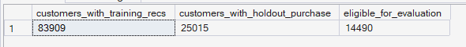
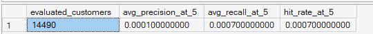
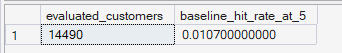

# Phase 7 — Recommendation Intelligence
## 05. Recommendation Evaluation

**SQL Script:** `05_recommendation_evaluation.sql`

---

## 1. Business Question

Are the generated recommendations actually relevant, or would we be fooling ourselves by claiming recommendation quality without evidence?

---

## 2. Objective

Evaluate the content-based recommendation engine using a leakage-safe historical holdout framework.

The evaluation measures:

- Precision@5
- Recall@5
- Hit Rate@5
- Comparison with a naive popularity-based Top-5 baseline

The goal is to determine whether the content-based engine provides measurable predictive signal beyond a simple best-seller recommendation strategy.

---

## 3. Leakage-Safe Evaluation Design

### Cutoff Date

> **2018-05-01**

The historical data is divided into:

```text
Training Period
All interactions before 2018-05-01
        ↓
Training-only customer profiles
        ↓
Training-only recommendations
        ↓
Holdout Period
Actual purchases on/after 2018-05-01
```

The holdout purchases represent future observations relative to the training data.

---

## 4. Training Data

Training interactions are rebuilt from `reco.interactions` using:

```sql
interaction_date < '2018-05-01'
```

The evaluation pipeline does not reuse the production customer-preference or recommendation tables created from the full observation period.

This prevents future customer interactions from being incorporated into the evaluation profiles and recommendations.

---

## 5. Training-Period Product Features

The evaluation also prevents transactional feature leakage.

Static product attributes are retained, while `price_norm` is recomputed from delivered transactions occurring before the cutoff.

Therefore:

- Category is training-safe
- Weight is training-safe
- Volume is training-safe
- Photo count is training-safe
- Price normalization is calculated from pre-cutoff delivered transactions only

This ensures the evaluation product feature representation does not use post-cutoff transaction information.

---

## 6. Evaluation Population

### Actual Output

| Metric | Value |
|---|---:|
| Customers with training recommendations | **83,909** |
| Customers with holdout purchases | **25,015** |
| Eligible for evaluation | **14,490** |

### Screenshot



The final evaluation population contains **14,490 customers** who have both training-period recommendation output and at least one purchase in the holdout period.

This is a genuine historical holdout population rather than an artificially enlarged sample.

---

## 7. Content-Based Recommendation Results

### Actual Output

| Metric | Value |
|---|---:|
| Evaluated customers | **14,490** |
| Average Precision@5 | **0.10%** |
| Average Recall@5 | **0.07%** |
| Hit Rate@5 | **0.07%** |

### Screenshot



The recommendation engine produces measurable but very limited predictive signal on the historical holdout task.

---

## 8. Popularity Baseline

A naive baseline recommends the five most popular products in the training period.

Critically, the baseline is evaluated on the **same 14,490 eligible customers** used for the content-based engine.

### Actual Output

| Metric | Value |
|---|---:|
| Evaluated customers | **14,490** |
| Baseline Hit Rate@5 | **1.07%** |

### Screenshot



Using the identical evaluation population makes the comparison apples-to-apples.

---

## 9. Engine vs Baseline

| Metric | Content-Based Engine | Popularity Baseline |
|---|---:|---:|
| Evaluated customers | **14,490** | **14,490** |
| Hit Rate@5 | **0.07%** | **1.07%** |

The popularity baseline achieves approximately **15.3×** the Hit Rate@5 of the content-based engine on this holdout evaluation.

---

## 10. Interpretation

The content-based recommendation engine does **not** outperform a naive popularity strategy on the historical future-purchase task.

This is a real measured result after correcting two methodological issues:

1. The baseline is evaluated on the same customer population as the engine.
2. Transaction-derived price features are rebuilt using training-period information only.

Therefore, the result should be treated as an actual limitation of this recommendation approach on this evaluation task.

---

## 11. What the Result Does and Does Not Mean

### What it means

The current content-based feature representation is not sufficient to predict future purchases better than simply recommending the most popular products in this dataset and evaluation setup.

### What it does not mean

It does not mean that the recommendation engine is technically invalid.

Script 04 demonstrated that the engine can generate ranked, interpretable, category-driven recommendations.

The evaluation measures a different question:

> **Can those recommendations predict later observed purchases better than a simple popularity baseline?**

For this task, the answer is **no**.

---

## 12. Why the Evaluation Sample Is Modest

The evaluation population is limited to customers with both:

- Training-period activity sufficient to generate recommendations
- At least one holdout purchase

This is expected given the low repeat-purchase behavior observed earlier in ORGEE.

The sample size is therefore reported transparently rather than hidden or expanded by using customers who could not actually receive recommendations.

---

## 13. Candidate-Pool Robustness Check

A widened candidate configuration using:

- Top-3 preference categories
- Top-250 products per category

was also tested.

That wider candidate pool produced a worse Hit Rate@5 result of **0.04%** compared with the final **0.07%** configuration.

Therefore, simply increasing candidate-pool breadth was not supported as the solution to the observed performance limitation.

The final configuration remains:

> **Top-1 preference category + Top-100 popular products per category**

---

## 14. Likely Analytical Limitation

The content-based engine primarily captures relationships between:

- Customer behavioral preferences
- Product attributes

It does not model collaborative behavior such as:

> **“Customers similar to this customer purchased product X.”**

That type of signal would require a collaborative recommendation approach, which is outside the locked Phase 7 v1.0 scope.

This observation is treated as a future enhancement rather than an excuse to expand the current project.

---

## 15. Analytical Guardrails

- Training data is strictly before the cutoff.
- Holdout purchases are on or after the cutoff.
- Training and holdout information are separated.
- The baseline uses the identical eligible customer population.
- Price normalization uses pre-cutoff delivered transactions.
- No causal uplift is claimed.
- The result is not tuned to obtain a preferred outcome.
- Collaborative filtering remains outside the current Phase 7 scope.

---

## 16. Technical Techniques

- CTE
- Date filtering
- Temporary tables
- Aggregation
- Window functions
- `ROW_NUMBER`
- Historical holdout evaluation
- Precision@5
- Recall@5
- Hit Rate@5
- Popularity baseline comparison

---

## 17. Validation Notes

The corrected evaluation confirms:

- **14,490** customers are evaluated by both approaches.
- Engine Hit Rate@5 = **0.07%**
- Baseline Hit Rate@5 = **1.07%**
- Evaluation uses training-period product price features.
- The historical cutoff is fixed at **2018-05-01**.

The corrected design removes the population mismatch and the transactional price leakage identified in the earlier version.

---

## 18. Signature Insight

> **On a leakage-safe holdout of 14,490 eligible customers, the content-based recommendation engine achieves a 0.07% Hit Rate@5, versus 1.07% for the identical-population popularity baseline, showing that the current content-only representation does not outperform a simple best-seller strategy for future-purchase prediction.**

---

## 19. Next Step

**Next script:** `06_recommendation_business_impact.sql`

The next analysis translates this measured recommendation quality and limitation into an evidence-based business impact assessment.
