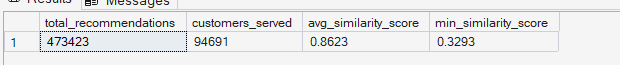
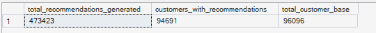
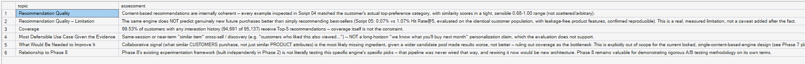

# Phase 7 — Recommendation Intelligence
## 06. Recommendation Business Impact

**SQL Script:** `06_recommendation_business_impact.sql`

---

## 1. Business Question

Given what the recommendation engine actually demonstrated, what is the honest business opportunity, and what should not be claimed at this stage?

---

## 2. Objective

Translate the Phase 7 recommendation-engine results into an evidence-based business interpretation.

The analysis intentionally separates:

- What the engine demonstrably does well
- What the evaluation does not support
- The practical use case most consistent with the evidence
- What additional capability could improve the recommendation system
- How this connects to the Phase 8 experimentation framework

No causal uplift is claimed in this script.

---

## 3. Evidence Boundary

Script 05 evaluated the recommendation engine against a historical holdout.

The result was:

- Engine Hit Rate@5: **0.07%**
- Popularity baseline Hit Rate@5: **1.07%**
- Evaluated population: **14,490 customers**

Therefore, the recommendation engine is **not** presented as a proven predictor of future purchases.

Causal impact remains outside the scope of this analysis and belongs to experimentation in Phase 8.

---

## 4. Recommendation Output Summary

### Actual Output

| Metric | Value |
|---|---:|
| Total recommendations | **473,423** |
| Customers served | **94,691** |
| Average similarity score | **0.8623** |
| Minimum similarity score | **0.3293** |

### Screenshot



---

## 5. Recommendation Coverage

### Actual Output

| Metric | Value |
|---|---:|
| Total recommendations generated | **473,423** |
| Customers with recommendations | **94,691** |
| Person-level customer base | **96,096** |

### Screenshot



The recommendation engine serves **94,691 customers**, consistent with the **99.53% coverage** established in Script 04.

---

## 6. Business Impact Assessment

### Actual Output

| Topic | Assessment |
|---|---|
| Recommendation Quality | Content-based recommendations are internally coherent, with inspected examples matching the customer's top-preference category and similarity scores in a sensible range. |
| Recommendation Quality — Limitation | The engine does not outperform the popularity baseline for genuinely new future purchases: **0.07% vs 1.07% Hit Rate@5** on the same evaluation population with leakage-safe product features. |
| Coverage | **94,691 of 95,137** customers with interaction history receive Top-5 recommendations, giving **99.53% coverage**. |
| Most Defensible Use Case | Same-session or near-term similar-item cross-sell / product discovery is more defensible than long-horizon future-purchase prediction. |
| What Would Be Needed to Improve It | Collaborative customer-behavior signal is the most likely missing ingredient, while adding a wider candidate pool was not supported as the solution by the tested results. |
| Relationship to Phase 8 | The existing Phase 8 experimentation framework is not literally testing the exact recommendations produced here; it remains a separate experimentation methodology foundation. |

### Screenshot



---

## 7. Key Business Interpretation

The Phase 7 result is intentionally a split outcome.

### What the engine demonstrates

The engine produces:

- Mathematically ranked recommendations
- Interpretable category-driven candidates
- Strong recommendation coverage
- Consistent similarity-based product matching

### What the engine does not demonstrate

The leakage-safe historical evaluation does not show that these recommendations predict future purchases better than a simple popularity strategy.

Therefore:

> **Recommendation coherence is not the same as predictive effectiveness.**

---

## 8. Most Defensible Business Use Case

Given the evidence, the strongest supported use case is:

> **Same-session or near-term similar-item discovery / cross-sell**

For example:

```text
Customer views product
        ↓
Engine identifies similar products
        ↓
Customer sees related products
        ↓
Near-term discovery / cross-sell
```

The analysis does not support a long-horizon claim such as predicting what a customer will purchase weeks or months later.

---

## 9. Business Limitation

The content-based engine uses product attributes and customer behavioral preferences, but it does not incorporate collaborative information about what similar customers purchase.

The historical evaluation shows that widening the candidate pool did not improve the result.

Therefore, additional candidate breadth alone is not supported as the primary solution to the observed performance limitation.

A collaborative signal would be a logical future enhancement, but it is **explicitly outside the locked Phase 7 v1.0 scope**.

---

## 10. Causal Impact Boundary

Script 05 is a historical observational evaluation.

It does not establish causal uplift.

Therefore, this script does not claim:

- Increased conversion caused by recommendations
- Increased revenue caused by recommendations
- Incremental AOV caused by recommendations

Those questions require controlled experimentation.

---

## 11. Relationship to Phase 8

The project intentionally keeps the existing Phase 8 experimentation framework separate from the production recommendation output created in Phase 7.

The Phase 8 framework can still demonstrate:

- Control vs Treatment
- Sample allocation
- SRM
- Statistical significance
- Effect size
- Confidence intervals
- Business decision

No artificial linkage is created between the independent synthetic experiment data and the exact Phase 7 recommendation rows.

---

## 12. Business Recommendation

The evidence supports a narrower interpretation of the recommendation engine:

> **Use the engine as a similarity-based discovery / cross-sell capability rather than presenting it as a validated long-horizon personalized purchase predictor.**

This conclusion is driven by the observed evaluation result rather than by a predetermined assumption.

---

## 13. Analytical Guardrails

- No causal uplift is claimed.
- No future-purchase prediction claim is made.
- The corrected Script 05 result is used: **0.07% vs 1.07% Hit Rate@5**.
- Recommendation coverage is reported separately from recommendation effectiveness.
- Future collaborative filtering is identified as an enhancement, not added to the current scope.
- Phase 8 remains the causal-validation layer.

---

## 14. Techniques Used

- Aggregation
- `COUNT`
- `COUNT(DISTINCT)`
- `AVG`
- `MIN`
- Structured business-impact assessment

---

## 15. Validation Notes

The business-impact outputs reconcile with the production recommendation layer:

- Total recommendations = **473,423**
- Customers served = **94,691**
- Average similarity = **0.8623**
- Minimum similarity = **0.3293**
- Recommendation coverage = **99.53%**
- Corrected evaluation result = **0.07% engine Hit Rate@5 vs 1.07% baseline**

---

## 16. Signature Insight

> **The content-based engine demonstrates high-coverage, internally coherent product recommendations, but its leakage-safe historical Hit Rate@5 of 0.07% remains well below the 1.07% popularity baseline, so its most defensible use is near-term similar-item discovery rather than long-horizon purchase prediction.**

---

## 17. Next Step

**Next script:** `07_phase7_validation.sql`

The final Phase 7 validation consolidates data-quality, recommendation-logic, coverage, and evaluation-validity checks across the recommendation pipeline.
