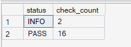
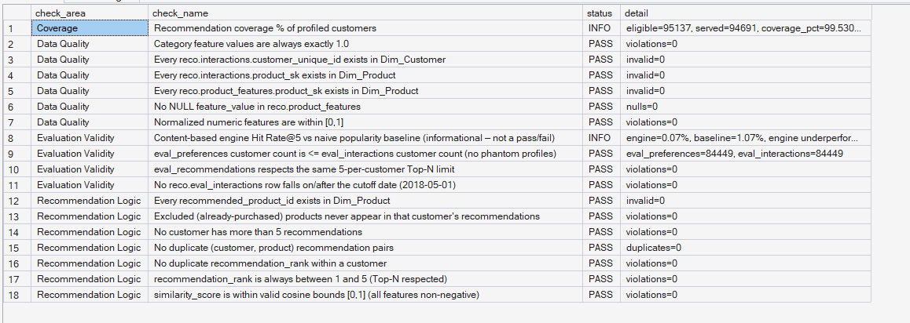

# Phase 7 — Recommendation Intelligence
## 07. Phase 7 Validation

**SQL Script:** `07_phase7_validation.sql`

---

## 1. Objective

Validate the Phase 7 recommendation pipeline across:

- Data quality
- Product-feature integrity
- Recommendation logic
- Recommendation coverage
- Historical evaluation validity

The validation follows the established ORGEE PASS / FAIL / INFO pattern.

---

## 2. Validation Result

### Actual Output

| Status | Check Count |
|---|---:|
| **PASS** | **16** |
| **INFO** | **2** |
| FAIL | **0** |

### Screenshot

---

## 3. Validation Detail

### Coverage

Recommendation coverage is reported as informational:

- Eligible profiled customers = **95,137**
- Customers served = **94,691**
- Coverage = **99.53%**

### Data Quality

Validated conditions include:

- Every interaction customer exists in `Dim_Customer`
- Every interaction product exists in `Dim_Product`
- Every product feature product exists in `Dim_Product`
- No NULL product feature values
- Category feature values equal `1.0`
- Normalized numeric features remain within `[0,1]`

All data-quality checks pass.

### Recommendation Logic

Validated conditions include:

- Recommended products exist in `Dim_Product`
- Recommendation rank remains between 1 and 5
- No customer receives more than five recommendations
- No duplicate `(customer, product)` recommendation pairs
- No duplicate recommendation ranks within a customer
- Similarity scores remain within valid cosine bounds
- Already-purchased products are excluded

All recommendation-logic checks pass.

### Evaluation Validity

Validated conditions include:

- No training interaction occurs on or after the `2018-05-01` cutoff
- Evaluation preference customers do not exceed evaluation interaction customers
- Evaluation recommendations respect the same five-per-customer limit
- Engine vs popularity baseline remains an informational result rather than a pass/fail rule

### Screenshot

---

## 4. Informational Results

Two checks are intentionally classified as `INFO` rather than `PASS` or `FAIL`.

### Recommendation Coverage

Coverage is a descriptive metric:

> **94,691 of 95,137 profiled customers receive recommendations = 99.53%.**

It is therefore reported rather than treated as a binary quality failure.

### Evaluation Performance

The recommendation engine does not outperform the popularity baseline:

> **Engine Hit Rate@5 = 0.07%**  
> **Popularity Baseline Hit Rate@5 = 1.07%**

This is reported as an informational business result rather than a technical validation failure.

---

## 5. Data Quality Validation

The validation confirms:

- No invalid customer references
- No invalid product references
- No invalid product-feature references
- No NULL feature values
- All category flags equal 1.0
- All normalized numeric features are within the `[0,1]` range

This confirms that the recommendation inputs are structurally valid.

---

## 6. Recommendation Logic Validation

The recommendation output satisfies the core constraints:

- Valid recommendation products
- Maximum Top-5 output
- No duplicate customer-product recommendations
- No duplicate ranks within a customer
- Valid cosine similarity bounds
- No previously purchased products recommended

These checks confirm that the production recommendation table obeys the intended ranking and filtering rules.

---

## 7. Evaluation Validity

The historical holdout uses a fixed cutoff:

> **2018-05-01**

The validation confirms that the training interaction layer contains no records on or after that cutoff.

The evaluation population and recommendation limits are also checked before the final interpretation of recommendation performance.

---

## 8. Final Validation Summary

| Area | Result |
|---|---|
| Data Quality | ✅ PASS |
| Recommendation Logic | ✅ PASS |
| Coverage | ℹ️ INFO |
| Evaluation Validity | ✅ PASS / ℹ️ performance result |
| Overall | **16 PASS / 2 INFO / 0 FAIL** |

### Screenshot

---

## 9. Interpretation

The recommendation pipeline passes all technical validation checks.

The two informational results are not technical failures:

- Coverage is measured and reported at **99.53%**.
- Recommendation effectiveness is transparently reported as **0.07% Hit Rate@5 vs 1.07% baseline**.

This separation keeps technical correctness distinct from model/business effectiveness.

---

## 10. Scope Control

Validation confirms the Phase 7 implementation remains within the locked scope:

> **One content-based recommendation capability.**

No additional recommender model, collaborative filtering system, deep learning model, or unnecessary ML expansion is introduced.

---

## 11. Techniques Used

- Temporary validation table
- Conditional status assignment
- `COUNT`
- `COUNT(DISTINCT)`
- `NOT EXISTS`
- Aggregation
- Referential checks
- Range checks
- Group-level duplicate checks
- Evaluation cutoff validation

---

## 12. Final Status

**Status: ✅ PHASE 7 VALIDATION PASSED**

### Final Result

> **16 PASS / 2 INFO / 0 FAIL**

The Phase 7 recommendation pipeline is technically valid, its coverage is high, and its limitations are explicitly documented based on the leakage-safe evaluation.

---

## 13. Signature Insight

> **Phase 7 passes all 16 technical validation checks with 0 failures, while transparently reporting 99.53% recommendation coverage and a 0.07% Hit Rate@5 versus a 1.07% popularity baseline.**

---

## 14. Next Step

**Phase 7 is complete.**

The next ORGEE phase is:

> **Phase 8 — Experimentation Framework**
