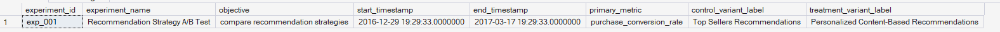
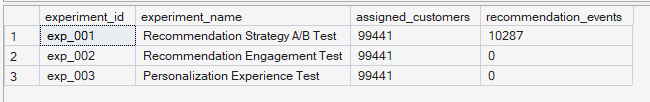
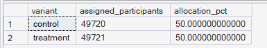

# Phase 8 — Experimentation Framework
## 01. Experiment Design

**SQL Script:** `01_experiment_design.sql`

---

## 1. Business Question

Does personalized product recommendation improve purchase conversion compared with a control experience using top-selling products?

---

## 2. Objective

Define and validate the experiment that will be analyzed in Phase 8, confirm the correct recommendation experiment, establish the analysis scope, and document the Control/Treatment allocation before performance and statistical analysis begin.

The experiment design is intentionally grounded in the actual ORGEE warehouse and the available synthetic recommendation-event data.

---

## 3. Experiment Scope

Phase 8 is scoped to **`exp_001` only**.

`Dim_Experiment` contains three experiments, but only `exp_001` has recommendation-event data available in `Fact_Recommendation_Events`. The other two experiments have assignments but no recommendation events, so they are not suitable for the recommendation A/B-test analysis in this phase.

This makes `exp_001` the appropriate experiment for the locked Phase 8 hypothesis:

- **Control:** Top Sellers Recommendations
- **Treatment:** Personalized Content-Based Recommendations
- **Primary Metric:** `purchase_conversion_rate`

### Experiment Definition Output



The warehouse confirms:

| Field | Value |
|---|---|
| Experiment ID | `exp_001` |
| Experiment Name | Recommendation Strategy A/B Test |
| Objective | compare recommendation strategies |
| Start | 2016-12-29 19:29:33 |
| End | 2017-03-17 19:29:33 |
| Primary Metric | `purchase_conversion_rate` |
| Control | Top Sellers Recommendations |
| Treatment | Personalized Content-Based Recommendations |

---

## 4. Recommendation-Event Availability

The script separately aggregates assignments and recommendation events before joining them at the experiment level. This avoids row-level fact-table fan-out and produces one summary row per experiment.

### Actual Output



| Experiment | Assigned Customers | Recommendation Events |
|---|---:|---:|
| `exp_001` | 99,441 | 10,287 |
| `exp_002` | 99,441 | 0 |
| `exp_003` | 99,441 | 0 |

This confirms that **`exp_001` is the sole analyzable recommendation experiment for Phase 8**.

---

## 5. Experiment Allocation

The experiment contains 99,441 assigned participants. Because the total population is odd, the most balanced possible deterministic split produces a one-participant difference between Control and Treatment.

### Actual Output



| Variant | Assigned Participants | Allocation |
|---|---:|---:|
| Control | 49,720 | 50.00% |
| Treatment | 49,721 | 50.00% |
| **Total** | **99,441** | **100.00%** |

The underlying assignment counts differ by only one participant, so the allocation is **near-exactly 50/50**.

The formal SRM validation is intentionally reserved for **Script 03**, where the planned allocation will be tested statistically using the locked Chi-Square Goodness-of-Fit approach.

---

## 6. Purchase Conversion Rate Definition

For this experiment, Purchase Conversion Rate is defined using the experiment's recorded recommendation-conversion outcome:

> **Customers with at least one `recommendation_conversion` event ÷ eligible assigned customers.**

The calculation is based on `Fact_Recommendation_Events` and is **not cross-referenced against `Fact_Order_Items`**.

This distinction is important because the recommendation-conversion signal is a synthetic experiment outcome generated independently from the real delivered-order history. It should therefore be interpreted as an experiment-defined conversion signal, not as independently verified delivered-order conversion.

---

## 7. Experiment Hypotheses

### Null Hypothesis (H₀)

There is no difference in Purchase Conversion Rate between Control and Treatment.

### Alternative Hypothesis (H₁)

Purchase Conversion Rate differs between Control and Treatment.

The statistical tests in later Phase 8 scripts will determine the actual result from the observed data.

---

## 8. Pre-Analysis Expectation

Inspection of the actual experiment generator shows that the recommendation-event probabilities are applied globally to both variants rather than encoding a deliberate treatment effect.

Therefore, the experiment data is expected to show **little or no systematic treatment advantage**, but this is only a pre-analysis expectation. The final Phase 8 conclusion must be based on the observed experiment metrics and statistical results.

No positive treatment effect is assumed or fabricated in advance.

---

## 9. Technical Design Note

The recommendation-event scope query was structured to aggregate the two fact tables independently:

```text
Fact_Experiment_Assignments
            ↓
   Aggregate by experiment
            ↓
      One row / experiment

Fact_Recommendation_Events
            ↓
   Aggregate by experiment
            ↓
      One row / experiment

            ↓
       Join summaries
```

This prevents the many-to-many multiplication that would occur if assignment rows and recommendation-event rows were joined directly at the fact level on the shared experiment key.

---

## 10. Business Interpretation

The warehouse confirms that `exp_001` is the correct Phase 8 experiment because its variants exactly represent the intended comparison between top-selling recommendations and personalized content-based recommendations.

The experiment has 99,441 assigned participants and only `exp_001` contains recommendation events, establishing a clear analysis boundary for the remaining Phase 8 scripts.

The assignment is effectively balanced at 50/50, with the one-participant difference explained by the odd total population size.

---

## 11. Business Implication

Phase 8 can proceed using **`exp_001` as the sole recommendation A/B-test population**.

The experiment is sufficiently defined to move into:

1. Experiment population construction
2. SRM validation
3. Primary and secondary metric calculation
4. Statistical significance analysis
5. Effect-size and confidence-interval analysis
6. Final experiment readout and business decision

---

## 12. Scope Control

This script intentionally does **not** perform:

- SRM statistical testing
- Primary metric performance comparison
- Statistical significance testing
- Confidence interval calculation
- Effect-size calculation
- Final business decision

Those responsibilities belong to later Phase 8 scripts.

---

## 13. Review Status

**PASS — Script 01 is complete and ready for Script 02.**

The only wording refinement from review was to describe the assignment as **near-exact 50/50** rather than mathematically exact 50/50 because the experiment contains an odd number of assigned participants.

---

## 14. Next Step

**Next script:** `02_experiment_population.sql`

The analysis now moves from experiment definition into construction of the final eligible population for Control/Treatment outcome analysis.
