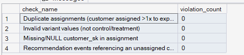
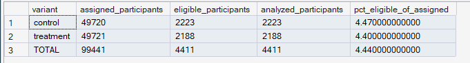

# Phase 8 — Experimentation Framework
## 02. Experiment Population

**SQL Script:** `02_experiment_population.sql`

---

## 1. Business Question

Who is the clean, valid analysis population for the `exp_001` recommendation experiment, and does the assignment data itself hold up to scrutiny before downstream analysis?

---

## 2. Objective

Build a reusable experiment population table that separates:

- **Assigned** participants
- **Eligible / exposed** participants with recommendation-event activity
- **Analyzed** participants with usable outcome data

The script also validates the assignment data before it becomes the population source.

---

## 3. Population Definition

### Assigned

Every customer assigned to `exp_001`.

**Total assigned:** **99,441**

### Eligible

Assigned customers who appear in `Fact_Recommendation_Events` for `exp_001`.

This represents customers with qualifying recommendation-event activity during the experiment window.

### Analyzed

For this dataset, **Analyzed = Eligible**. No additional filtering was required because the eligible recommendation-event records are treated as complete usable data.

---

## 4. Data Quality Validation



All four assignment/population checks returned **0 violations**:

| Check | Violations |
|---|---:|
| Duplicate assignments | 0 |
| Invalid variant values | 0 |
| Missing/NULL customer assignments | 0 |
| Recommendation events linked to unassigned customers | 0 |

This confirms a clean assignment population for downstream analysis.

---

## 5. Population Funnel



| Variant | Assigned | Eligible | Analyzed | Eligible / Assigned |
|---|---:|---:|---:|---:|
| Control | 49,720 | 2,223 | 2,223 | 4.47% |
| Treatment | 49,721 | 2,188 | 2,188 | 4.40% |
| **Total** | **99,441** | **4,411** | **4,411** | **4.44%** |

The eligible population is closely balanced between variants.

---

## 6. Analytical Interpretation

The assignment data is clean, while only a subset of assigned customers generated recommendation-event activity.

This creates three distinct analytical layers:

```text
Assigned Population
        ↓
Eligible / Exposed Population
        ↓
Analyzed Population
```

The assigned population remains important for assignment integrity and the canonical SRM test. The eligible population is used for outcome and metric analysis.

---

## 7. Business Implication

The experiment has a clean assignment foundation and a clearly defined usable analysis population.

From this point onward:

- **Script 03** validates the assigned-population SRM.
- **Scripts 04–08** use the eligible/analyzed population for experiment outcomes and decisions.

---

## 8. Scope

This script does not calculate experiment performance or statistical significance.

Those analyses are handled by later Phase 8 scripts.

---

## 9. Review Status

**PASS — population logic and validation checks are complete.**

---

## 10. Next Step

**Next script:** `03_srm_validation.sql`
