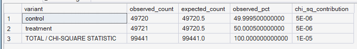
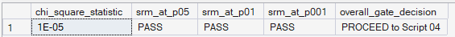
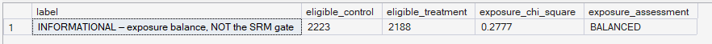

# Phase 8 — Experimentation Framework
## 03. SRM Validation

**SQL Script:** `03_srm_validation.sql`

---

## 1. Business Question

Was the experiment assignment itself distributed according to the planned 50/50 allocation?

---

## 2. Objective

Validate the integrity of the experiment assignment using a **Chi-Square Goodness-of-Fit test** against the planned 50/50 allocation.

The canonical SRM gate is performed on the **assigned population**.

---

## 3. Methodology

The assigned population contains:

- Control: **49,720**
- Treatment: **49,721**
- Total: **99,441**

Because the total population is odd, the most balanced possible allocation is a one-customer difference between variants.

Expected counts under a 50/50 allocation:

- Control: **49,720.5**
- Treatment: **49,720.5**

The test uses 1 degree of freedom and compares the chi-square statistic against standard critical values.

---

## 4. Primary SRM Output



| Variant | Observed | Expected | Observed % |
|---|---:|---:|---:|
| Control | 49,720 | 49,720.5 | 49.9995% |
| Treatment | 49,721 | 49,720.5 | 50.0005% |

**Chi-Square Statistic:** **0.00001**

---

## 5. SRM Decision



| Threshold | Result |
|---|---|
| p < 0.05 | PASS |
| p < 0.01 | PASS |
| p < 0.001 | PASS |

### Overall Gate

**PROCEED TO SCRIPT 04**

The assignment distribution is effectively 50/50 and does not indicate a sample-ratio mismatch.

---

## 6. Informational Exposure-Balance Diagnostic

The eligible population is also compared separately:



| Metric | Value |
|---|---:|
| Eligible Control | 2,223 |
| Eligible Treatment | 2,188 |
| Exposure Chi-Square | 0.2777 |
| Assessment | BALANCED |

This is explicitly **not the SRM gate**.

It is a secondary diagnostic of post-assignment exposure balance.

---

## 7. Analytical Interpretation

The canonical SRM test passes cleanly because the assigned population is essentially perfectly balanced.

The exposure-balance diagnostic is also balanced, indicating no obvious post-assignment imbalance between the eligible populations.

---

## 8. Business Implication

The experiment passes its assignment-integrity gate, so downstream metric and statistical analysis can proceed.

---

## 9. Important Methodological Distinction

```text
Assigned Population
        ↓
Canonical SRM
        ↓
PASS

Eligible / Exposed Population
        ↓
Exposure Balance Diagnostic
        ↓
BALANCED
```

The two checks answer different questions and are intentionally not conflated.

---

## 10. Review Status

**PASS — SRM gate and exposure-balance diagnostic are correctly defined and validated.**

---

## 11. Next Step

**Next script:** `04_experiment_metrics.sql`
