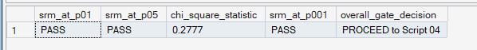
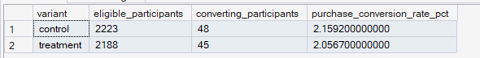
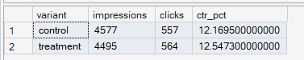
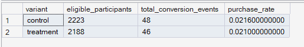

# Phase 8 — Experimentation Framework
## 04. Experiment Metrics

**SQL Script:** `04_experiment_metrics.sql`

---

## 1. Business Question

How did Control and Treatment perform across the locked primary and secondary experiment metrics?

---

## 2. Objective

Measure:

### Primary Metric
**Purchase Conversion Rate**

### Secondary Metrics

- Recommendation CTR
- Purchase Rate
- AOV (proxy)
- Revenue per User (proxy)

All outcome metrics use the eligible/analyzed population.

---

## 3. Primary Metric — Purchase Conversion Rate

Purchase Conversion Rate is defined as:

> Eligible customers with at least one `recommendation_conversion` event divided by eligible customers.

| Variant | Eligible | Converting | Conversion Rate |
|---|---:|---:|---:|
| Control | 2,223 | 48 | **2.1592%** |
| Treatment | 2,188 | 45 | **2.0567%** |

Treatment is slightly lower by approximately **0.10 percentage points**.

---

## 4. Secondary Metric — Recommendation CTR

| Variant | Impressions | Clicks | CTR |
|---|---:|---:|---:|
| Control | 4,577 | 557 | **12.1695%** |
| Treatment | 4,495 | 564 | **12.5473%** |

Treatment shows a slightly higher recommendation click-through rate.

---

## 5. Secondary Metric — Purchase Rate

Purchase Rate is defined as total `recommendation_conversion` events divided by eligible customers.

| Variant | Eligible | Conversion Events | Purchase Rate |
|---|---:|---:|---:|
| Control | 2,223 | 48 | **0.0216** |
| Treatment | 2,188 | 46 | **0.0210** |

The event-level rate is broadly similar between variants.

---

## 6. Secondary Metrics — AOV and Revenue/User Proxy

`Fact_Recommendation_Events` does not contain actual order revenue.

Therefore these metrics use a clearly disclosed **proxy**:

> Each recommendation-conversion event is assigned the average observed delivered transaction price of the corresponding product.

| Variant | Conversions with Proxy Value | AOV Proxy | Revenue/User Proxy |
|---|---:|---:|---:|
| Control | 46 | **$114.72** | **$2.37** |
| Treatment | 46 | **$266.26** | **$5.60** |

These are **not actual collected revenue figures**.

AOV proxy is calculated from conversions for which a proxy product value is available.

---

## 7. Analytical Interpretation

Treatment has:

- slightly lower Purchase Conversion Rate
- slightly higher Recommendation CTR
- broadly similar Purchase Rate
- higher proxy AOV and Revenue/User values

The primary metric remains the decision anchor.

---

## 8. Business Implication

The descriptive results do not establish a clear conversion advantage for personalized recommendations.

The next step is to determine whether the observed primary-metric difference is statistically distinguishable from random variation.

---

## 9. Analytical Guardrails

- Purchase Conversion Rate is based on the experiment's `recommendation_conversion` signal.
- This signal is not independently verified against delivered orders.
- AOV and Revenue/User are proxies, not realized revenue.
- Descriptive differences do not establish causal lift.

---

## 10. Review Status

**PASS — metric definitions, populations, and proxy guardrails are explicit.**

---

## 11. Next Step

**Next script:** `05_statistical_significance.sql`
