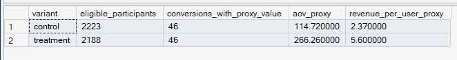

# Phase 8 — Experimentation Framework
## 05. Statistical Significance

**SQL Script:** `05_statistical_significance.sql`

---

## 1. Business Question

Is the observed difference in Purchase Conversion Rate between Control and Treatment unlikely to be explained by random variation?

---

## 2. Objective

Evaluate the primary experiment outcome using a **two-proportion z-test** and report:

- absolute effect
- relative lift
- z-statistic
- p-value
- statistical significance
- 95% confidence interval

---

## 3. Statistical Method

For the primary metric:

```text
H0:
Control Conversion Rate = Treatment Conversion Rate

H1:
Control Conversion Rate ≠ Treatment Conversion Rate
```

The significance threshold is:

**α = 0.05**

The treatment effect is defined as:

```text
Treatment Conversion Rate − Control Conversion Rate
```

---

## 4. Actual Result



| Metric | Result |
|---|---:|
| Control n | 2,223 |
| Treatment n | 2,188 |
| Control Conversion | **2.1592%** |
| Treatment Conversion | **2.0567%** |
| Absolute Effect | **-0.1026 pp** |
| Relative Lift | **-4.75%** |
| z-statistic | **-0.2371** |
| p-value | **0.8126** |
| Significance | **NOT SIGNIFICANT** |
| 95% CI | **[-0.9504 pp, +0.7452 pp]** |

---

## 5. Statistical Interpretation

The Treatment conversion rate is slightly below Control, but:

**p = 0.8126**

This is far above the α = 0.05 threshold.

Therefore:

> **The observed difference is not statistically significant.**

The 95% confidence interval spans zero:

```text
[-0.9504 pp, +0.7452 pp]
```

So the current experiment does not establish a positive or negative treatment effect.

---

## 6. Effect Size Interpretation

The observed treatment effect is:

**-0.1026 percentage points**

with a relative lift of:

**-4.75%**

The effect is small relative to the uncertainty represented by the confidence interval.

---

## 7. Business Interpretation

The experiment does not provide evidence that personalized recommendations improve Purchase Conversion Rate over the Top Sellers control.

The result is consistent with the experiment design expectation that no synthetic treatment effect was deliberately encoded in the underlying event-generation process.

That expectation does not replace the statistical test; it simply provides transparent context for interpreting the observed outcome.

---

## 8. Guardrails

Statistical significance is not the same as commercial significance.

A final business decision should also consider the magnitude of the observed effect and the confidence interval.

The final decision is made in later Phase 8 scripts.

---

## 9. Review Status

**PASS — primary-metric statistical test, effect calculation, p-value, and confidence interval are reported consistently.**

---

## 10. Next Step

**Next script:** `06_experiment_readout.sql`
