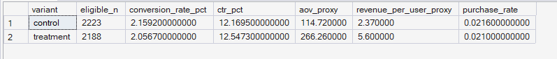
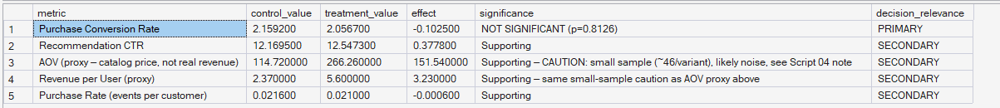

# Phase 8 — Experimentation Framework
## 06. Experiment Readout

**SQL Script:** `06_experiment_readout.sql`

---

## 1. Business Question

Bring the major findings from Scripts 01–05 into one consolidated, executive-readable experiment readout.

---

## 2. Objective

Recompute the validated experiment metrics and present the primary metric, secondary metrics, statistical summary, and business implication in one place.

The metric calculations are intentionally isolated to avoid population fan-out and denominator errors.

---

## 3. Consolidated Metric Output

| Metric | Control | Treatment |
|---|---:|---:|
| Purchase Conversion Rate | **2.1592%** | **2.0567%** |
| Recommendation CTR | **12.1695%** | **12.5473%** |
| AOV Proxy | **$114.72** | **$266.26** |
| Revenue/User Proxy | **$2.37** | **$5.60** |
| Purchase Rate | **0.0216** | **0.0210** |

The primary conversion result is slightly lower for Treatment.

---

## 4. Executive Metric Table

The primary metric is:

**Purchase Conversion Rate**

The observed treatment effect is approximately **-0.1025 percentage points** from the displayed metric values.

The supporting metrics are descriptive and do not override the locked primary metric.

The AOV and Revenue/User values are explicitly proxies rather than actual collected revenue.

---

## 5. Statistical Summary

Validated statistical result from Script 05:

- Control: **2.1592%**
- Treatment: **2.0567%**
- Absolute effect: **-0.1026 pp**
- Relative lift: **-4.75%**
- p-value: **0.8126**
- 95% CI: **[-0.9504 pp, +0.7452 pp]**
- SRM status: **PASS**

The confidence interval spans zero, and the primary result is not statistically significant.

---

## 6. Business Interpretation

The personalized treatment does not show a clear purchase-conversion advantage over the top-sellers control experience.

Treatment has a slightly higher Recommendation CTR, but the primary purchase-conversion outcome remains slightly lower and statistically indistinguishable from Control.

---

## 7. Guardrails

- Experiment scope is `exp_001` only.
- Purchase Conversion Rate uses the experiment's `recommendation_conversion` outcome.
- AOV and Revenue/User are catalog-price proxies, not actual collected revenue.
- The statistical summary reports the already-validated Script 05 result rather than duplicating the hypothesis-test implementation.

---

## 8. Review Status

**PASS — consolidated readout matches the validated Phase 8 metric and statistical results.**

---

## 9. Next Step

**Next script:** `07_business_decision.sql`
