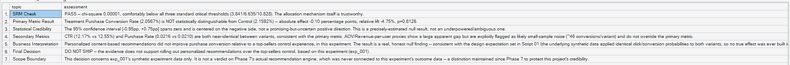

# Phase 8 — Experimentation Framework
## 07. Business Decision

**SQL Script:** `07_business_decision.sql`

---

## 1. Business Question

Given the validated experiment evidence, should the personalized recommendation treatment be shipped, rejected, or tested further?

---

## 2. Objective

Translate the statistical and business evidence into one of the three locked outcomes:

- **SHIP**
- **DO NOT SHIP**
- **CONTINUE TESTING**

---

## 3. Decision Evidence

### SRM

**PASS**

Canonical SRM chi-square:

**0.00001**

The assignment mechanism is effectively 50/50 and passes the experiment-integrity gate.

### Primary Metric

**Control:** 2.1592%  
**Treatment:** 2.0567%

Treatment is lower by approximately **0.10 percentage points**.

### Statistical Result

**p = 0.8126**

Therefore the primary result is **NOT statistically significant** at α = 0.05.

### Confidence Interval

**95% CI: [-0.9504 pp, +0.7452 pp]**

The interval spans zero.

---

## 4. Secondary Metrics

Recommendation CTR:

**12.17% Control vs 12.55% Treatment**

Purchase Rate:

**0.0216 Control vs 0.0210 Treatment**

AOV and Revenue/User proxies show a larger apparent difference, but they are based on only about 46 conversion events per variant with proxy price coverage and therefore are treated as noisy supporting evidence.

They do not override the primary metric.

---

## 5. Final Business Decision

# **DO NOT SHIP**

The experiment does not provide evidence that personalized content-based recommendations improve Purchase Conversion Rate relative to the Top Sellers control experience.

The point estimate is slightly negative, and the statistical test does not establish an improvement.

---

## 6. Scope Boundary

This conclusion applies only to **`exp_001`'s synthetic experiment data**.

It is **not** a verdict on the actual Phase 7 recommendation engine, because Phase 7's recommendation outputs were not connected to this experiment's outcome data.

That distinction is intentionally preserved for analytical credibility.

---

## 7. Signature Insight

> **Personalized recommendations changed Purchase Conversion Rate by -0.10 percentage points (-4.75% relative lift), with a 95% confidence interval of [-0.95 pp, +0.75 pp], leading to a DO NOT SHIP decision.**

---

## 8. Review Status

**PASS — the final decision is consistent with the validated SRM, primary metric, statistical test, effect direction, and confidence interval.**

---

## 9. Next Step

**Next script:** `08_phase8_validation.sql`
