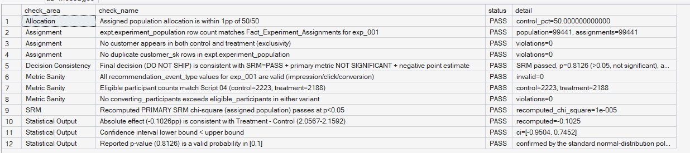
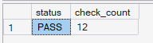

# Phase 8 — Experimentation Framework
## 08. Phase 8 Validation

**SQL Script:** `08_phase8_validation.sql`

---

## 1. Objective

Validate the assignment population, allocation, SRM, metric denominators, statistical outputs, and final decision consistency across Phase 8.

---

## 2. Validation Detail

The validation checks cover:

- assignment population reconciliation
- Control/Treatment exclusivity
- duplicate customer assignments in the population table
- 50/50 allocation sanity
- primary SRM recomputation
- eligible participant counts
- conversion sanity
- valid recommendation event types
- p-value validity
- confidence interval ordering
- treatment-minus-control effect consistency
- final decision consistency

---

## 3. Validation Summary

### Result

**12 PASS**

**0 FAIL**

All implemented Phase 8 validation checks pass.

---

## 4. Key Validation Evidence

### Assignment

The experiment population contains the expected **99,441 assigned customers** and remains mutually exclusive across Control and Treatment.

### Allocation

Control allocation is effectively **50.00%**, within the defined 1 percentage-point tolerance.

### SRM

The recomputed primary SRM statistic is:

**0.00001**

This passes the p < 0.05 gate.

### Metric Population

Eligible participants match the validated Script 04 population:

- Control: **2,223**
- Treatment: **2,188**

### Statistical Outputs

- p-value: **0.8126**
- 95% CI: **[-0.9504, +0.7452] pp**
- effect: **-0.1026 pp**

All pass their corresponding consistency checks.

### Decision

The final **DO NOT SHIP** decision is consistent with:

- SRM = PASS
- primary metric = NOT SIGNIFICANT
- negative treatment effect

---

## 5. Interpretation

Phase 8 passes its final validation layer.

The experiment is internally consistent from assignment and population construction through statistical analysis and final business decision.

---

## 6. Review Status

**PASS — 12/12 validation checks pass, with 0 failures.**

---

## 7. Phase 8 Lock Status

**Phase 8 is ready for final phase-level packaging and lock.**
