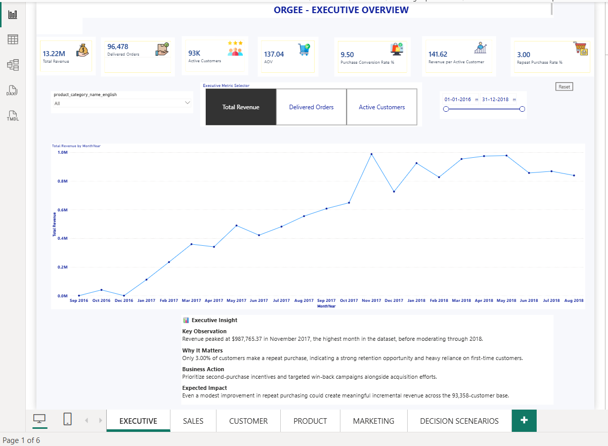
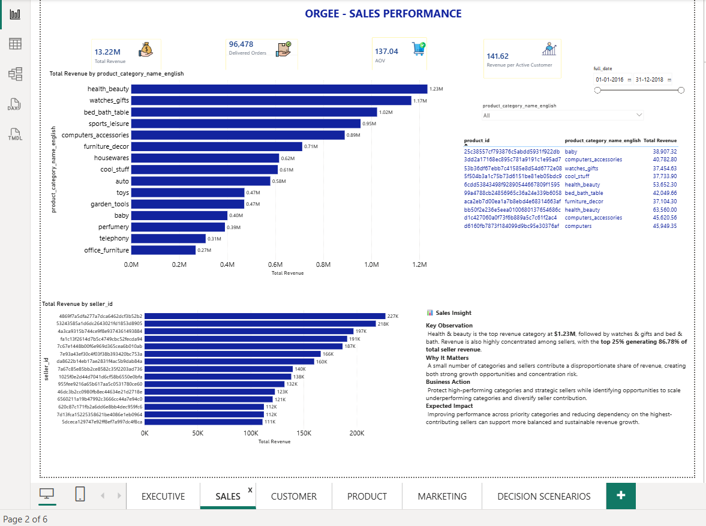
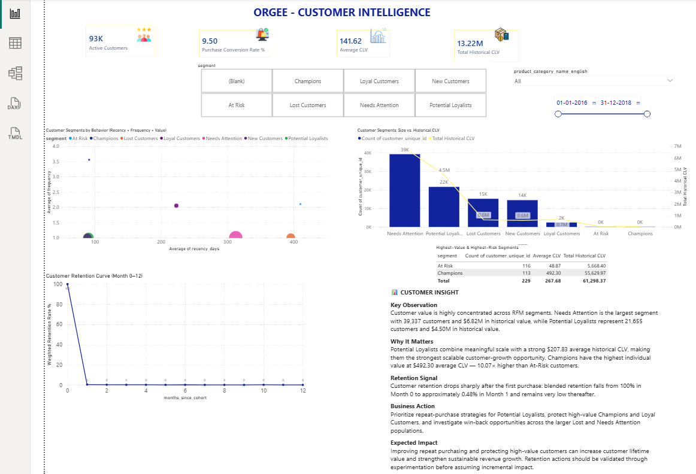
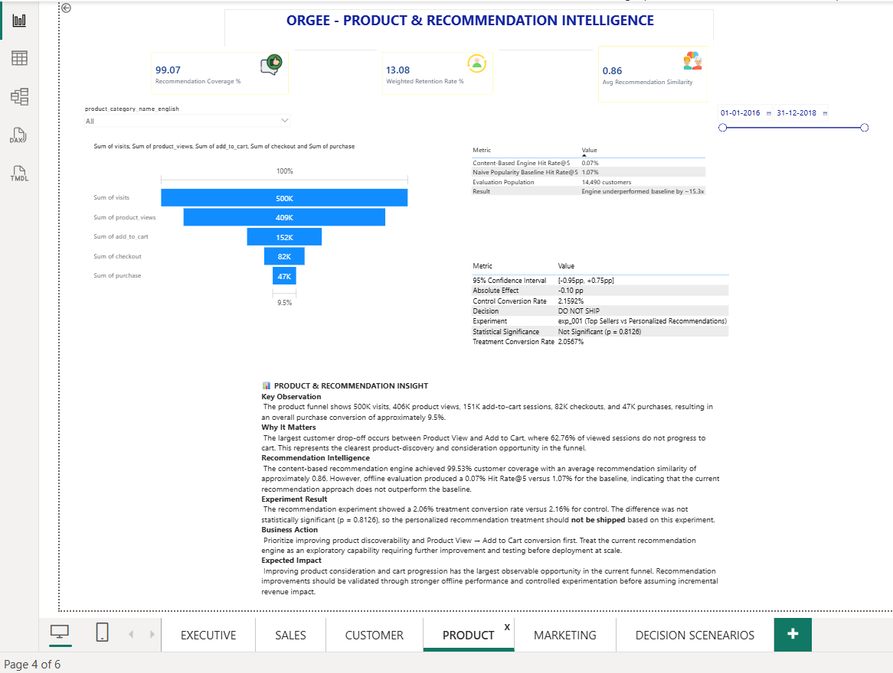
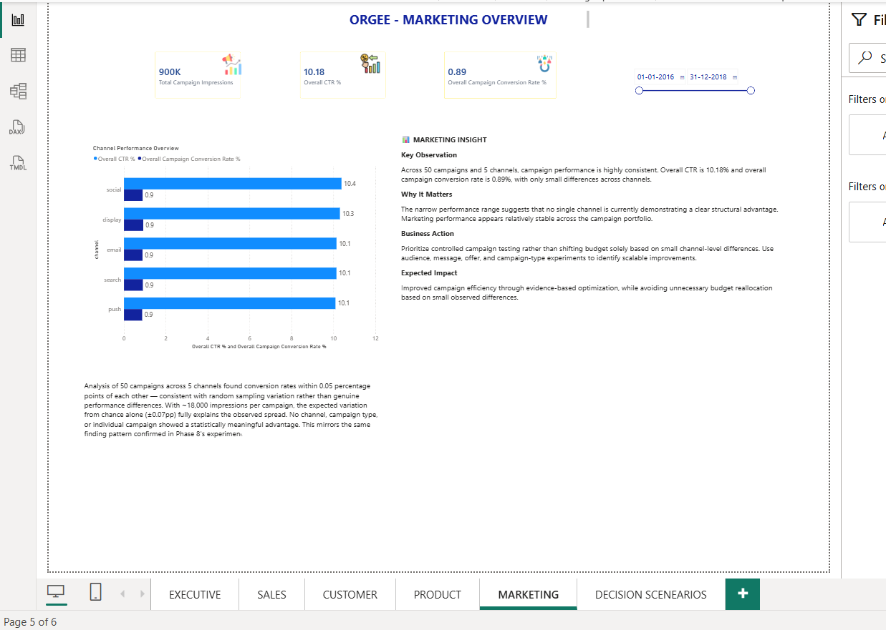

# Phase 9 — Power BI Executive Decision Platform
## ORGEE — Omnichannel Retail & Growth Experimentation Engine

**Location:** Power BI Desktop, ORGEE.pbix (pages 1–5 of 6; page 6 is Phase 10)
**Status:** Complete

---

## 1. Objective

Turn the SQL-based analysis from Phases 4–8 into a live, interactive executive reporting layer — five purpose-built dashboard pages, each answering a specific stakeholder's questions, sharing one connected data model, and cross-filterable end to end.

Phase 9 answers **"what is happening in the business?"** — Phase 10 (the What-If layer built on top of it) answers "what would happen under different assumptions."

---

## 2. Pages

| Page | Audience | Core question |
|---|---|---|
| Executive | Leadership | How is the business performing overall? |
| Sales | Sales/Category leads | Which categories and sellers drive revenue? |
| Customer | Customer/CRM leads | Who are our customers, and how much are they worth? |
| Product | Product leads | How does the funnel perform, and does the recommendation engine work? |
| Marketing | Marketing leads | Are campaigns and channels performing evenly? |

Each page uses the same structure: a title, a row of KPI cards, one or two primary charts, and an "Insight" text box (Key Observation / Why It Matters / Business Action / Expected Impact) — the same narrative discipline used throughout Phases 4–8, so every chart is paired with a stated business conclusion rather than left to speak for itself.

---

## 3. Data Sources

Built on the Phase 3 Kimball star schema (`Fact_Order_Items`, `Dim_Customer`, `Dim_Product`, `Dim_Date`, `Dim_Seller`, `Dim_Campaign`, `Dim_Experiment`) plus purpose-built views and tables created for reporting:

- `vw_Daily_Campaign_Performance`, `vw_Daily_Product_Funnel` — pre-aggregated views for the Marketing and Product funnel visuals
- `Customer_RFM_Segments`, `Customer_Cohort_Retention` — feed the Customer page's segmentation and retention visuals
- `Experiment_Results_Facts`, `reco recommendations`, `reco eval_recommendations` — feed the Product page's recommendation and A/B test tables

All KPI figures reconcile exactly to the verified numbers from Phases 4–8 (13.22M revenue, 96,478 delivered orders, 93,358 active customers, 137.04 AOV, 3.00% repeat-purchase rate) — confirmed by direct comparison during this phase's build and QA pass.

---

## 4. Interactivity

- **Synced slicers**, a product category dropdown and a date range control, apply across Executive, Sales, Customer, and Product simultaneously (Marketing intentionally excludes the category slicer, since campaigns have no product-category relationship in the model — confirmed via Manage Relationships rather than assumed).
- Two relationships (`Fact_Order_Items → Dim_Customer`, `Dim_Customer → Customer_RFM_Segments`) were changed from single- to bidirectional cross-filtering so the category slicer could correctly reach the Customer page's CLV and RFM cards — verified by testing a specific category and confirming every affected card changed while structurally unfilterable visuals (the retention curve, the product funnel) were explicitly marked to ignore the filter via Edit Interactions, rather than left silently unresponsive.
- **Drill-through** from the Sales page's category bar chart to the Product page, automatically filtering to the clicked category — tested and confirmed working (Recommendation Coverage % and Avg Recommendation Similarity both changed correctly on drill-through; the funnel and retention cards correctly stayed fixed, per the same relationship constraint above).
- The Executive page includes a metric-selector control (Total Revenue / Delivered Orders / Active Customers) that swaps the underlying chart, plus a synced date-range slider.

---

## 5. Notable Finding & Fix: Retention Curve Discrepancy

During QA, the Customer page's Weighted Retention Rate % (built via `SUM(retained)/SUM(cohort_size)`, a size-weighted average) was checked against Phase 5's SQL-derived retention curve (which used `AVG(retention_pct)`, an unweighted average across cohorts) and found to disagree by more than 10x at Month 1 (0.48% vs. 5.45%).

Root cause: the unweighted SQL average let a single-customer cohort's lucky 100% retention count exactly as much as a 1,600+ customer cohort's real retention rate, inflating the SQL figure. The Power BI DAX measure was correct as designed. Phase 5's SQL (`09_retention_curves.sql`) and its results documentation were corrected to match the weighted methodology, re-run, and the corrected SQL output (0.48% at Month 1) now reconciles exactly with this dashboard's figure. As a secondary validation, the corrected monthly retention percentages (Months 1–12) sum to ≈3.02%, matching Phase 4's independently-verified 3.00% overall repeat-purchase rate — the original unweighted figures summed to ≈8.09%, nearly 3× too high, which is a useful general check for this class of error in future work.

---

## 6. Design QA Pass

A full visual consistency pass was completed after the functional build:

- **Color palette** unified to a single blue accent across all charts on all 5 pages (previously inconsistent — gold, navy, and light blue mixed across pages).
- **Number formatting** corrected for Western thousands-separator consistency (a Delivered Orders card with no separator, and a product table subtotal row rendering in Indian-style digit grouping, were both fixed).
- **Title typos** corrected: "RECOMENDATION" → "RECOMMENDATION" on the Product page; a missing space in "ORGEE -SALES PERFORMANCE" on the Sales page; the Customer page's title being visually overlapped by a filter icon was fixed by repositioning.
- **Stray filter state** found and cleared: the Product page had a locked `product_category is health_beauty` filter left over from interactivity testing, which would have shown filtered (not baseline) data to a first-time viewer. Removed.

---

## 7. Known Limitations

- The Customer page's retention curve and the Product page's visit-to-purchase funnel cannot be filtered by product category — both are built from tables (`Customer_Cohort_Retention`, `vw_Daily_Product_Funnel`) with no relationship to `Dim_Product`, a genuine structural boundary in the data model rather than an oversight. Both visuals are explicitly configured (via Edit Interactions) to ignore the category slicer rather than silently failing to respond.
- The Product page's funnel is built as a horizontal bar chart rather than Power BI's native Funnel visual — functionally correct, but a candidate for future visual polish.
- Marketing's campaign data has no relationship to individual product categories in the current model; the category slicer is intentionally omitted from that page rather than shown non-functional.

---

## 8. Screenshots

**Executive:**

**Sales:**

**Customer:**

**Product:**

**Marketing:**

---

## 9. Relationship to the Rest of ORGEE

Phase 9 is the first of two Power BI phases. It surfaces the verified findings from Phases 4–8 as a live, interactive reporting layer with a shared, cross-filterable data model — the foundation Phase 10's What-If scenario layer is built directly on top of.
