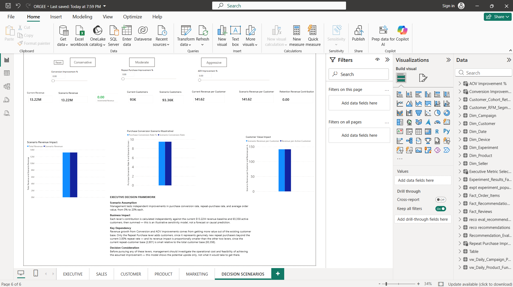
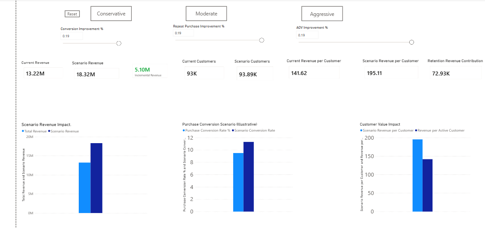
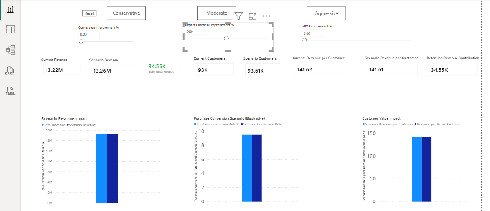
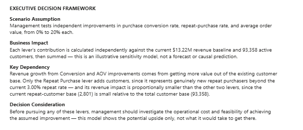

# Phase 10 — Decision Scenarios & What-If Analysis
## ORGEE — Omnichannel Retail & Growth Experimentation Engine

**Location:** Power BI Desktop, ORGEE.pbix, "Decision Scenarios" page (page 6 of 6)
**Status:** Complete

---

## 1. Core Business Question

> "If management changes a key business lever, what could happen to revenue, customers, conversion, and customer value?"

Phase 9 answers *what is happening* in the business. Phase 10 answers *what would happen under different management assumptions* — turning ORGEE from a collection of dashboards into an executive decision-support tool.

```
Actual Business Performance
        ↓
Management Assumption / What-If Parameter
        ↓
Scenario Calculation
        ↓
Projected Business Impact
        ↓
Management Decision
```

---

## 2. Scope

Three What-If levers were built, each independently adjustable from 0% to 20%:

| Parameter | Purpose |
|---|---|
| Conversion Improvement % | Test the impact of improving purchase conversion rate |
| Repeat Purchase Improvement % | Test the impact of improving customer retention/repeat-purchase rate |
| AOV Improvement % | Test the impact of improving average order value |

These three were chosen over the full six-scenario list in the original project blueprint (Cart Abandonment, Inventory Optimization, and Recommendation Adoption were intentionally left out) because they map directly onto verified, real numbers already established in Phases 4–9, and because forcing a positive "what if" onto Recommendation Adoption specifically would sit awkwardly against Phase 8's honest DO NOT SHIP finding. Depth on fewer, well-grounded levers was prioritized over shallow coverage of all six.

---

## 3. Parameters

Built using Power BI's native **What-If Parameter** feature (Modeling → New parameter → Numeric range):

| Parameter | Type | Min | Max | Increment | Default |
|---|---|---|---|---|---|
| Conversion Improvement % | Decimal | 0 | 0.20 | 0.01 | 0 |
| Repeat Purchase Improvement % | Decimal | 0 | 0.20 | 0.01 | 0 |
| AOV Improvement % | Decimal | 0 | 0.20 | 0.01 | 0 |

**Interpretation convention:** each parameter is a **relative percentage improvement**, not a percentage-point addition. For example, Repeat Purchase Improvement at 10% takes the real repeat-purchase rate from 3.00% → 3.30%, not to 13.00%. This keeps every scenario anchored close to real, believable numbers.

---

## 4. Formulas

All scenario measures hold the baseline figures ($13.22M revenue, 93,358 customers, $141.62 revenue/customer, 3.00%/2,801 repeat customers) fixed as verified constants, and calculate each lever's contribution **independently**, then sum them — a standard sensitivity-analysis technique ("what if only this changed, holding everything else constant"), deliberately avoiding a more complex interaction model that the project's locked scope excludes ("no complicated simulation").

```
Scenario Revenue =
    Baseline Revenue
  + (Baseline Revenue × Conversion Improvement %)
  + (Baseline Revenue × AOV Improvement %)
  + (2,801 repeat customers × Repeat Purchase Improvement % × AOV)

Incremental Revenue = Scenario Revenue − Total Revenue

Scenario Customers = 93,358 + (2,801 × Repeat Purchase Improvement %)
  — Conversion and AOV improvements increase value per customer, not
    customer count; only the Retention lever adds genuinely new
    repeat customers to the base.

Scenario Revenue per Customer = Scenario Revenue ÷ Scenario Customers

Scenario Conversion Rate = Purchase Conversion Rate % × (1 + Conversion Improvement %)
Scenario Repeat Purchase Rate = Repeat Purchase Rate % × (1 + Repeat Purchase Improvement %)
Scenario AOV = AOV × (1 + AOV Improvement %)

Revenue Uplift % = Incremental Revenue ÷ Total Revenue

Retention Revenue Contribution = 2,801 × Repeat Purchase Improvement % × AOV
  — an isolated view of the retention lever's effect alone, added
    separately because its contribution is small relative to the
    other two levers and not visible on the main revenue chart's scale.
```

---

## 5. Page Layout

**Top — Scenario Controls:** 3 What-If parameter sliders, plus 4 buttons (Conservative, Moderate, Aggressive, Reset) built with Power BI Bookmarks, letting a viewer jump to a preset combination of all three sliders in one click instead of dragging each manually.

**Middle — Scenario KPI Cards** (ordered Current → Scenario, left to right, per the plan): Current/Scenario Revenue, Incremental Revenue (green when positive via conditional formatting), Current/Scenario Customers, Current/Scenario Revenue per Customer, and a dedicated Retention Revenue Contribution card isolating the smallest lever's effect.

**Main visual — Scenario Revenue Impact:** clustered column chart, Total Revenue vs. Scenario Revenue.

**Second visual — Purchase Conversion Scenario (Illustrative):** clustered column chart, Purchase Conversion Rate % vs. Scenario Conversion Rate. Explicitly labeled "Illustrative" in the title, per the plan's requirement to avoid implying a forecast.

**Third visual — Customer Value Impact:** clustered column chart, Revenue per Active Customer vs. Scenario Revenue per Customer — tied directly to the Phase 6 North Star metric, "Monthly Delivered Revenue per Active Customer."

**Bottom — Executive Decision Framework:** a text box structured as Scenario Assumption / Business Impact / Key Dependency / Decision Consideration, stating plainly that this is an illustrative sensitivity model, not a forecast or causal prediction, and naming what management should investigate before acting on any lever.

---

## 6. Key Findings

- At a representative test point (all three levers ≈19%), Scenario Revenue rose from $13.22M to $18.32M (+$5.10M, +38.6%), with the Conversion and AOV levers each contributing roughly $2.5M and the Retention lever contributing roughly $73K.
- **The Retention lever's effect is real but proportionally small** — about 35× smaller than either of the other two levers at the same percentage improvement. This is a direct, honest consequence of the real repeat-customer base (2,801) being small relative to the total customer base (93,358), not a flaw in the model. It is the reason a dedicated isolated card was added for that lever specifically.
- Scenario Revenue per Customer is far more sensitive to Conversion and AOV improvements than to Retention improvements, since Retention adds customers who spend at the same average rate as the existing base, while Conversion and AOV increase value per existing customer directly.

---

## 7. Assumptions & Limitations

- This is a **sensitivity model**, not a forecast: it shows what each lever *would* produce *if* the assumed improvement were achieved, with no claim about the likelihood, cost, or feasibility of achieving it.
- The three levers are modeled **independently** (no interaction effects between them) — a deliberate simplification consistent with the project's locked scope, which explicitly excludes complicated simulation.
- The Retention lever assumes each additional repeat customer spends at the current average AOV; it does not model a different spending pattern for reactivated vs. new repeat customers.
- All figures are illustrative and clearly labeled as such on the page itself (see the Purchase Conversion Scenario chart title and the Executive Decision Framework text box).

---

## 8. Validation

See `03_scenario_validation.md` for the full 6-point validation checklist (baseline reproduction, parameter responsiveness, no-negative-values, arithmetic verification, baseline reconciliation against Phase 6/9, and confirmation that scenario measures do not modify source data). All 6 checks passed.

---

## 9. Screenshots

**Baseline state — all sliders at 0%:**


**Aggressive preset applied:**


**Retention lever isolated (only Repeat Purchase Improvement % moved):**


**Executive Decision Framework:**


---

## 10. Relationship to the Rest of ORGEE

Phase 10 is the final phase of the ORGEE architecture. It does not introduce new data, new tables, or new ML — it is a read-only analytical layer built entirely on top of the figures already verified in Phases 6–9 (Total Revenue, AOV, Purchase Conversion Rate, Repeat Purchase Rate, Active Customers). This closes the project's stated architecture: Phase 9 answers "what is happening," Phase 10 answers "what happens under different assumptions" — the distinction that turns ORGEE into an executive decision-support system rather than a collection of dashboards.
